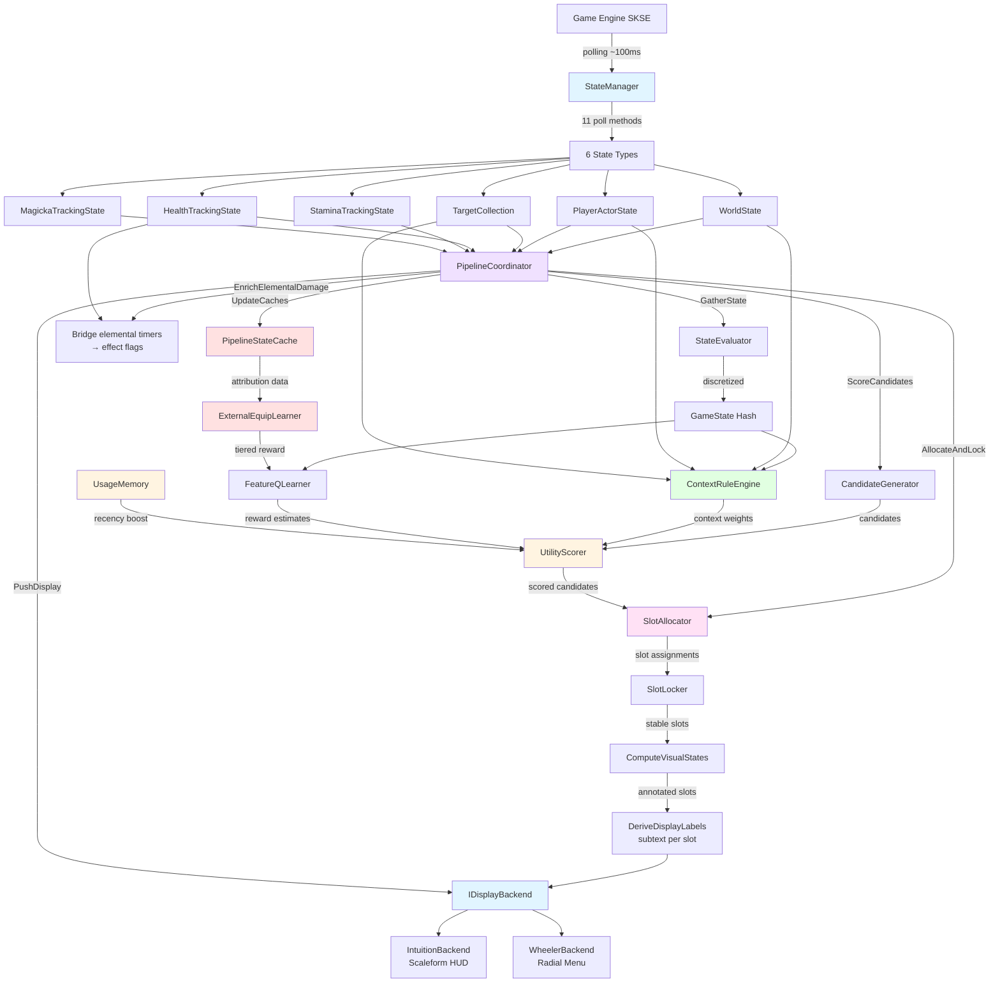
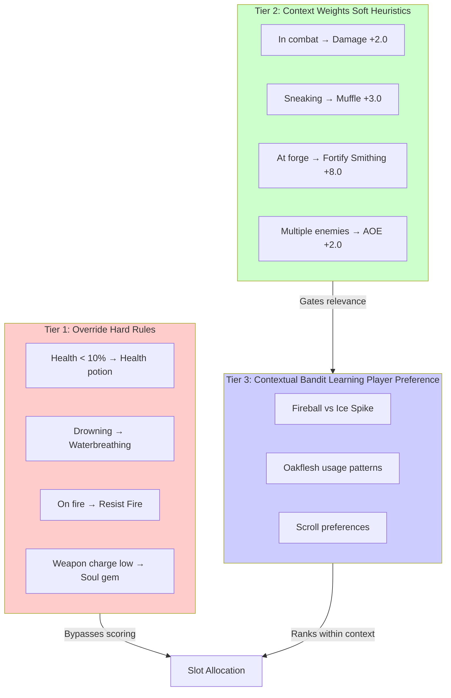
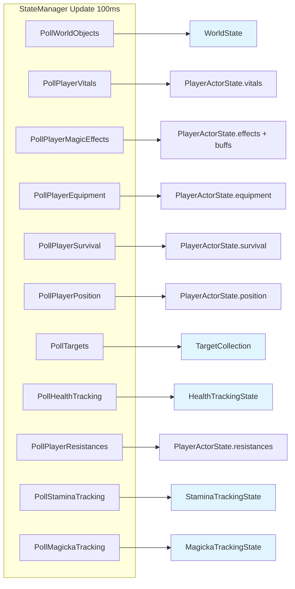
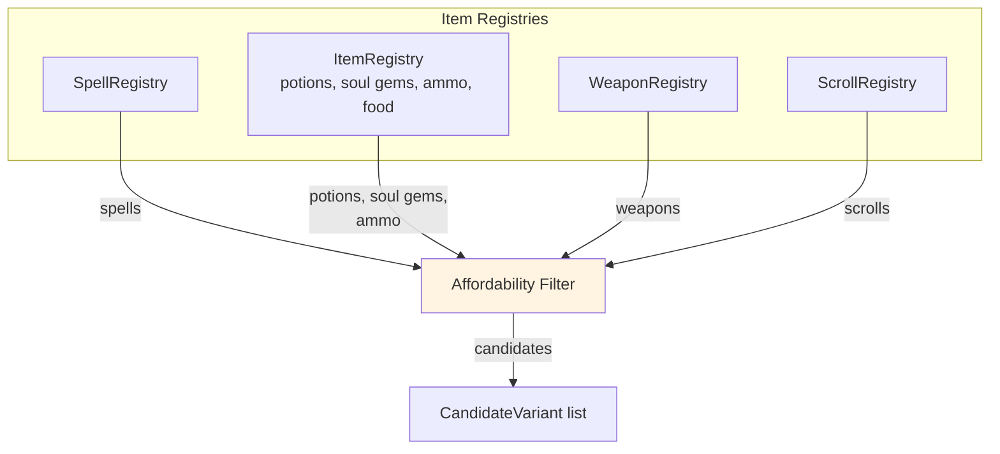
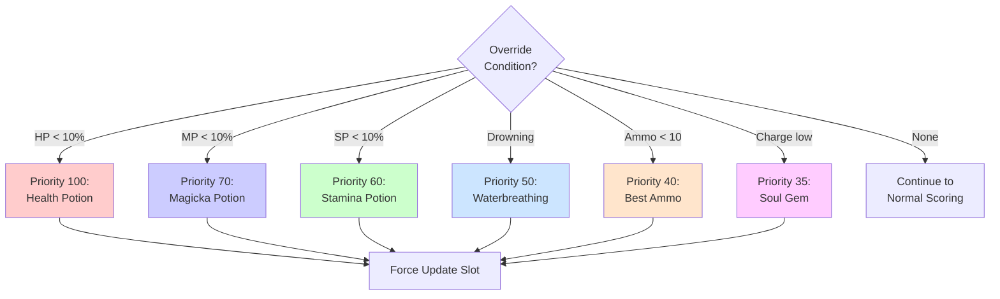
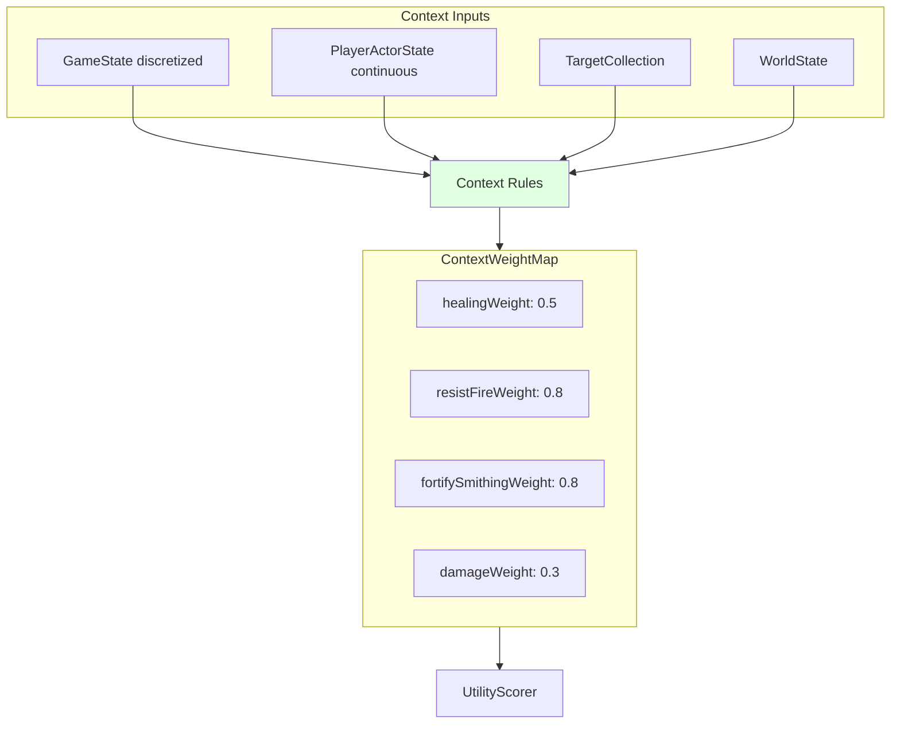
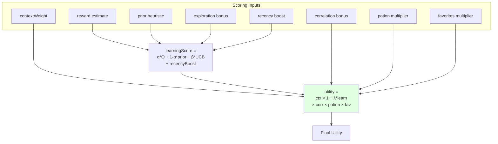
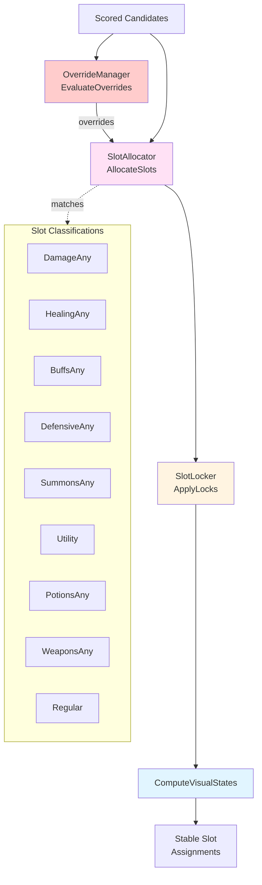
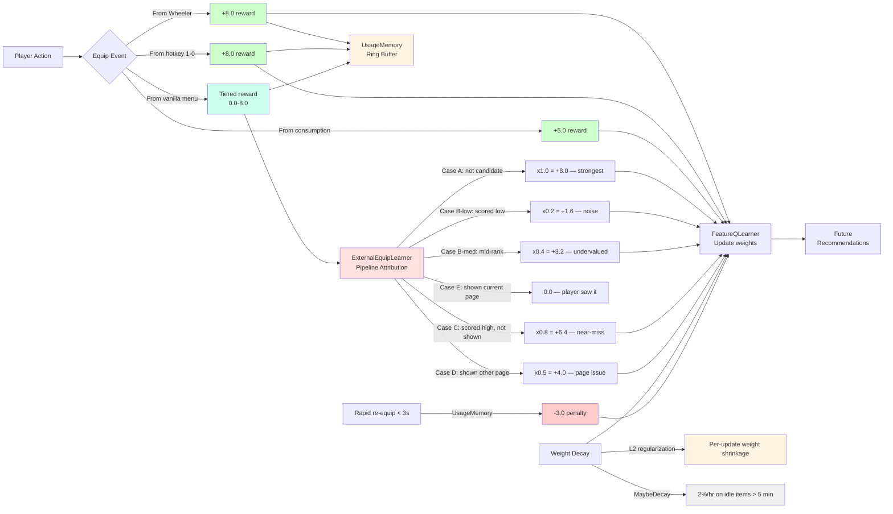
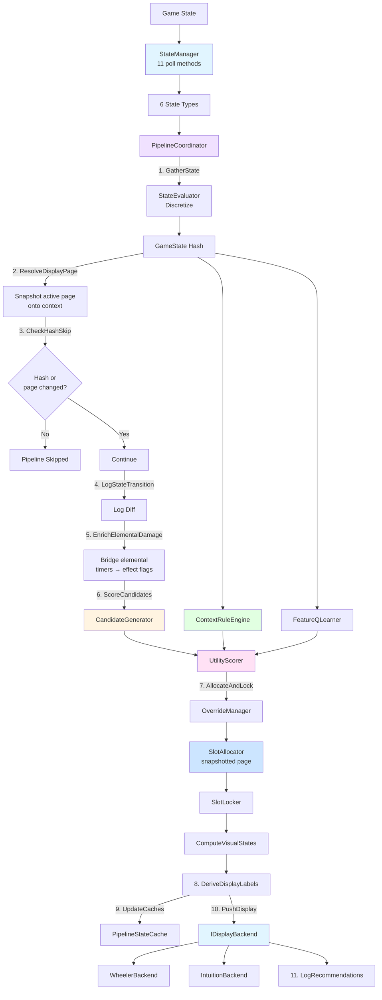

# Huginn Recommendation Pipeline

This document describes the data flow from game state to slot recommendations as currently implemented in v0.19.10.

> **Related documentation:**
> - [1-states.md](1-states.md) - State models (WorldState, PlayerActorState, TargetCollection, tracking states)
> - [4-contextual-bandits.md](4-contextual-bandits.md) - contextual bandit learning implementation
> - [5-slots.md](5-slots.md) - Slot classification and overrides

---

## Current Implementation Status (v0.19.x)

**Scoring Formula:**
```
utility = contextWeight × (1 + λ(confidence) × learningScore)
          × correlationBonus × potionMultiplier × favoritesMultiplier
```

Where `λ(confidence) = lambdaMin + confidence × (lambdaMax − lambdaMin)`. Context acts as a gate: zero context = zero utility regardless of learning.

**Architecture Progress:**
- ✅ StateManager with 11 poll methods (complete)
- ✅ ContextRuleEngine — sole source of context weights
- ✅ CandidateGenerator relevance refactored — tags only, no scoring
- ✅ UtilityScorer — multiplicative formula + cold-start UCB fallback
- ✅ UsageMemory — event-driven short-term recency boost
- ✅ SlotAllocator with multi-page support
- ✅ Two-tier lazy decay (replaces skip penalties)
- ✅ contextual bandit learning persistence via SKSE cosave
- ✅ PipelineStateCache for external equip attribution
- ✅ ExternalEquipLearner for learning from vanilla/hotkey equips
- ✅ Cold-start UCB context boost for empty-slot prevention
- ✅ PipelineCoordinator extraction (orchestrates all pipeline steps)
- ✅ IDisplayBackend interface (pluggable display targets)
- ✅ Legacy additive formula removed — single scoring path

Added since v0.18.x:

- ✅ `ResolveDisplayPage` — one page snapshot for the whole tick (allocation, caches, push)
- ✅ Page-race bail in `AllocateAndLock` — abandon rather than leak page-blind locks
- ✅ `NeedsForcedRun()` — one list of unhashed latches, consulted by *both* skip gates
- ✅ Unhashed-state bypasses for falling (#60) and underwater (#61)
- ✅ `anyCasting` added to the `GameState` hash (72,576 states)
- ✅ `ContextReason` derived from the same weight map the ranking used (#10), damped by `ReasonHold` (#62)
- ✅ `DeriveDisplayLabels` — subtext stamped on the tick's own assignments
- ✅ Page-keyed wildcard cache (`Scoring::WildcardPage`)
- ✅ `LogRecommendations` — periodic top-N log plus the one-shot `hg recs` dump
- ✅ `Telemetry::SoakMetrics` — per-tick cost, candidate/display counts, `[Soak]` heartbeat

---

## Pipeline Overview



**Key Components:**

| Component | Role | Source File |
|-----------|------|-------------|
| **UpdateHandler** | Frame hook; throttles the tick to `Config::UPDATE_INTERVAL_MS` (100ms) | `src/update/UpdateHandler.cpp` |
| **OnUpdate / RunPipelineIfNeeded** | World-loaded gate, subsystem ticks, registry maintenance, outer skip gate | `src/UpdateLoop.cpp` |
| **StateManager** | Polls game state at intervals (100ms-1000ms) | `src/state/StateManager.h` |
| **StateEvaluator** | Discretizes state into the `GameState` bucket vector | `src/state/StateEvaluator.h` |
| **PipelineCoordinator** | Orchestrates all pipeline steps in sequence | `src/pipeline/PipelineCoordinator.h` |
| **CandidateGenerator** | Gathers available items + tags for filtering | `src/candidate/CandidateGenerator.h` |
| **ContextRuleEngine** | Evaluates context rules → weight map | `src/context/ContextRuleEngine.h` |
| **UtilityScorer** | Combines context + learning → utility | `src/learning/UtilityScorer.h` |
| **UsageMemory** | Event-driven short-term recency boost | `src/learning/UsageMemory.h` |
| **WildcardManager** | Exploration picks, cached per display page | `src/learning/WildcardManager.h` |
| **ReasonHold** | Damps the *displayed* context reason so it stays readable (#62) | `src/context/ReasonHold.h` |
| **OverrideManager** | Evaluates urgent override conditions | `src/override/OverrideManager.h` |
| **SlotAllocator** | Assigns candidates to classified slots | `src/slot/SlotAllocator.h` |
| **SlotLocker** | Temporal stability via lock timers | `src/slot/SlotLocker.h` |
| **PipelineStateCache** | Caches scored candidates for external equip attribution | `src/learning/PipelineStateCache.h` |
| **ExternalEquipLearner** | Learns from vanilla menu/hotkey equips | `src/learning/ExternalEquipLearner.h` |
| **DeriveExplanationLabel** | Pure subtext derivation, shared by the coordinator and Wheeler | `src/display/ExplanationLabel.h` |
| **IDisplayBackend** | Interface for display targets (Intuition, Wheeler) | `src/display/IDisplayBackend.h` |
| **SoakMetrics** | Long-play telemetry: tick cost, candidate/display counts, page-race bails | `src/telemetry/SoakMetrics.h` |

---

## PipelineCoordinator

The `PipelineCoordinator` singleton orchestrates the full recommendation pipeline. Extracted from the original `OnUpdate()` function, each step method maps 1:1 to a block of the original code. Data flows through a `PipelineContext` struct that makes inter-step dependencies explicit.

**Step execution order** (`PipelineCoordinator::RunPipeline()`):

```
 1. GatherState          — Fetch state snapshots from StateManager + StateEvaluator
 2. ResolveDisplayPage   — Sync active page to the backend's desired page (IDisplayBackend::GetDesiredPage), snapshot it onto the context; result folds into the skip decision
 3. CheckHashSkip        — Compare discretized hash; skip if unchanged (+ unhashed-state / page-change override)   [may return early]
 4. LogStateTransition   — Log diff of changed GameState fields
 5. EnrichElementalDamage — Bridge HealthTrackingState elemental timers → PlayerActorState effect flags
 6. ScoreCandidates      — CandidateGenerator.GenerateCandidates() → UtilityScorer.ScoreCandidates(), then name + hold the dominant ContextReason
 7. AllocateAndLock      — OverrideManager → SlotAllocator (for the snapshotted page) → SlotLocker → ComputeVisualStates   [may abandon the tick]
 8. DeriveDisplayLabels  — Stamp subtextLabel on ctx.assignments (Display::DeriveExplanationLabel)
 9. UpdateCaches         — PipelineStateCache + EquipManager slot contents (snapshotted page)
10. PushDisplay          — Push DisplayContext to all IDisplayBackend instances
11. LogRecommendations   — Periodic top-N log, or the one-shot `hg recs` dump
    (+ UpdateDebugWidgets, `#ifndef NDEBUG` only)
```

Two of those steps can end the tick early. `CheckHashSkip` returns `false` from
`RunPipeline` when nothing the hash can see has changed. `AllocateAndLock` returns
`false` when an off-thread page switch landed after `ResolveDisplayPage`'s snapshot —
locking the stale page would pin its content into the new page's slots, so the tick is
abandoned and re-run next tick via `SlotAllocator::MarkPageDirty()`. The abandoned tick
is not side-effect-free (override hysteresis has already advanced, the hash is already
committed), which is why the re-run is *owned* rather than inferred.

After a successful run the coordinator records soak telemetry:
`SoakMetrics::RecordPipelineRun(candidateCount, displayedCount, overrideTookASlot)` —
where "override took a slot" means the top override actually had a candidate, not merely
that its condition was true.

> **Page consistency:** `ResolveDisplayPage` resolves and snapshots the active page (index/count/slot count/name onto `PipelineContext`) *before* the hash-skip and allocation. Allocation, caches, and push all read that snapshot, so a page switch arriving off-thread mid-tick (Wheeler callback, page-cycle keys, console) can't tear assignments from their page metadata — it just raises the page-dirty flag and re-runs next tick.

**PipelineContext** (`src/pipeline/PipelineCoordinator.h`):

The data bundle shared between steps. It is a *member* of the coordinator (`m_ctx`),
`Reset()` each tick so container capacity is reused rather than reallocated.

- **Inputs:** `deltaMs`, `player`, `actorValue`, `now`
- **State snapshots:** `currentState` (`GameState`), `playerState`, `targets`, `worldState`, `healthTracking`, `currentMagicka`, `stateHash`
- **Unhashed-state flags:** `elementalDamageActive`, `fallingActive`, `underwaterActive`
- **Pipeline outputs:** `scoredCandidates`, `overrides`, `rawAssignments`, `assignments`, `contextReason`
- **Page snapshot:** `displayPageIndex`, `displayPageCount`, `displaySlotCount`, `displayWildcardSlots`, `displayPageName`

> Only `HealthTrackingState` is snapshotted. `MagickaTrackingState` and
> `StaminaTrackingState` used to ride along for the relevance tags; nothing consumes
> them now that the display reason is derived from the context weights (#10), so they
> are no longer copied onto the context each tick. `StateManager` still polls all
> three — see `GetPollTable()`.

### Two skip gates, one latch list

The skip check exists in two places and they consult the same list of latches.

| Gate | Where | Asks |
|---|---|---|
| Outer | `RunPipelineIfNeeded()` in `src/UpdateLoop.cpp` | `StateManager::DidLastUpdateChangeState()`, `SlotAllocator::PeekPageChanged()`, `StateManager::IsElementalWindowActive()`, `PipelineCoordinator::NeedsForcedRun()` |
| Inner | `PipelineCoordinator::CheckHashSkip()` | `stateHash == m_lastPipelineHash`, page changed, this tick's unhashed-state flags, `NeedsForcedRun()` |

The outer gate returns before `RunPipeline` is ever called, so a latch wired into only
the inner gate is dead in a static scene. `NeedsForcedRun()` is the single list, and it
currently holds four things the `GameState` hash cannot see:

| Latch | Why the hash misses it |
|---|---|
| `m_wasElementalDamageActive` | The enriched `isOnFire` / `isFrozen` / `isShocked` flags are not hashed; the window's *closing* edge needs one more run to clear fire-scored recommendations |
| `m_wasFalling` (#60) | `isFalling` is not hashed; stepping off a ledge moves no bucket, and landing needs a run to clear slow-fall scoring |
| `m_wasUnderwater` (#61) | Swimming is not sneaking, combat or a target, so submerging moves no bucket. This one hid behind #61's water-height bug: the sensor never fired, so the gap was invisible |
| `m_reasonHold.IsHolding()` (#62) | A held label has to be allowed to expire, and a quiet scene is exactly where nothing else forces a tick |

All four are bounded — a fall ends in about a second, the elemental window is
fixed-length, and a hold expires within `REASON_HOLD_MS / UPDATE_INTERVAL_MS` runs
(~15). A fifth belongs in `NeedsForcedRun()`, not at a call site.

`ResetCrossSaveState()` clears the hash baseline, the logged-state baseline and all
four latches on load, so the first post-load pass can never hash-skip into the previous
character's recommendations.

---

## Hybrid Scoring System (Three Tiers)



**Tier Breakdown:**

| Tier | Purpose | Examples | Implementation |
|------|---------|----------|----------------|
| **Override** | Urgent situations with obvious answer | Critical HP, drowning, on fire | `OverrideManager` hard rules, bypass scoring |
| **Context Weight** | Situational relevance (rule-based) | Combat buffs, workstation potions | `ContextRuleEngine` + `CandidateGenerator` |
| **Contextual Bandit Learning** | Player-specific preference | Item choice within context | `FeatureQLearner` reward estimate lookup |

---

## Stage Descriptions

### Stage 1: Game State Polling (StateManager)

The StateManager contains 11 poll methods that act as **sensors**, reading directly from the game engine (SKSE API):



**Poll Methods:**

| Poll Method | Reads From | Updates | Interval |
|-------------|-----------|---------|----------|
| `PollWorldObjects()` | `RE::CrosshairPickData`, `RE::Calendar` | `WorldState` | 100ms |
| `PollPlayerVitals()` | `RE::ActorValueOwner::GetActorValue()` | `PlayerActorState.vitals` | 100ms |
| `PollPlayerMagicEffects()` | `RE::Actor::GetActiveEffectList()` | `PlayerActorState.effects + .buffs` | 100ms |
| `PollPlayerEquipment()` | `RE::Actor::GetEquippedObject()` | `PlayerActorState.equipment` | 100ms |
| `PollPlayerSurvival()` | `RE::ActorValue` (survival stats) | `PlayerActorState.survival` | 1000ms |
| `PollPlayerPosition()` | `RE::Actor::IsSwimming()`, `IsSneaking()` | `PlayerActorState.position` | 100ms |
| `PollTargets()` | `RE::ProcessLists::GetSingleton()` | `TargetCollection` | 100ms |
| `PollHealthTracking()` | Health delta, `DamageEventSink` enrichment | `HealthTrackingState` | 100ms |
| `PollPlayerResistances()` | `RE::ActorValue` (resistances) | `PlayerActorState.resistances` | 500ms |
| `PollStaminaTracking()` | Stamina delta, usage source classification | `StaminaTrackingState` | 100ms |
| `PollMagickaTracking()` | Magicka delta, casting state classification | `MagickaTrackingState` | 100ms |

**State Types** (output):

| Struct | Purpose | Details |
|--------|---------|---------|
| `WorldState` | Crosshair targets, locks, workstations, time, light | See [1-states.md](1-states.md) |
| `PlayerActorState` | Vitals, effects, buffs, equipment, survival, position, resistances | See [1-states.md](1-states.md) |
| `TargetCollection` | Primary target + up to 50 tracked actors | See [1-states.md](1-states.md) |
| `HealthTrackingState` | Recent damage/healing events, rates, elemental damage timers | See [1-states.md](1-states.md) |
| `StaminaTrackingState` | Stamina usage events, rates, source classification | See [1-states.md](1-states.md) |
| `MagickaTrackingState` | Magicka usage events, rates, casting state | See [1-states.md](1-states.md) |

**Discretized State** (for contextual bandit learning):

| Struct | Purpose | Details |
|--------|---------|---------|
| `GameState` | Discretized buckets for the pipeline skip-check — 72,576 states, bases `[6, 6, 3, 7, 4, 3, 2, 2, 2]` (health, magicka, distance, targetType, enemyCount, allyStatus, anyCasting, inCombat, isSneaking). Stamina is in the struct but excluded from the hash. | See [4-contextual-bandits.md](4-contextual-bandits.md) |

### Stage 2: Candidate Generator

Gathers all potential recommendations from four registries:



**Registries** (`CandidateGenerator` member references):

| Registry | Class | Candidate Types |
|----------|-------|-----------------|
| `m_spellRegistry` | `Spell::SpellRegistry` | Known spells |
| `m_itemRegistry` | `Item::ItemRegistry` | Potions, food, soul gems |
| `m_weaponRegistry` | `Weapon::WeaponRegistry` | Favorited weapons (melee + ranged + staves) **and ammo** |
| `m_scrollRegistry` | `Scroll::ScrollRegistry` | Scrolls |

**Gather order** (`GenerateCandidates`, into a persistent `m_gatherBuffer` whose capacity
is retained between ticks): spells → potions → scrolls → weapons → ammo → soul gems.
The buffer is then run through `m_filters->ApplyAllFilters(...)`, which is where magicka
affordability and the other per-candidate gates live.

Gathering itself is **unconditional per source** — a registry is skipped only when it is
missing, still loading, or disabled by config (e.g. `enableSoulGemRecharge`). There is no
"only gather soul gems when the weapon is drained" test in the generator: soul gems, ammo
and buff potions are all gathered every tick and *gated by context weight* instead, which
is why `[ContextWeights]` carries always-on baselines like `fWeightSoulGem`,
`fWeightBuffPotion`, `fWeightWeapon` and `fWeightSpell`. Without those baselines an item
sits at `fWeightBaseRelevance` (0.05), never clears `fMinimumUtility` (0.1), and so never
gets a chance to be learned at all.

Staves are treated as weapons with charge. Items are classified by **effect type** (not
school), which works for vanilla and modded content.

> `CandidateGenerator` computes neither relevance scores nor display explanations — it gathers, filters, and dedups. `ContextRuleEngine` owns both: its `ContextWeightMap` ranks candidates, and `DominantReason()` names the single `ContextReason` the pipeline hands to the display each tick for the Wheeler subtext label (critique #10).

### Stage 3: Elemental Damage Enrichment

Before scoring, `PipelineCoordinator::EnrichElementalDamage()` bridges instant-hit elemental detection into the player state:

```cpp
// If HealthTrackingState recorded fire/frost/shock within the enrichment window,
// set the corresponding PlayerActorState.effects flag so ContextRuleEngine sees it.
if (healthTracking.timeSinceLastFire < ELEMENTAL_DAMAGE_ENRICHMENT_WINDOW)
    playerState.effects.isOnFire = true;
if (healthTracking.timeSinceLastFrost < ELEMENTAL_DAMAGE_ENRICHMENT_WINDOW)
    playerState.effects.isFrozen = true;
if (healthTracking.timeSinceLastShock < ELEMENTAL_DAMAGE_ENRICHMENT_WINDOW)
    playerState.effects.isShocked = true;
```

This is necessary because instant-hit elemental damage (e.g., a fireball impact) doesn't create a persistent magic effect that `PollPlayerMagicEffects` would detect. The `DamageEventSink` records the elemental type at impact time, and enrichment carries it forward into the scoring pipeline.

### Stage 4: Override Check (OverrideManager)

Urgent conditions bypass normal scoring. Implemented by `OverrideManager::EvaluateOverrides()`.



**Override Rules** (see [5-slots.md](5-slots.md) for full details):

| Priority | Condition | Threshold | Hysteresis | Action | INI Toggle |
|----------|-----------|-----------|------------|--------|------------|
| 100 | CRITICAL_HEALTH | HP < 10% | 15% | Best health potion | `bEnableCriticalHealth` |
| 70 | CRITICAL_MAGICKA | MP < 10% | 15% | Best magicka potion | `bEnableCriticalMagicka` |
| 60 | CRITICAL_STAMINA | SP < 10% | 15% | Best stamina potion | `bEnableCriticalStamina` |
| 50 | DROWNING | Underwater, no buff | N/A | Waterbreathing potion | `bEnableDrowning` |
| 40 | LOW_AMMO | < 10 arrows/bolts | 15 | Best ammo | `bEnableLowAmmo` |
| 35 | WEAPON_EMPTY | Charge < 25% | 5% | Best filled soul gem | `bEnableWeaponCharge` |

> **Note:** The three *vital* rows show the compile-time fallbacks in
> `Override::Defaults` (`src/override/OverrideConfig.h`); the shipped
> `configs/Huginn.ini` sets all three to **35%** for a more proactive experience, and
> the INI value is authoritative at runtime. The weapon-charge row is 25% in *both*
> — the activation test is `charge < threshold` and a drained weapon keeps a small
> unusable remainder rather than exactly 0, so a zero threshold would never fire.
> Hysteresis is a *release gap*: the override stays active until the value rises above
> `threshold + hysteresis`.

All potion overrides use the `bAllowImpurePotions` INI setting to control whether potions with harmful side effects are used as a last resort.

**Pipeline position:** Overrides are evaluated in `AllocateAndLock` as a **peer step** to slot allocation — the `OverrideCollection` is passed as a parameter to `SlotAllocator::AllocateSlots()`, not as a gate before it.

### Stage 5: Context Evaluation (ContextRuleEngine)

ContextRuleEngine is the sole source of context weights. It evaluates game state once per scoring pass and produces a `ContextWeightMap` consumed by `UtilityScorer`. The same map is then handed to `DominantReason()` to name the tick's `ContextReason` for display — one encoding for both ranking and explanation (#10), so the subtext can never disagree with the scoring.



**Example Rules:**

| Condition | Weight field | Shape | Rationale |
|-----------|--------------|-------|-----------|
| health below full | `healingWeight` | `(1 - healthPct)^fHealthSmoothingExponent`, clamped to [0,1] | Continuous curve, no cliff |
| magicka / stamina below full | `magickaRestoreWeight`, `staminaRestoreWeight` | same shape, own exponent | Continuous curve |
| taking fire damage | `resistFireWeight` | `fWeightOnFire × resistScale(fireResist)` | Active threat, damped by how resistant you already are |
| underwater, no waterbreathing | `waterbreathingWeight` | `fWeightUnderwater`, ramped by depth | Will drown |
| at forge workstation | `fortifySmithingWeight` | `fWeightAtForge` | Obvious context |
| sneaking | `stealthWeight` | `fWeightSneaking` | Stealth utility |
| enchanted weapon draining | `weaponChargeWeight` | ramped, clamped to [0,1] | Charge urgency |

> **The weight map is not uniformly [0,1].** The three vital-restoration curves and
> `weaponChargeWeight` are explicitly clamped to [0,1]; the elemental, environmental,
> workstation and tactical rules multiply an INI value on the **legacy 0-10 scale**
> straight into the map (`fWeightOnFire = 8.0`, `fWeightUnderwater = 10.0`,
> `fWeightLookingAtLock = 10.0`). `ContextWeightConfig` keeps both families side by side
> in one immutable 35-float snapshot — 31 weights plus 4 smoothing exponents — and there
> is no normalization pass at the end of `ComputeWeights()`.
>
> Configuration lives in the `[ContextWeights]` INI section: **31 `fWeight*` keys plus 4
> smoothing exponents**, which as of 0.19.14 is exactly the 35 fields
> `ContextWeightConfig` carries. The loader still READS three more —
> `fWeightWeaponChargeModerate/Low/Critical` — whose keys were removed because they
> land in `ContextWeightSettings` and never reach the config, so nothing consumes
> them; the weapon-charge weight is a continuous `pow()` curve now. Auditing this
> section needs all three legs (INI key → loader → consumer); the first two alone
> pass those three.
> `resistScale()` damps a resist weight by the resistance the player already has, and
> clamps negative resistances (weaknesses) so they cannot over-amplify.

### Stage 6: Utility Scoring (UtilityScorer)

The scorer combines context weights, learning, and other factors into final utility scores using the multiplicative formula.



**Scoring Formula:**

```cpp
// Step 1-4: Compute learning score
learningScore = α * Q + (1 - α) * prior + β * UCB + recencyBoost

// Step 5-7: Gather multipliers
correlationBonus  = CorrelationBooster  (equipment synergies, always multiplicative)
potionMultiplier  = PotionDiscriminator (combat timing, value discrimination)
favoritesMultiplier = Favorites system  (boost/off/suppress)

// Step 8: Final utility (multiplicative formula)
λ = lambdaMin + confidence × (lambdaMax - lambdaMin)
utility = contextWeight × (1 + λ × learningScore)
          × correlationBonus × potionMultiplier × favoritesMultiplier
```

Where:
- `contextWeight` = From ContextRuleEngine [0,1] — zero context = zero utility
- `learningScore` = `α×Q + (1-α)×prior + β×UCB + recencyBoost`
- `λ` = Confidence-adaptive: `lambdaMin + confidence × (lambdaMax - lambdaMin)` (0.5 at cold start → 3.0 at full confidence)
- `Q` = Learned preference from FeatureQLearner (18-float linear function approximation)
- `α` = Confidence (more training → trust Q more)
- `prior` = Intrinsic quality heuristic from PriorCalculator (magnitude, cost, charge)
- `UCB` = Exploration bonus for untried items
- `recencyBoost` = From UsageMemory — additive boost for items used repeatedly in the same context

**UsageMemory (Event-Driven Short-Term Recall):**

`UsageMemory` (`src/learning/UsageMemory.h`) tracks recent item usage in a ring buffer. When the same item is used 3+ times in the same discretized game context, it receives an additive `recencyBoost = 1.5` to its learning score. This creates short-term situational recall — if the player keeps using Fireball in this context, boost Fireball.

| Parameter | Value | Purpose |
|-----------|-------|---------|
| `BUFFER_CAPACITY` | 20 events | Ring buffer size (self-pruning) |
| `MATCH_THRESHOLD` | 3 uses | Minimum matching events to trigger boost |
| `RECENCY_BOOST` | 1.5 | Additive to `learningScore` inside `(1 + λ × learn)` |

UsageMemory also detects **misclicks**: if the player switches to a different item within `MISCLICK_WINDOW_SECONDS` in the same context, the previous equip is flagged as unintentional. Thread-safe via internal mutex (multiple writers: Wheeler, equip callback, ExternalEquipLearner; one reader: update thread).

**Cold-Start Fallback:**

When too few candidates pass the minimum utility threshold (e.g., new character with no Q-data), the scorer runs a fallback pass with UCB-boosted context weights:

```
effectiveContext = max(contextWeight, coldStartUCBBoost × UCB)
```

Untried items get UCB ≈ 1.0, which decays with visits — the fallback is self-healing. This prevents the "Top 0 Candidates" empty-slot scenario where `baseRelevanceWeight = 0.05` is too low to pass `fMinimumUtility = 0.1`. Configured via `fColdStartUCBBoost = 0.2` in `[Scoring]` INI section (0.0 disables).

### Stage 7: Slot Allocation (SlotAllocator)



**Slot Classifications** (from `SlotClassification` enum in `src/slot/SlotConfig.h`):

- **Effect-based:** `DamageAny`, `HealingAny`, `BuffsAny`, `DefensiveAny`, `SummonsAny`, `Utility`
- **Item-type based:** `PotionsAny`, `ScrollsAny`, `SpellsAny`, `SpellsDestruction`, `SpellsRestoration`, `SpellsConjuration`, `SpellsIllusion`, `SpellsAlteration`, `WeaponsAny`, `WeaponsMelee`, `WeaponsRanged`, `FoodAny`, `AlcoholAny`, `AmmoAny`
- **Unrestricted:** `Regular` (accepts any candidate)

**Duplicate Removal:**

Remove items already allocated to higher-priority slots. **No penalty** for filtered duplicates (the item wasn't rejected by the player).

**Slot Allocation:**

Pick top-scoring candidate per slot, respecting:
- Slot classification filter
- Override priority (overrides passed as parameter to `AllocateSlots`)
- Deduplication
- Lock status (can be broken by high-priority overrides)

**SlotLocker Temporal Stability:**

Prevents UI flicker from brief state oscillations by holding slot content for configurable duration (default 3000ms). Overrides with priority >= 50 can break locks immediately.

**ComputeVisualStates:**

After locking, each slot is assigned a `SlotVisualState` that drives UI animations:

| Visual State | Meaning | Trigger |
|--------------|---------|---------|
| `Normal` | Default, no effect | Slot unchanged or empty |
| `Confirmed` | Re-evaluated, same item | Lock expired but new scoring picked the same item |
| `Expiring` | Lock about to expire, content will change | Last 40% of lock duration AND raw assignment differs |
| `Override` | Override triggered | Slot has `AssignmentType::Override` |
| `Wildcard` | Exploration pick | Slot has `AssignmentType::Wildcard` |

### Stage 8: Display Labels (DeriveDisplayLabels)

`PipelineCoordinator::DeriveDisplayLabels()` stamps `subtextLabel` on every slot of
`ctx.assignments` via the pure `Display::DeriveExplanationLabel(assignment, contextReason)`
(`src/display/ExplanationLabel.h`). This runs at every log level in both build configs,
because the label is what `hg recs` prints — the displayed surface is verifiable from a
log alone, with no dependency on Wheeler and no reading labels off the wheel by hand.

The labels stamped here are the coordinator's own view. **Wheeler does not inherit them:**
`WheelerBackend` clears `subtextLabel` and re-derives under its own `[Subtexts]` INI
toggles (override / lock timer / wildcard / explanation), so the toggles keep working and
the wildcard label keeps its slot. Both sides call the same pure function, so the
explanation text itself cannot diverge.

A transition-gated `[Subtext]` debug line logs the label set whenever it changes.

---

## Display Backends

The display layer uses the `IDisplayBackend` interface (`src/display/IDisplayBackend.h`). Each backend receives a `DisplayContext` struct containing slot assignments, scored candidates, overrides, player/world state, the resolved page state (index, count, slot count, name), the tick's `contextReason`, and timing. The page fields are the tick snapshot from `ResolveDisplayPage`, so backends read them off the context instead of re-fetching from the `SlotAllocator`/`SlotSettings` singletons.

A backend also implements `GetDesiredPage()` — returns the page it wants shown (or `-1` for no opinion). The coordinator polls this before allocation to resolve the active page, taking the **first** enabled backend that expresses an opinion; today only Wheeler does. An out-of-range desire is ignored (with a deduped debug line) rather than clamped, because clamping would never converge and would pin the skip gate open. Wheeler-specific concerns (urgent-override auto-focus) live in `WheelerBackend`, not the coordinator.

**Registered backends** (in registration order, `s_displayBackends[]` in `PipelineCoordinator.cpp` — order decides which `GetDesiredPage()` opinion wins):

| Backend | Class | Purpose |
|---------|-------|---------|
| **WheelerBackend** | `Display::WheelerBackend` | Wheeler mod radial menu integration; the only backend that drives `GetDesiredPage()` |
| **IntuitionBackend** | `Display::IntuitionBackend` | Scaleform HUD widget (primary player-facing) |

**Debug-only displays** (not `IDisplayBackend`):
- `UtilityScorerDebugWidget` — ImGui overlay with per-slot scoring breakdown (`_DEBUG` builds only)
- `StateManagerDebugWidget` — ImGui state display (`_DEBUG` builds only)

Adding a new display target: implement `IDisplayBackend` (`Push`, `IsEnabled`, and optionally `GetDesiredPage` if it drives page selection), add an instance to the `s_displayBackends[]` array in `PipelineCoordinator.cpp`.

---

## Observability

The pipeline is deliberately readable from the log alone — behaviour soak runs are Debug
builds, and the lines below are meant to be read by a log tool or an LLM rather than by eye.

| Line | Level | Cadence | Source |
|---|---|---|---|
| `[Pipeline] State transition (hash=…) — scoring \| …` | info | On hash change only | `LogStateTransition` |
| `[Enrichment] … damage detected … → isOnFire=true` | debug | Window opening edge only | `EnrichElementalDamage` |
| `[Context] Reason: X → Y (raw Z) \| hp=… mp=… sp=… charge=…` | debug | On change of raw *or* shown reason | `ScoreCandidates` |
| `[Subtext] page N \| slot=label(item) …` | debug | On label-set change | `DeriveDisplayLabels` |
| `[Recs] …` | info | `hg recs` one-shot dump | `LogRecommendations` |
| `[Pipeline] Page changed mid-tick (…); abandoning tick` | debug | Page-race bail | `AllocateAndLock` |
| `[Soak] …` heartbeat | info | Periodic | `Telemetry::SoakMetrics` |

The `[Context]` line carries the vitals because they are the *assertable* part: the
continuous rules invert their curve at fixed percentages, so the line can be checked
against itself. It prints one decimal place on purpose — at `{:.0f}` a true 15.4% prints
as "15%", destroying exactly the reading that decides whether the boundary held. The raw
reason is only printed when the `ReasonHold` is masking it, and the line is deduped on
*both* halves so a masked reason is never unrecoverable from the log.

`LogRecommendations` has two paths. The periodic one is throttled to 5s and gated on
`[Debug] iRecommendationLog` (0 = off, 1 = compact, 2 = detail; dMenu's INI). The dump
path is the one-shot `hg recs [N]` request: full detail, bypasses verbosity/throttle/dedup,
and also prints the tick's slot assignments with their subtext labels. Both run in Release
as well as Debug.

---

## Feedback Loop

> **Design Principle (v0.13.0+):** Learning is decoupled from the presentation layer (Wheeler/Widget). The system learns from all equip events — both Huginn-mediated (Wheeler, hotkeys) and external (vanilla menu, favorites). Negative signals come from L2 regularization and time-based decay, not from Wheeler open/close events or skip penalties. See [../roadmap.md](../roadmap.md) for rationale.



**Learning Signals:**

| Signal | Source | Effect | Purpose |
|--------|--------|--------|---------|
| Equip reward | Wheeler selection / hotkey 1-0 | +8.0 (`EQUIP_REWARD`) to equipped item | Positive reinforcement (Huginn-mediated) |
| Consume reward | Potion/scroll consumption | +5.0 (`CONSUME_REWARD`) to consumed item | Separate tuning for finite resources |
| External equip reward | Vanilla menu / favorites | 0.0 to +8.0 (tiered by pipeline attribution) | Learn from non-Huginn equips |
| Misclick penalty | Rapid equip-then-switch (< 3s) | -3.0 (`MISCLICK_PENALTY`) to discarded item | Penalize accidental equips |
| Recency boost | UsageMemory ring buffer | +1.5 after 3+ uses in same context | Short-term situational recall |
| L2 regularization | Per gradient descent step | Weight shrinkage (λ=0.01) | Continuous dampening, prevents unbounded drift |
| Time-based decay | `MaybeDecay()` per candidate read | 2%/hr exponential decay (idle > 5 min) | Stale entries erode over time |

**External Equip Attribution Cases** (`ExternalEquipLearner`, Phase 3b):

| Case | Condition | Reward Multiplier | Rationale |
|------|-----------|-------------------|-----------|
| A | Not in candidate pool | x1.0 = +8.0 (strongest) | Player went out of their way — strongest preference signal |
| B-low | Low-rank (beyond `FAR_MISS_SLOTS` overshoot) | x0.20 = +1.6 | Scored low, possible noise |
| B-med | Mid-rank (between `NEAR_MISS_SLOTS` and `FAR_MISS_SLOTS`) | x0.40 = +3.2 | Scoring undervalued |
| C | High-rank (within `NEAR_MISS_SLOTS`), not displayed | x0.80 = +6.4 | Near-miss — scoring correct, slot allocation missed |
| D | Displayed on different page | x0.50 = +4.0 | Multi-page UX issue |
| E | Displayed on current page | 0.0 (skip) | Player saw it, chose vanilla UI anyway |

**Anti-spam filters:** 3s minimum between same-item equips, low-stakes filter (skip if not in combat with full health), re-equip filter, recent-Wheeler filter (skip if Wheeler open in last 2s).

**Removed signals (v0.13.0):**

| Former Signal | Reason Removed |
|---------------|----------------|
| Skip penalty (-1.0 on wheel close) | Punished correct recommendations during state transitions. Learning should not be coupled to presentation layer. |
| Cast bonus (+3.0) | Never implemented; `CAST_BONUS` has since been deleted from `src/Config.h` entirely. |

See [4-contextual-bandits.md](4-contextual-bandits.md) for learning update details and [../roadmap.md](../roadmap.md) for design rationale.

---

## Pipeline Summary



**Processing Stages:**

| Stage | Step | Input | Output | Notes |
|-------|------|-------|--------|-------|
| 1 | `GatherState` | Game world | 6 state types + discretized `GameState` | 11 poll methods at 100ms-1000ms intervals |
| 2 | `ResolveDisplayPage` | Backend `GetDesiredPage()` | Active page synced + snapshotted onto context | Page change folds into the skip decision; snapshot keeps the whole tick on one page |
| 3 | `CheckHashSkip` | `GameState` hash, page-change flag, unhashed-state latches | Skip/continue decision | Elemental window / falling / underwater / held reason / page change all override the hash skip |
| 4 | `LogStateTransition` | Previous + current `GameState` | Log output | Only logs when hash changes |
| 5 | `EnrichElementalDamage` | `HealthTrackingState` timers | `PlayerActorState.effects` flags | Bridges instant-hit detection to context rules |
| 6 | `ScoreCandidates` | State types, registries | Scored candidates | `CandidateGenerator` → `UtilityScorer` |
| 7 | `AllocateAndLock` | Scored candidates, state, snapshotted page | Stable slot assignments | `OverrideManager` → `SlotAllocator` (snapshotted page) → `SlotLocker` → `ComputeVisualStates`; abandons the tick if the page moved mid-tick |
| 8 | `DeriveDisplayLabels` | Assignments + `contextReason` | `subtextLabel` on every slot | `Display::DeriveExplanationLabel`; Wheeler re-derives under its own `[Subtexts]` toggles |
| 9 | `UpdateCaches` | Scored candidates, assignments | Cached pipeline snapshot | `PipelineStateCache` + `EquipManager` slot contents (snapshotted page) |
| 10 | `PushDisplay` | Assignments, overrides, page snapshot, `contextReason` | UI updates | `WheelerBackend` (radial menu) + `IntuitionBackend` (Scaleform HUD), in registration order |
| 11 | `LogRecommendations` | Scored candidates, assignments | Log output | Throttled top-5 every 5s when `[Debug] iRecommendationLog` ≥ 1 (dMenu INI), or the one-shot `hg recs` full dump |

---

## See Also

- [../ARCHITECTURE.md](../ARCHITECTURE.md) - Overall system design
- [4-contextual-bandits.md](4-contextual-bandits.md) - Learning system (FeatureQLearner architecture)
- [5-slots.md](5-slots.md) - Slot classification and overrides
- [1-states.md](1-states.md) - State model architecture
