# Huginn State Model

This document describes the state management architecture using the StateManager system (v0.6.1+, enhanced in v0.12.x).

---

## Architecture Overview

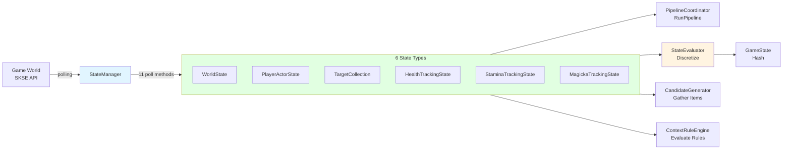

**StateManager Evolution:**
- **Before (v0.6.0)**: 9 individual sensors + ContextSensor coordinator
- **After (v0.6.1+)**: 3 state models + StateManager coordinator + 7 poll methods
- **v0.6.6**: Added resistances, transformation, follower tracking
- **v0.6.9**: Added StaminaTrackingState + MagickaTrackingState (11 poll methods total)
- **v0.12.x**: Added HealthTrackingState + enrichment via DamageEventSink

---

## File Organization (v0.6.x+)

The StateManager implementation is split across multiple files for maintainability:

| File | Contents | Notes |
|------|----------|-------|
| `StateManager.h` | Class interface, all declarations | Single public interface |
| `StateManager.cpp` | Constructor, Update(), ForceUpdate(), state accessors | Core logic |
| `StateManager_World.cpp` | `PollWorldObjects()`, crosshair helpers | Locks, workstations, time |
| `StateManager_Vitals.cpp` | `PollPlayerVitals()` | Health/magicka/stamina |
| `StateManager_MagicEffects.cpp` | `PollPlayerMagicEffects()`, `CacheRaceFormIDs()` | Effects + buffs classification |
| `StateManager_Equipment.cpp` | `PollPlayerEquipment()` | Weapons, charge, ammo |
| `StateManager_Survival.cpp` | `PollPlayerSurvival()`, `CacheSurvivalGlobals()` | Hunger, cold, fatigue |
| `StateManager_Position.cpp` | `PollPlayerPosition()` | Swimming, sneaking, combat |
| `StateManager_Targets.cpp` | `PollTargets()`, target management helpers | Multi-target tracking |
| `StateManager_HealthTracking.cpp` | `PollHealthTracking()` | Health damage/healing events, rates |
| `StateManager_Resistances.cpp` | `PollPlayerResistances()` | Elemental resistances |
| `StateManager_StaminaTracking.cpp` | `PollStaminaTracking()` | Stamina usage/regen tracking (v0.6.9) |
| `StateManager_MagickaTracking.cpp` | `PollMagickaTracking()` | Magicka usage/regen tracking (v0.6.9) |

**Benefits:**
- Focused files: Each poll method in its own file with related helpers
- Parallel compilation: MSVC can compile sensor files concurrently
- Easier code review: Changes isolated to relevant sensor files
- Header unchanged: `StateManager.h` remains the single public interface

---

## Six State Types

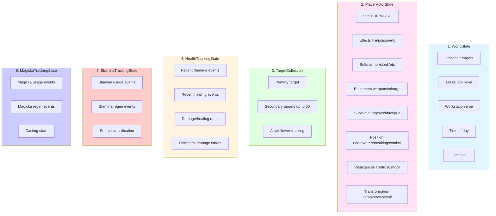

### 1. WorldState ([src/state/WorldState.h](../../src/state/WorldState.h))

Observable world objects that the player can interact with.

| Field | Type | Description |
|-------|------|-------------|
| `timeOfDay` | `float` | 0-24 hour format |
| `lightLevel` | `float` | 0.0=dark, 1.0=bright |
| `isInterior` | `bool` | True if in interior cell |
| `isLookingAtLock` | `bool` | Crosshair on locked container/door |
| `lockLevel` | `int` | 0=Novice, 1=Apprentice, 2=Adept, 3=Expert, 4=Master, 5=Requires Key |
| `isLookingAtOreVein` | `bool` | Crosshair on ore vein |
| `isLookingAtWorkstation` | `bool` | Crosshair on workstation |
| `workstationType` | `uint8_t` | 0=None, 1=Forge, 2=Smithing, 3=Enchanting, 4=EnchantExp, 5=Alchemy, 6=AlchemyExp, 7=Tanning, 8=Smelter, 9=Cooking |

**Poll Method:** `PollWorldObjects()` at 100ms interval (responsive crosshair detection)

### 2. PlayerActorState ([src/state/PlayerActorState.h](../../src/state/PlayerActorState.h))

Complete player state snapshot with 8 sub-components:

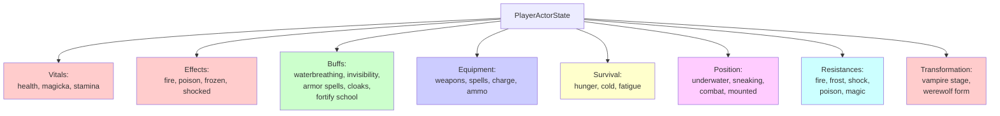

#### Vitals
| Field | Type | Description | Poll |
|-------|------|-------------|------|
| `health`, `magicka`, `stamina` | `float` | 0.0-1.0 percentage | 100ms |
| `maxHealth`, `maxMagicka`, `maxStamina` | `float` | Current max values (after debuffs) | 100ms |
| `baseMaxHealth`, `baseMaxMagicka`, `baseMaxStamina` | `float` | Base max (before debuffs) | 100ms |

**Poll Method:** `PollPlayerVitals()` at 100ms interval

#### Active Effects
| Field | Type | Description | Poll |
|-------|------|-------------|------|
| `isOnFire`, `isPoisoned`, `isFrozen`, `isShocked` | `bool` | Damage over time effects | 100ms |
| `isDiseased` | `bool` | Disease status | 100ms |
| `hasMagickaPoison`, `hasStaminaPoison` | `bool` | Resource damage | 100ms |
| `hasHealthDrain` | `bool` | Bleeding effect | 100ms |

**Poll Method:** `PollPlayerMagicEffects()` at 100ms interval (combined with buffs)

#### Active Buffs
| Field | Type | Description | Poll |
|-------|------|-------------|------|
| `hasWaterBreathing` | `bool` | Water breathing active | 100ms |
| `isInvisible` | `bool` | Invisibility active | 100ms |
| `hasMuffle` | `bool` | Muffle active | 100ms |
| `hasArmorBuff` | `bool` | Any armor spell active (Oakflesh, etc.) | 100ms |
| `hasCloakActive` | `bool` | Any cloak spell active | 100ms |
| `activeCloakType` | `EffectType` | Fire/Frost/Shock cloak | 100ms |
| `hasActiveSummon` | `bool` | Conjured creature active | 100ms |
| `hasHealthRegenBuff` | `bool` | Fortify Health Regen (v0.6.6) | 100ms |
| `hasHealthRegenDebuff` | `bool` | Damage Health Regen (v0.6.6) | 100ms |
| `hasMagickaRegenBuff` | `bool` | Fortify Magicka Regen (v0.6.6) | 100ms |
| `hasMagickaRegenDebuff` | `bool` | Damage Magicka Regen (v0.6.6) | 100ms |
| `hasStaminaRegenBuff` | `bool` | Fortify Stamina Regen (v0.6.6) | 100ms |
| `hasStaminaRegenDebuff` | `bool` | Damage Stamina Regen (v0.6.6) | 100ms |
| `hasFortifyDestruction` | `bool` | Fortify Destruction school (v0.8.x) | 100ms |
| `hasFortifyConjuration` | `bool` | Fortify Conjuration school (v0.8.x) | 100ms |
| `hasFortifyRestoration` | `bool` | Fortify Restoration school (v0.8.x) | 100ms |
| `hasFortifyAlteration` | `bool` | Fortify Alteration school (v0.8.x) | 100ms |
| `hasFortifyIllusion` | `bool` | Fortify Illusion school (v0.8.x) | 100ms |
| `hasFortifyEnchanting` | `bool` | Fortify Enchanting (v0.8.x) | 100ms |

**Poll Method:** `PollPlayerMagicEffects()` at 100ms interval (combined with effects)

The Fortify Magic School buffs (v0.8.x) enable spell synergy — when a Fortify school buff is active, spells of that school get a correlation bonus in scoring.

#### Equipment
| Field | Type | Description | Poll |
|-------|------|-------------|------|
| `rightHandWeapon`, `leftHandWeapon` | `FormID` | Equipped weapon form IDs | 100ms |
| `rightHandSpell`, `leftHandSpell` | `FormID` | Equipped spell form IDs (0=none) | 100ms |
| `equippedShield` | `FormID` | Shield form ID | 100ms |
| `weaponChargePercent` | `float` | 0.0-1.0 charge | 100ms |
| `weaponChargeMax` | `float` | Max charge value | 100ms |
| `hasEnchantedWeapon` | `bool` | Equipped weapon has enchantment | 100ms |
| `arrowCount`, `boltCount` | `int32_t` | Ammo count | 100ms |
| `hasBowEquipped` | `bool` | Bow equipped | 100ms |
| `hasCrossbowEquipped` | `bool` | Crossbow equipped | 100ms |
| `hasMeleeEquipped` | `bool` | Melee weapon equipped | 100ms |
| `hasOneHandedEquipped` | `bool` | One-handed weapon equipped | 100ms |
| `hasTwoHandedEquipped` | `bool` | Two-handed weapon equipped | 100ms |
| `hasStaffEquipped` | `bool` | Staff equipped | 100ms |
| `hasShieldEquipped` | `bool` | Shield equipped | 100ms |
| `hasSpellEquipped` | `bool` | Spell equipped in hand | 100ms |
| `hasTorchEquipped` | `bool` | Torch equipped | 100ms |
| `equippedAmmoName` | `std::string` | Name of equipped arrow/bolt (for display) | 100ms |
| `equippedAmmoDamage` | `float` | Base damage of equipped ammo | 100ms |

**Poll Method:** `PollPlayerEquipment()` at 100ms interval (fast charge tracking)

#### Survival (Creation Club / Mods)
| Field | Type | Description | Poll |
|-------|------|-------------|------|
| `survivalModeActive` | `bool` | Survival mode enabled | 1000ms |
| `hungerLevel` | `int` | 0=Well Fed → 5=Starving (6 levels) | 1000ms |
| `coldLevel` | `int` | 0=Warm → 5=Numb (6 levels) | 1000ms |
| `fatigueLevel` | `int` | -3=Well Rested → 4=Debilitated (8 levels) | 1000ms |
| `warmthRating` | `float` | Current warmth from gear/buffs (v0.6.6) | 1000ms |

**Poll Method:** `PollPlayerSurvival()` at 1000ms interval (slow-changing state)

**Survival Levels** (from `StateConstants.h::SurvivalThreshold`):
- **Hunger:** Well Fed (0), Fed (1), Peckish (2), Hungry (3), Famished (4), Starving (5)
- **Cold:** Warm (0), Comfortable (1), Chilly (2), Very Cold (3), Freezing (4), Numb (5)
- **Fatigue:** Well Rested (-3), Rested (-2), Refreshed (0), Slightly Tired (1), Tired (2), Weary (3), Debilitated (4)

#### Position/State
| Field | Type | Description | Poll |
|-------|------|-------------|------|
| `isUnderwater` | `bool` | Head is underwater | 100ms |
| `isSwimming` | `bool` | Currently swimming | 100ms |
| `isFalling` | `bool` | Falling through air | 100ms |
| `heightAboveGround` | `float` | Fall detection | 100ms |
| `isOverencumbered` | `bool` | Carry weight exceeded | 100ms |
| `isSneaking` | `bool` | In sneak mode | 100ms |
| `isInCombat` | `bool` | In combat state | 100ms |
| `isMounted` | `bool` | On horse or dragon | 100ms |
| `isMountedOnDragon` | `bool` | Specifically mounted on dragon | 100ms |

**Poll Method:** `PollPlayerPosition()` at 100ms interval (responsive combat detection)

#### Resistances (v0.6.6)
| Field | Type | Description | Poll |
|-------|------|-------------|------|
| `fire` | `float` | Fire resistance % (0-100+, can be negative) | 500ms |
| `frost` | `float` | Frost resistance % | 500ms |
| `shock` | `float` | Shock resistance % | 500ms |
| `poison` | `float` | Poison resistance % | 500ms |
| `magic` | `float` | Magic resistance % | 500ms |

**Poll Method:** `PollPlayerResistances()` at 500ms interval

#### Transformation State (v0.6.6)
| Field | Type | Description | Poll |
|-------|------|-------------|------|
| `vampireStage` | `int` | 0=Not vampire, 1-4=Vampire stage | 100ms |
| `isWerewolf` | `bool` | Has beast blood (can transform) | 100ms |
| `isInBeastForm` | `bool` | Currently transformed | 100ms |

**Poll Method:** `PollPlayerMagicEffects()` at 100ms interval (combined with magic effects)

### 3. TargetCollection ([src/state/TargetActorState.h](../../src/state/TargetActorState.h))

Multi-target tracking for combat awareness.

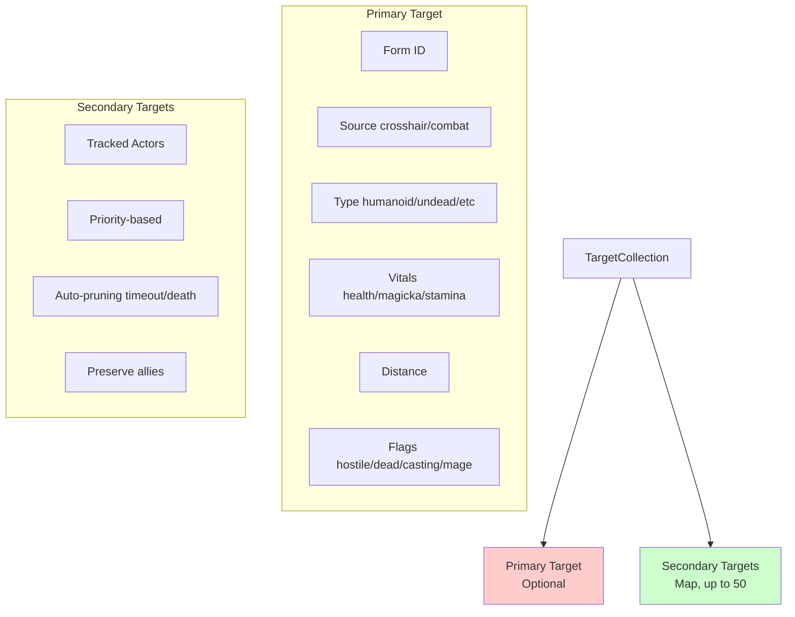

#### Primary Target (Optional)
| Field | Type | Description |
|-------|------|-------------|
| `actorFormID` | `FormID` | Actor form ID |
| `source` | `TargetSource` | Crosshair, CombatPrimary, NearbyEnemy, NearbyAlly |
| `targetType` | `TargetType` | Humanoid, Undead, Beast, Dragon, Construct |
| `vitals` | `ActorVitals` | Health/magicka/stamina (shared component) |
| `distanceToPlayerSq` | `float` | Squared distance (performance) |
| `isHostile` | `bool` | Target is hostile |
| `isDead` | `bool` | Target is dead |
| `isCasting` | `bool` | Target is casting a spell |
| `isFollower` | `bool` | Target is player's teammate (v0.6.10) |
| `isMage` | `bool` | Target has spell equipped in either hand (v0.6.11) |
| `level` | `uint16_t` | Actor level for illusion spell caps (v0.6.6) |
| `isStaggered` | `bool` | Target is staggered - damage window (v0.6.6) |
| `lastSeenTime` | `float` | Game time when last detected |
| `lastVitalsPollTime` | `float` | Game time when vitals were last polled (v0.6.11) |
| `priority` | `float` | Tracking priority score |

#### Secondary Targets (Map)
- Up to 50 tracked actors (`MAX_TRACKED_TARGETS`)
- Automatic pruning (3s timeout, 5s for dead)
- Priority-based eviction when full

**Poll Method:** `PollTargets()` at 100ms interval (combat responsiveness)

#### Ally/Follower Tracking (v0.6.12)

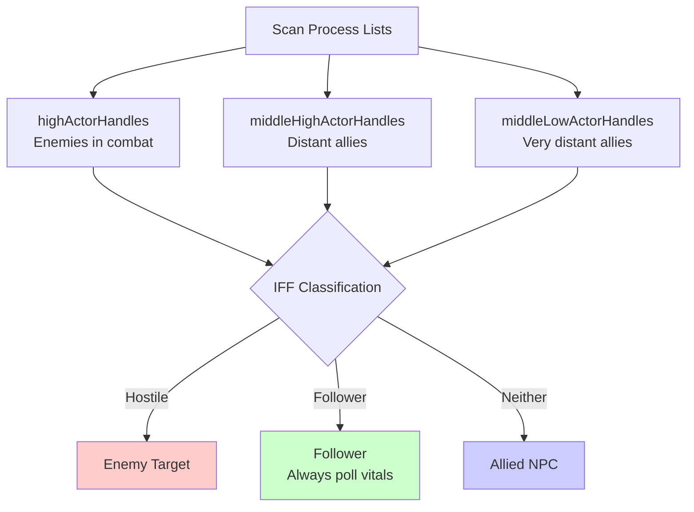

**Detection:** Allies are scanned from all three process levels (`highActorHandles`, `middleHighActorHandles`, `middleLowActorHandles`) to detect distant allies that the game engine has demoted from high process. Enemies in combat remain in high process, but allies at distance may be in middle process levels.

**Crosshair Limitation:** Skyrim's `CrosshairPickData` API only detects actors within ~400 units. Beyond this range, allies appear in secondary targets but won't become primary until closer. This is a game engine limitation.

**Follower HP Tracking:** Followers (`isFollower=true`) always have their vitals polled regardless of distance (controlled by `ALWAYS_POLL_FOLLOWER_VITALS`). This enables healing spell recommendations based on follower health.

**IFF Classification:**
- `isHostile=true` → Hostile (enemy)
- `isFollower=true` → Follower (player teammate)
- `isHostile=false && isFollower=false` → Allied (friendly NPC like guards, merchants)

**Target Priority Formula:**
```cpp
priority = (10.0f / distance) + sourceBonus + stateBonus
  where:
    sourceBonus = crosshair(15.0) | combat(10.0) | nearby(0.0)
    stateBonus = hostile(5.0) + lowHealth(3.0)
```

### 4. HealthTrackingState ([src/state/StateTypes.h](../../src/state/StateTypes.h))

Tracks recent damage and healing for ward/shield spell recommendations and elemental resist context.

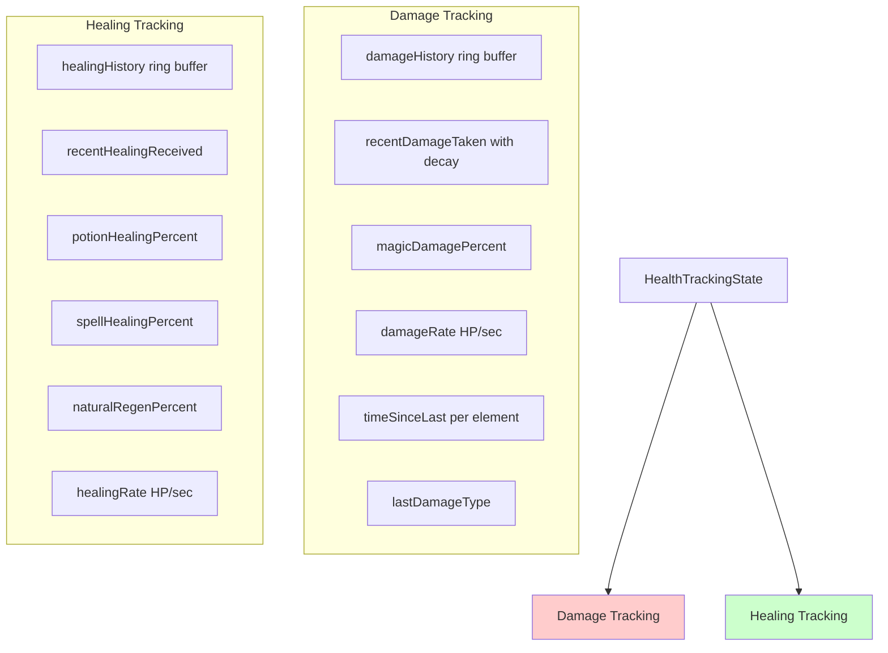

#### Damage Tracking
| Field | Type | Description |
|-------|------|-------------|
| `damageHistory` | `EventRingBuffer<DamageEvent, 10>` | Recent damage events (max 10) |
| `recentDamageTaken` | `float` | Total damage in last 2s (with decay) |
| `magicDamagePercent` | `float` | % of recent damage that was magic (0.0-1.0) |
| `takingMagicDamage` | `bool` | Any recent damage was magic |
| `damageRate` | `float` | HP/sec damage rate |
| `timeSinceLastHit` | `float` | Seconds since last damage (99 = not recent) |
| `lastDamageType` | `DamageType` | Most recent damage type (v0.6.7) |
| `timeSinceLastFire` | `float` | Seconds since last fire damage (v0.6.7) |
| `timeSinceLastFrost` | `float` | Seconds since last frost damage (v0.6.7) |
| `timeSinceLastShock` | `float` | Seconds since last shock damage (v0.6.7) |
| `timeSinceLastPoison` | `float` | Seconds since last poison damage (v0.6.7) |
| `damageIncreasing` | `bool` | Damage rate is accelerating |
| `damageDecreasing` | `bool` | Damage rate is decelerating |

#### Healing Tracking
| Field | Type | Description |
|-------|------|-------------|
| `healingHistory` | `EventRingBuffer<HealingEvent, 10>` | Recent healing events (max 10) |
| `recentHealingReceived` | `float` | Total healing in last 2s (with decay) |
| `potionHealingPercent` | `float` | % from potions (0.0-1.0) |
| `spellHealingPercent` | `float` | % from spells (0.0-1.0) |
| `naturalRegenPercent` | `float` | % from natural regen (0.0-1.0) |
| `healingRate` | `float` | HP/sec healing rate |
| `timeSinceLastHeal` | `float` | Seconds since last healing (99 = not recent) |
| `healingIncreasing` | `bool` | Healing rate is accelerating |
| `healingDecreasing` | `bool` | Healing rate is decelerating |

**Poll Method:** `PollHealthTracking()` at 100ms interval

**Enrichment:** Data from `DamageEventSink` (instant elemental hits detected) is combined with health delta polling for comprehensive damage tracking. The `PipelineCoordinator::EnrichElementalDamage()` step bridges the elemental timers into `PlayerActorState.effects` flags before scoring.

**DamageType enum** (v0.6.7):
- `Physical` - Melee, arrows, fall damage
- `Fire` - Fire spells, dragon breath
- `Frost` - Frost spells, ice traps
- `Shock` - Shock spells, lightning
- `Poison` - Poison damage over time
- `Disease` - Disease damage (rare)
- `Magic` - Generic magic damage
- `Unknown` - Unable to classify

### 5. StaminaTrackingState ([src/state/StateTypes.h](../../src/state/StateTypes.h))

Tracks stamina consumption and recovery for stamina-related recommendations (v0.6.9).

| Field | Type | Description |
|-------|------|-------------|
| `usage` | `ResourceFlowTracker<StaminaUsageEvent>` | Usage history, rate, trends |
| `regen` | `ResourceFlowTracker<StaminaRegenEvent>` | Regen history, rate, trends |
| `powerAttackPercent` | `float` | % of recent usage from power attacks (0.0-1.0) |
| `sprintPercent` | `float` | % of recent usage from sprinting (0.0-1.0) |

**Poll Method:** `PollStaminaTracking()` at 100ms interval

**StaminaUsageSource enum:**
- `Unknown` - Unable to classify
- `PowerAttack` - Heavy melee swing
- `Sprint` - Running
- `Block` - Shield block
- `Jump` - Jumping
- `ShieldBash` - Offensive bash
- `Swimming` - Swimming movement

### 6. MagickaTrackingState ([src/state/StateTypes.h](../../src/state/StateTypes.h))

Tracks magicka consumption and recovery for magicka-related recommendations (v0.6.9).

| Field | Type | Description |
|-------|------|-------------|
| `usage` | `ResourceFlowTracker<MagickaUsageEvent>` | Usage history, rate, trends |
| `regen` | `ResourceFlowTracker<MagickaRegenEvent>` | Regen history, rate, trends |
| `isChanneling` | `bool` | Concentration spell active |
| `isHoldingWard` | `bool` | Ward being maintained |
| `instantCastPercent` | `float` | % of recent usage from instant casts (0.0-1.0) |
| `concentrationPercent` | `float` | % of recent usage from concentration spells (0.0-1.0) |

**Poll Method:** `PollMagickaTracking()` at 100ms interval

**MagickaUsageSource enum:**
- `Unknown` - Unable to classify
- `SpellCast` - Instant cast
- `Concentration` - Sustained spell (flames, healing)
- `Ward` - Ward maintenance
- `Staff` - Staff discharge

### ResourceFlowTracker Template

Both `StaminaTrackingState` and `MagickaTrackingState` use `ResourceFlowTracker<T>`, a generic tracker for resource consumption/recovery with exponential decay:

| Field | Type | Description |
|-------|------|-------------|
| `history` | `EventRingBuffer<T, 10>` | Event ring buffer |
| `recentAmount` | `float` | Total in active window |
| `rate` | `float` | Units per second |
| `timeSinceLast` | `float` | Seconds since last event (99 = sentinel) |
| `isIncreasing` | `bool` | Rate accelerating |
| `isDecreasing` | `bool` | Rate decelerating |

---

## Data Flow: Polling Loop

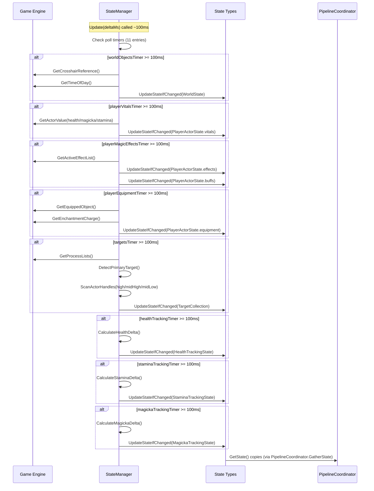

**Thread Safety:**
- Each poll method builds state locally, then atomically updates via `UpdateStateIfChanged()`
- `UpdateStateIfChanged()` acquires unique lock for compare-and-swap (reduces contention)
- Copy-out pattern for consumer access (shared locks for reads)
- Short critical sections minimize lock holding time

---

## Data Flow: State Types → Consumers

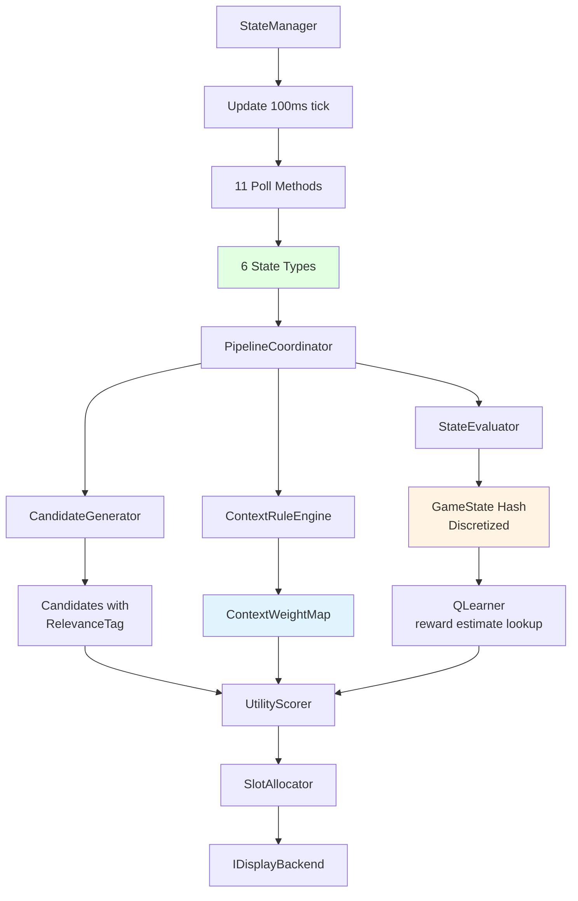

**State Consumers:**

| Consumer | Uses | Purpose |
|----------|------|---------|
| **PipelineCoordinator** | All 6 state types | Orchestrates pipeline, passes state to each step |
| **StateEvaluator** | WorldState, PlayerActorState, TargetCollection | Discretize to GameState hash (36,288 states) |
| **CandidateGenerator** | All 6 state types | Gather available items, tag relevance |
| **ContextRuleEngine** | WorldState, PlayerActorState, TargetCollection + GameState | Evaluate context rules → weight map |
| **UtilityScorer** | GameState hash | reward estimate lookup via QLearner |
| **OverrideManager** | PlayerActorState, WorldState | Override condition checks |

**StateManager Public Accessors:**

| Method | Returns | Thread Safety |
|--------|---------|---------------|
| `GetWorldState()` | `WorldState` | `shared_lock` copy-out |
| `GetPlayerState()` | `PlayerActorState` | `shared_lock` copy-out |
| `GetTargets()` | `TargetCollection` | `shared_lock` copy-out |
| `GetPrimaryTarget()` | `std::optional<TargetActorState>` | `shared_lock` copy-out |
| `GetHealthTracking()` | `HealthTrackingState` | copy-out |
| `GetStaminaTracking()` | `StaminaTrackingState` | copy-out |
| `GetMagickaTracking()` | `MagickaTrackingState` | copy-out |
| `ResetTrackingState()` | void | Resets all tracking on save load/new game |
| `PollAll()` | `bool` | Forces all polls, returns true if any changed |
| `DidLastUpdateChangeState()` | `bool` | Tier-1 pipeline skip check |

---

## Example: Healing Spell Context Weight

**State Model → Context Weight Calculation:**

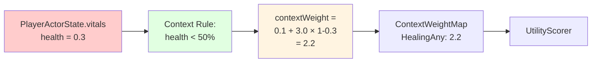

**Calculation Details:**

```cpp
// StateManager provides state models
PlayerActorState player = mgr.GetPlayerState();

// Context weight calculation uses raw continuous state
float GetWeight_RestoreHealth(const PlayerActorState& player) {
    float healthPct = player.vitals.health;  // 0.0-1.0

    if (healthPct >= 0.5f) return 0.1f;  // Baseline (healthy)

    // Scale with damage: 0.5 → 0.0 health = 0.1 → 3.1 weight
    return 0.1f + 3.0f * (1.0f - healthPct);
}

// Examples:
// health = 1.0 (100%) → weight = 0.1 (not relevant)
// health = 0.5 (50%)  → weight = 0.1 (threshold)
// health = 0.3 (30%)  → weight = 2.2 (relevant)
// health = 0.1 (10%)  → weight = 2.8 (urgent)
```

**GameState Hash → Contextual Bandit Learning:**

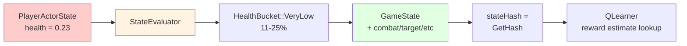

**Discretization:**

```cpp
// StateEvaluator discretizes for Q-table lookup
GameState gameState = evaluator.EvaluateCurrentState(world, player, targets);
// gameState.health = HealthBucket::VeryLow (11-25%)
// gameState.inCombat = CombatStatus::InCombat
// gameState.targetType = TargetType::Humanoid
// ... etc

uint32_t stateHash = gameState.GetHash();  // 0-36,287
float qValue = qLearner.GetQValue(stateHash, healSpellFormID);
```

**Combined Utility:**
```cpp
// Multiplicative formula (default as of v0.12.5)
utility = contextWeight × (1 + λ × learningScore) × correlationBonus
          * potionMultiplier * favoritesMultiplier

// Example values (contextWeight normalized to [0,1]):
// Assuming contextWeight=0.8, λ=2.0 (adaptive), learningScore=0.85
utility = 0.8 × (1 + 2.0 × 0.85) × 1.0 × 1.0 × 1.0
        = 0.8 × (1 + 1.7) × 1.0
        = 0.8 × 2.7
        = 2.16

// Legacy formula (available via config for backwards compatibility):
// utility = (contextWeight + λ × learningScore + correlationBonus)
//           * potionMultiplier * favoritesMultiplier
```

---

## State Representation Levels

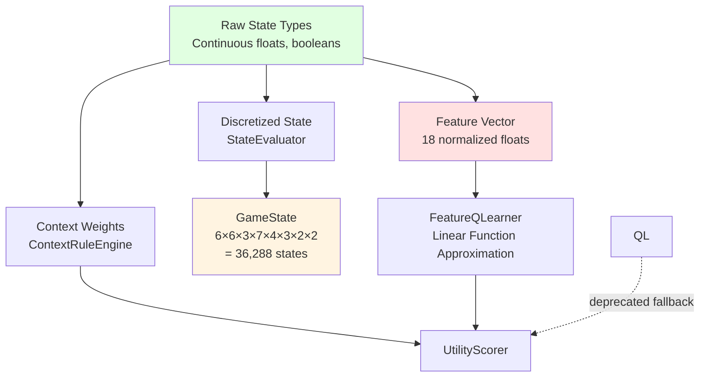

**Why Multiple Representations?**

| Level | Purpose | Granularity | Consumer |
|-------|---------|-------------|----------|
| **Raw State** (6 state types) | Context weights, slot allocation | Continuous floats, booleans | ContextRuleEngine, CandidateGenerator |
| **Discretized State** (GameState) | tabular QLearner state hash (removed in v0.13.x) | Bucketed enums (6×6×3×7×4×3×2×2, stamina excluded) | Tabular Q-table lookup |
| **Feature Vector** (StateFeatures) | Feature-based contextual bandit learning | 18 normalized floats | FeatureQLearner (linear function approximation) |

**Examples:**

1. **Raw State** (continuous): Precise heuristic calculations
   - `health = 0.23f` → `weight = 2.41` (smooth scaling)

2. **GameState** (discretized): Tractable Q-table size
   - `health = 0.23f` → `HealthBucket::VeryLow` (11-25% bucket)
   - Total states: 36,288 (reduced from 435,456 via state space reduction — stamina excluded from hash, ally dimensions collapsed)

3. **Feature Vector** (FeatureQLearner): Smooth generalization
   - `health = 0.23f` → feature stays 0.23 (continuous)
   - Linear interpolation between similar states

---

## Performance Characteristics

**Poll Overhead** (per Update call):

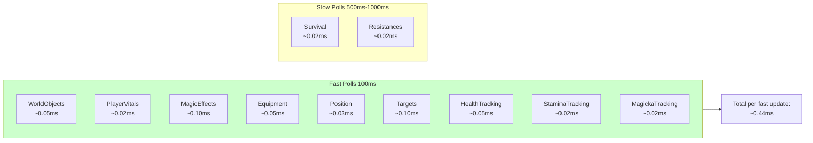

**Performance Budget:**

| Poll Method | Overhead | Interval | Notes |
|-------------|----------|----------|-------|
| WorldObjects | ~0.05ms | 100ms | Crosshair detection |
| PlayerVitals | ~0.02ms | 100ms | 3 actor value reads |
| PlayerMagicEffects | ~0.10ms | 100ms | Effect iteration |
| PlayerEquipment | ~0.05ms | 100ms | Early-exit inventory scan |
| PlayerSurvival | ~0.02ms | 1000ms | 3 actor value reads, 1s interval |
| PlayerPosition | ~0.03ms | 100ms | Boolean state reads |
| Targets | ~0.10ms | 100ms | Process lists scan + priority calc |
| HealthTracking | ~0.05ms | 100ms | Delta calculation + event merge |
| PlayerResistances | ~0.02ms | 500ms | 5 actor value reads, 0.5s interval |
| StaminaTracking | ~0.02ms | 100ms | Delta calculation + source classify |
| MagickaTracking | ~0.02ms | 100ms | Delta calculation + cast state |
| **Total (fast polls)** | **~0.44ms** | **100ms** | **Target: <0.5ms** |

**Memory Overhead:**

| Component | Size | Notes |
|-----------|------|-------|
| WorldState | ~64 bytes | Simple struct |
| PlayerActorState | ~320 bytes | 8 sub-components (incl. fortify/spell fields) |
| TargetCollection | ~6.4KB | 50 targets × 128 bytes |
| HealthTrackingState | ~512 bytes | 2 ring buffers + metrics |
| StaminaTrackingState | ~256 bytes | 2 ResourceFlowTrackers + source % |
| MagickaTrackingState | ~256 bytes | 2 ResourceFlowTrackers + cast state |
| **Total** | **~7.8KB** | **Target: <10KB** |

---

## Thread Safety

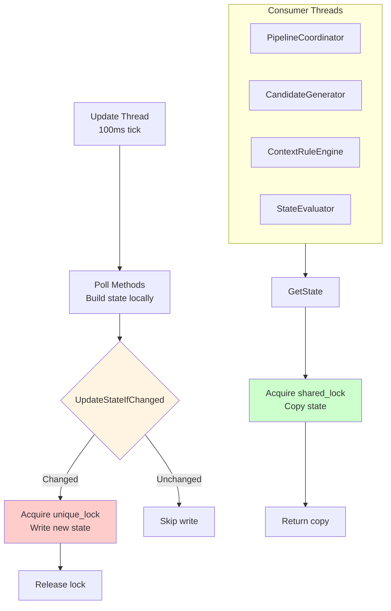

**Thread Safety Patterns:**

1. **Copy-out pattern:** Accessors return copies, not references
   ```cpp
   PlayerActorState GetPlayerState() const {
       std::shared_lock lock(m_playerMutex);
       return m_playerState;  // Copy
   }
   ```

2. **Compare-and-swap:** `UpdateStateIfChanged()` only writes if state actually changed
   ```cpp
   template<typename T>
   bool UpdateStateIfChanged(std::shared_mutex& mutex, T& current, const T& newState) {
       std::unique_lock lock(mutex);
       if (current != newState) {
           current = newState;
           return true;
       }
       return false;
   }
   ```

3. **Short critical sections:** Build state outside lock, then copy in
   ```cpp
   bool PollPlayerVitals() {
       // Build state locally (no lock)
       ActorVitals newVitals;
       newVitals.health = player->GetActorValue(kHealth);
       // ... more reads

       // Atomically update (locked)
       return UpdateStateIfChanged(m_playerMutex, m_playerState.vitals, newVitals);
   }
   ```

**Lock structure** (3 coarse-grained mutexes):
- `m_worldMutex` — Protects WorldState
- `m_playerMutex` — Protects PlayerActorState
- `m_targetsMutex` — Protects TargetCollection

Tracking states (Health/Stamina/Magicka) are single-writer (only mutated from their poll method on the update thread), so they don't require separate mutexes.

---

## Event Enrichment (v0.12.x)

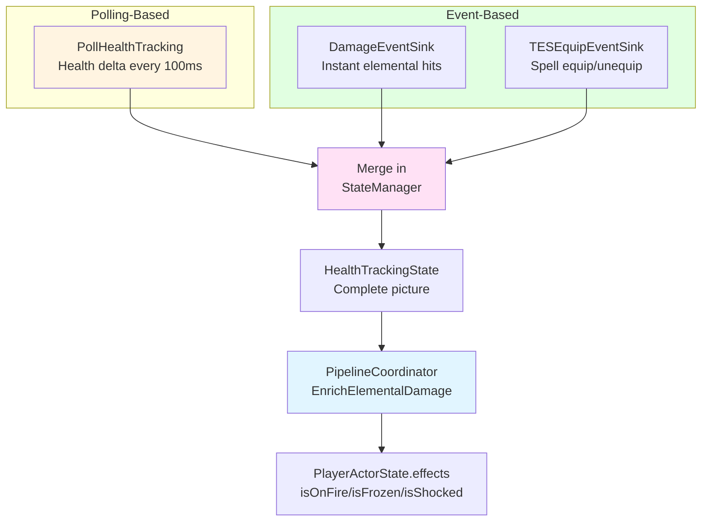

**Why Hybrid Approach:**

| Aspect | Polling | Events |
|--------|---------|--------|
| **Coverage** | All damage types | Only specific events |
| **Latency** | 100ms delay | Instant |
| **Reliability** | Always works | Event API limitations |
| **Use Case** | General damage tracking | Elemental classification |

**DamageEventSink** (v0.12.x):
- Catches instant-hit elemental damage (fire/frost/shock spells, dragon breath)
- Enriches `HealthTrackingState` with precise damage type
- Handles sub-threshold hits (high resist scenarios where polling misses small damage)

**TESEquipEventSink** (v0.12.x):
- Detects spell equip/unequip for feedback loop
- Updates equipment state immediately (no poll delay)

---

## Observable State Only (Anti-Cheat)

**Allowed Information:**
- Player's own stats (health, magicka, stamina)
- What player is looking at (crosshair target)
- Player's inventory and equipment
- Active effects on player
- Environmental conditions (underwater, time, light)
- Target vitals (observable via UI)
- Follower vitals (always polled for healing recommendations)

**Forbidden Information:**
- Enemy spell lists or abilities
- Hidden trap locations
- NPC inventories (before pickpocketing)
- Locked container contents
- Future events or predictions

**Distance Limits:**
- Crosshair detection: ~400 units (game engine limit)
- Target tracking: Up to 50 actors, pruned by priority
- Follower vitals: Always polled regardless of distance (for healing support)

---

## Current vs Target

| Aspect | Current (v0.13.x) | Target (v1.0) | Status |
|--------|-------------------|---------------|--------|
| **Poll Methods** | 11 methods, split files | No change needed | ✅ Complete |
| **State Types** | 6 types (3 core + 3 tracking) | No change needed | ✅ Complete |
| **Event Enrichment** | DamageEventSink, TESEquipEvent | Working well | ✅ Complete |
| **Thread Safety** | Copy-out + compare-and-swap | Correct pattern | ✅ Complete |
| **Pipeline Skip** | Two-tier: dirty flag + hash-based | Implemented | ✅ Complete |
| **State Space** | 36,288 states (reduced from 435,456) | 12x reduction | ✅ Complete |
| **Memory Usage** | ~7.8KB | Within budget | ✅ Complete |
| **Learning Persistence** | SKSE cosave (FQLW records) | Per-character persistence | ✅ Complete |
| **Pipeline State Cache** | Caches scored candidates per cycle | External equip attribution | ✅ Complete |
| **Feature Learning** | FeatureQLearner (18-float linear) | Active, tabular is fallback | ✅ Complete |

### Pipeline Skip Optimization (v0.13.0)

Two-tier skip system prevents unnecessary pipeline work:

1. **Sensor-level skip** (`DidLastUpdateChangeState()`): StateManager tracks whether any poll method detected a change. If no raw state changed, the entire recommendation pipeline is skipped.

2. **Hash-level skip** (`CheckHashSkip` in PipelineCoordinator): Even when raw sensor values change (e.g., health 85.1% → 85.2%), the discretized GameState hash may be identical (both map to `VeryHigh`). The hash comparison skips scoring when the Q-table lookup state is unchanged. Elemental damage activity overrides the hash skip to ensure resist spells surface promptly.

```cpp
// Tier 1: Skip entire pipeline if no sensor detected changes
bool stateChanged = stateManager.DidLastUpdateChangeState();
if (!stateChanged) return;  // Huge win when idle

// Tier 2: Skip scoring if discretized state hash is unchanged
// (with elemental damage override)
if (stateHash == lastHash && !pageChanged && !elementalDamageActive) {
    PipelineStateCache::RefreshTimestamp();  // Keep cache fresh
    return;  // Catches within-bucket shifts
}
```

---

## See Also

- [0-pipeline.md](0-pipeline.md) - Recommendation pipeline using state models
- [4-contextual-bandits.md](4-contextual-bandits.md) - GameState discretization for contextual bandit learning
- [../ARCHITECTURE.md](../ARCHITECTURE.md) - Overall system design
