# Huginn State Model

This document describes the state management architecture using the StateManager
system. **Verified against `src/` at v0.19.10 (2026-08-29).** The state layer has
been structurally stable since v0.6.x; the drift since the v0.13.x snapshot is in
the discretized `GameState` (a ninth hash dimension), the fall/underwater sensors,
the target container, and the scoring formula.

---

## Architecture Overview

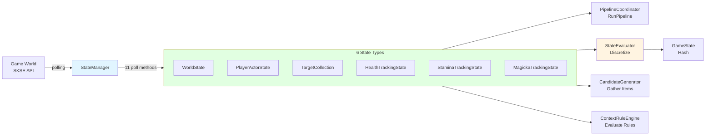

**StateManager Evolution** (versions taken from the in-source headers, not from
release notes):

- **Before (v0.6.0)**: 9 individual sensors + ContextSensor coordinator
- **After (v0.6.1+)**: 3 state models + StateManager coordinator + 7 poll methods
- **v0.6.6**: Added resistances, transformation, follower tracking
- **v0.6.8**: Added `DamageEventSink` (TESHitEvent) for instant elemental
  classification — see [DamageEventSink.h](../../src/state/DamageEventSink.h)
- **v0.6.9**: Added StaminaTrackingState + MagickaTrackingState (11 poll methods total)
- **v0.19.x**: Fall-depth tracking (`FallTracker`, #60) and a corrected underwater
  test (#61) in `PollPlayerPosition`

> `HealthTrackingState` is older than the v0.13.x snapshot claimed — its header
> dates it to v0.5.0 Phase 4, renamed in v0.6.9. What v0.12.x added was the
> enrichment path around it, not the struct.

---

## File Organization

The StateManager implementation is split across multiple files for maintainability
(list mirrors the manifest at the top of
[StateManager.cpp](../../src/state/StateManager.cpp)):

| File | Contents | Notes |
|------|----------|-------|
| `StateManager.h` | Class interface, all declarations | Single public interface |
| `StateManager.cpp` | Constructor, poll table, Update(), PollAll(), ForceUpdate(), ResetTrackingState(), accessors | Core logic |
| `StateManager_World.cpp` | `PollWorldObjects()`, crosshair helpers | Locks, ore veins, workstations, time, light |
| `StateManager_Vitals.cpp` | `PollPlayerVitals()` | Health/magicka/stamina |
| `StateManager_MagicEffects.cpp` | `PollPlayerMagicEffects()`, `CacheRaceFormIDs()` | Effects + buffs classification, transformation |
| `StateManager_Equipment.cpp` | `PollPlayerEquipment()` | Weapons, charge, ammo |
| `StateManager_Survival.cpp` | `PollPlayerSurvival()`, `CacheSurvivalGlobals()` | Hunger, cold, fatigue |
| `StateManager_Position.cpp` | `PollPlayerPosition()` | Underwater, swimming, falling, sneak, combat, mounted |
| `StateManager_Targets.cpp` | `PollTargets()`, target management helpers | Multi-target tracking |
| `StateManager_HealthTracking.cpp` | `PollHealthTracking()` | Health damage/healing events, rates |
| `StateManager_Resistances.cpp` | `PollPlayerResistances()` | Elemental resistances |
| `StateManager_StaminaTracking.cpp` | `PollStaminaTracking()` | Stamina usage/regen tracking (v0.6.9) |
| `StateManager_MagickaTracking.cpp` | `PollMagickaTracking()` | Magicka usage/regen tracking (v0.6.9) |

Supporting headers in the same directory that are *not* part of the split:
[`GameState.h`](../../src/state/GameState.h) (discretization enums),
[`StateTypes.h`](../../src/state/StateTypes.h) (tracking structs),
[`StateConstants.h`](../../src/state/StateConstants.h) (thresholds),
[`StateManagerConstants.h`](../../src/state/StateManagerConstants.h) (poll intervals,
target tracking config), [`FallTracker.h`](../../src/state/FallTracker.h), and
[`DamageEventSink.h`](../../src/state/DamageEventSink.h).

**Benefits:**
- Focused files: Each poll method in its own file with related helpers
- Parallel compilation: MSVC can compile sensor files concurrently
- Easier code review: Changes isolated to relevant sensor files
- Header unchanged: `StateManager.h` remains the single public interface

The poll loop itself is data-driven: `GetPollTable()` returns
`std::array<PollEntry, 11>` of `{timer, interval, member-fn}` triples, and
`Update()`, `PollAll()`, `ForceUpdate()` and `ResetTrackingState()` all iterate it.
Adding a poll means adding one row.

---

## Six State Types

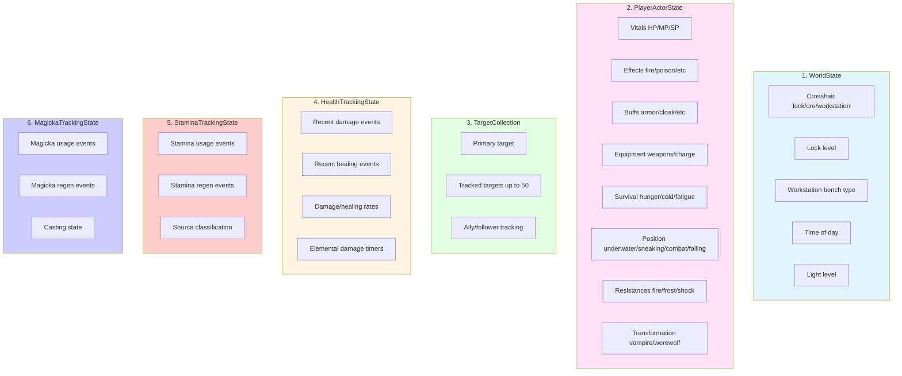

### 1. WorldState ([src/state/WorldState.h](../../src/state/WorldState.h))

Observable world objects that the player can interact with.

| Field | Type | Description |
|-------|------|-------------|
| `timeOfDay` | `float` | 0-24 hour format |
| `lightLevel` | `float` | 0.0=dark, 1.0=bright, quantized to 10% steps |
| `isInterior` | `bool` | True if in interior cell |
| `isLookingAtLock` | `bool` | Crosshair on locked container/door |
| `lockLevel` | `int` | 0=Novice, 1=Apprentice, 2=Adept, 3=Expert, 4=Master, 5=Requires Key |
| `isLookingAtOreVein` | `bool` | Crosshair on ore vein |
| `isLookingAtWorkstation` | `bool` | Crosshair on workstation |
| `workstationType` | `uint8_t` | Raw `RE::TESFurniture::WorkBenchData::BenchType` |

`workstationType` is stored verbatim as the game's own bench-type enum — it is
**not** remapped:

| Value | BenchType | In practice |
|---|---|---|
| 0 | `kNone` | Not a workstation (never stored; the flag stays false) |
| 1 | `kCreateObject` | Forge / cooking pot / smelter / tanning rack |
| 2 | `kSmithingWeapon` | Grindstone |
| 3 | `kEnchanting` | Arcane enchanter |
| 4 | `kEnchantingExperiment` | Enchanting experiment bench |
| 5 | `kAlchemy` | Alchemy lab |
| 6 | `kAlchemyExperiment` | Alchemy experiment bench |
| 7 | `kSmithingArmor` | Armour workbench |

<!-- UNVERIFIED: the "In practice" column maps bench types to the furniture the
player recognises. It is the standard Skyrim mapping, but nothing in src/ asserts
it — the code only stores the raw enum. -->

**Poll Method:** `PollWorldObjects()` at 100ms interval (responsive crosshair detection)

Light level is *derived*, not sampled: interiors get a fixed
`LightLevel::INTERIOR_DEFAULT`, exteriors get a triangular daylight curve peaking
at noon and floored at `LightLevel::NIGHTTIME_BASE`, then the result is quantized
to 10% steps to keep the dirty flag from firing every tick.

Ore-vein detection keyword-matches the base object once per FormID and memoizes
the answer in a positive and a negative cache (`m_oreVeinCache`,
`m_notOreVeinCache`), both cleared by `ResetTrackingState()`.

### 2. PlayerActorState ([src/state/PlayerActorState.h](../../src/state/PlayerActorState.h))

Complete player state snapshot. Four of the sub-components are named structs
(`ActorVitals`, `ActorEffects`, `ActorBuffs`, `ActorResistances`, the first three
shared with `TargetActorState`); equipment, survival, transformation and position
are flat fields on `PlayerActorState` itself.

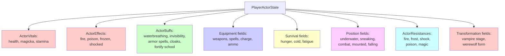

#### Vitals (`ActorVitals`)
| Field | Type | Description | Poll |
|-------|------|-------------|------|
| `health`, `magicka`, `stamina` | `float` | 0.0-1.0 percentage | 100ms |
| `maxHealth`, `maxMagicka`, `maxStamina` | `float` | Effective max values (after debuffs) | 100ms |
| `baseMaxHealth`, `baseMaxMagicka`, `baseMaxStamina` | `float` | Base max (before debuffs) | 100ms |

**Poll Method:** `PollPlayerVitals()` at 100ms interval

#### Active Effects (`ActorEffects`)
| Field | Type | Description | Poll |
|-------|------|-------------|------|
| `isOnFire`, `isPoisoned`, `isFrozen`, `isShocked` | `bool` | Damage over time effects | 100ms |
| `isDiseased` | `bool` | Disease status | 100ms |
| `hasMagickaPoison`, `hasStaminaPoison` | `bool` | Resource damage | 100ms |
| `hasHealthDrain` | `bool` | Bleeding effect | 100ms |

**Poll Method:** `PollPlayerMagicEffects()` at 100ms interval (combined with buffs)

`isOnFire` / `isFrozen` / `isShocked` are also written *after* polling, by
`PipelineCoordinator::EnrichElementalDamage()` — see [Event Enrichment](#event-enrichment).

#### Active Buffs (`ActorBuffs`)
| Field | Type | Description | Poll |
|-------|------|-------------|------|
| `hasWaterBreathing` | `bool` | Water breathing active | 100ms |
| `isInvisible` | `bool` | Invisibility active | 100ms |
| `hasMuffle` | `bool` | Muffle active | 100ms |
| `hasArmorBuff` | `bool` | Any armor spell active (Oakflesh, etc.) | 100ms |
| `hasCloakActive` | `bool` | Any cloak spell active | 100ms |
| `activeCloakType` | `EffectType` | None/CloakFire/CloakFrost/CloakShock | 100ms |
| `hasActiveSummon` | `bool` | Conjured creature active | 100ms |
| `hasHealthRegenBuff` | `bool` | Fortify Health Regen (v0.6.6) | 100ms |
| `hasHealthRegenDebuff` | `bool` | Damage Health Regen (v0.6.6) | 100ms |
| `hasMagickaRegenBuff` | `bool` | Fortify Magicka Regen (v0.6.6) | 100ms |
| `hasMagickaRegenDebuff` | `bool` | Damage Magicka Regen (v0.6.6) | 100ms |
| `hasStaminaRegenBuff` | `bool` | Fortify Stamina Regen (v0.6.6) | 100ms |
| `hasStaminaRegenDebuff` | `bool` | Damage Stamina Regen (v0.6.6) | 100ms |
| `hasFortifyDestruction` | `bool` | Fortify Destruction school (v0.8.x) | 100ms |
| `hasFortifyConjuration` | `bool` | Fortify Conjuration school (v0.8.x) | 100ms |
| `hasFortifyRestoration` | `bool` | Fortify Restoration school (v0.8.x) | 100ms |
| `hasFortifyAlteration` | `bool` | Fortify Alteration school (v0.8.x) | 100ms |
| `hasFortifyIllusion` | `bool` | Fortify Illusion school (v0.8.x) | 100ms |
| `hasFortifyEnchanting` | `bool` | Fortify Enchanting (v0.8.x) — not a school, same pattern | 100ms |

**Poll Method:** `PollPlayerMagicEffects()` at 100ms interval (combined with effects)

The Fortify Magic School buffs enable spell synergy — when a Fortify school buff is
active, spells of that school get a correlation bonus in scoring (see
[`CorrelationBooster`](../../src/learning/CorrelationBooster.h)).

#### Equipment
| Field | Type | Description | Poll |
|-------|------|-------------|------|
| `rightHandWeapon`, `leftHandWeapon` | `RE::FormID` | Equipped weapon form IDs | 100ms |
| `rightHandSpell`, `leftHandSpell` | `RE::FormID` | Equipped spell form IDs (0=none) | 100ms |
| `equippedShield` | `RE::FormID` | Shield form ID | 100ms |
| `weaponChargePercent` | `float` | 0.0-1.0 charge | 100ms |
| `weaponChargeMax` | `float` | Max charge value | 100ms |
| `hasEnchantedWeapon` | `bool` | Equipped weapon has enchantment (staves count) | 100ms |
| `arrowCount`, `boltCount` | `std::int32_t` | Ammo count | 100ms |
| `hasBowEquipped` | `bool` | Bow equipped | 100ms |
| `hasCrossbowEquipped` | `bool` | Crossbow equipped | 100ms |
| `hasMeleeEquipped` | `bool` | Melee weapon equipped | 100ms |
| `hasOneHandedEquipped` | `bool` | One-handed weapon equipped | 100ms |
| `hasTwoHandedEquipped` | `bool` | Two-handed weapon equipped | 100ms |
| `hasStaffEquipped` | `bool` | Staff equipped | 100ms |
| `hasShieldEquipped` | `bool` | Shield equipped | 100ms |
| `hasSpellEquipped` | `bool` | Spell equipped in hand | 100ms |
| `hasTorchEquipped` | `bool` | Torch equipped | 100ms |
| `equippedAmmoFormID` | `RE::FormID` | FormID of equipped arrow/bolt; the display name is looked up at render time | 100ms |
| `equippedAmmoDamage` | `float` | Base damage of equipped ammo | 100ms |

**Poll Method:** `PollPlayerEquipment()` at 100ms interval (fast charge tracking)

> The ammo field holds a **FormID, not a name**. Earlier revisions stored a
> `std::string equippedAmmoName`, which made `PlayerActorState` non-trivially
> copyable on the copy-out path; the struct is now all POD.

Weapon charge is read from the `kRightItemCharge` actor value (what the game's own
HUD reads), divided by the enchantment's `amountofEnchantment` — **not** from
`ExtraCharge` inventory data, which is lazily created and unreliable for
base-enchanted weapons.

#### Survival (Creation Club / Mods)
| Field | Type | Description | Poll |
|-------|------|-------------|------|
| `survivalModeActive` | `bool` | Survival mode enabled | 1000ms |
| `hungerLevel` | `int` | 0=Well Fed → 5=Starving (6 levels) | 1000ms |
| `coldLevel` | `int` | 0=Warm → 5=Numb (6 levels) | 1000ms |
| `fatigueLevel` | `int` | -3=Well Rested → 4=Debilitated (8 levels) | 1000ms |
| `warmthRating` | `float` | Current warmth from gear/buffs (v0.6.6) | 1000ms |

**Poll Method:** `PollPlayerSurvival()` at 1000ms interval (slow-changing state)

**Survival Levels** (from `StateConstants.h::SurvivalThreshold`):
- **Hunger:** Well Fed (0), Fed (1), Peckish (2), Hungry (3), Famished (4), Starving (5)
- **Cold:** Warm (0), Comfortable (1), Chilly (2), Very Cold (3), Freezing (4), Numb (5)
- **Fatigue:** Well Rested (-3), Lover's Comfort (-3), Rested (-2), Refreshed (0),
  Slightly Tired (1), Tired (2), Weary (3), Debilitated (4)

Values come from cached `TESGlobal` pointers rather than effect-name parsing —
CC Survival Mode globals, plus a separate SMI (`SurvivalModeImproved.esp`) path
with pre-computed stage globals and per-need enable flags. Warmth comes from the
CC Survival engine's own `GetWarmthRating` function pointer when it resolves.

#### Position/State
| Field | Type | Description | Poll |
|-------|------|-------------|------|
| `isUnderwater` | `bool` | Head is underwater | 100ms |
| `isSwimming` | `bool` | Currently swimming | 100ms |
| `isFalling` | `bool` | A *real* fall — `fallDepth >= PhysicsConstants::FALL_DEPTH_MIN` | 100ms |
| `fallDepth` | `float` | Descent below the point the player last left the ground (Skyrim units); 0 while grounded and across an ordinary jump | 100ms |
| `isOverencumbered` | `bool` | Carry weight exceeded | 100ms |
| `isSneaking` | `bool` | In sneak mode | 100ms |
| `isInCombat` | `bool` | In combat state | 100ms |
| `isMounted` | `bool` | On horse or dragon | 100ms |
| `isMountedOnDragon` | `bool` | Specifically mounted on dragon | 100ms |

**Poll Method:** `PollPlayerPosition()` at 100ms interval (responsive combat detection)

Two v0.19.x corrections live here:

- **Falling (#60).** `heightAboveGround` is gone. Raw `IsInMidair()` is true for
  every jump, kerb-hop and knockback, which drove `slowFallWeight` to full
  constantly. [`FallTracker`](../../src/state/FallTracker.h) anchors on the take-off
  Z and reports the descent below it, with a plausibility clamp of
  `MAX_FALL_SPEED × pollInterval` per sample; swimming is excluded before the
  tracker sees it. The anchor is single-writer in this poll and **must** be reset
  by `ResetTrackingState()` — the previous save's take-off Z describes a different
  world position.
- **Underwater (#61).** The test now uses `GetWaterHeight()` (the height of the
  water this reference is actually in) rather than the cell's water plane, which
  was wrong wherever local water is a placed object — rivers and ponds, not just
  interiors. Still head-relative (`z + HEAD_HEIGHT`), so ankle-deep does not count.

This poll also owns the combat-transition latch: it sets `m_isInCombat` and
`m_combatTransition` (`None`/`Entered`/`Exited`) so the update loop can observe a
combat edge without copying the whole `PlayerActorState`.

#### Resistances (`ActorResistances`, v0.6.6)
| Field | Type | Description | Poll |
|-------|------|-------------|------|
| `fire` | `float` | Fire resistance % (0-100+, can be negative) | 500ms |
| `frost` | `float` | Frost resistance % | 500ms |
| `shock` | `float` | Shock resistance % | 500ms |
| `poison` | `float` | Poison resistance % | 500ms |
| `magic` | `float` | Magic resistance % | 500ms |

**Poll Method:** `PollPlayerResistances()` at 500ms interval

Two threshold tiers are exposed: `HasHigh*Resist()` (deprioritize resist items)
and `Is*ResistCapped()` (resist items nearly useless).

#### Transformation State (v0.6.6)
| Field | Type | Description | Poll |
|-------|------|-------------|------|
| `vampireStage` | `int` | 0=Not vampire, 1-4=Vampire stage | 100ms |
| `isWerewolf` | `bool` | Has beast blood (can transform) | 100ms |
| `isInBeastForm` | `bool` | Currently transformed | 100ms |

**Poll Method:** `PollPlayerMagicEffects()` at 100ms interval (combined with magic effects)

Race lookups are memoized in `m_vampireRaceFormIDs` / `m_werewolfBeastFormID` /
`m_werewolfHumanFormID` by `CacheRaceFormIDs()`, so the per-poll path never does
`strstr` over race EditorIDs.

### 3. TargetCollection ([src/state/TargetActorState.h](../../src/state/TargetActorState.h))

Multi-target tracking for combat awareness.

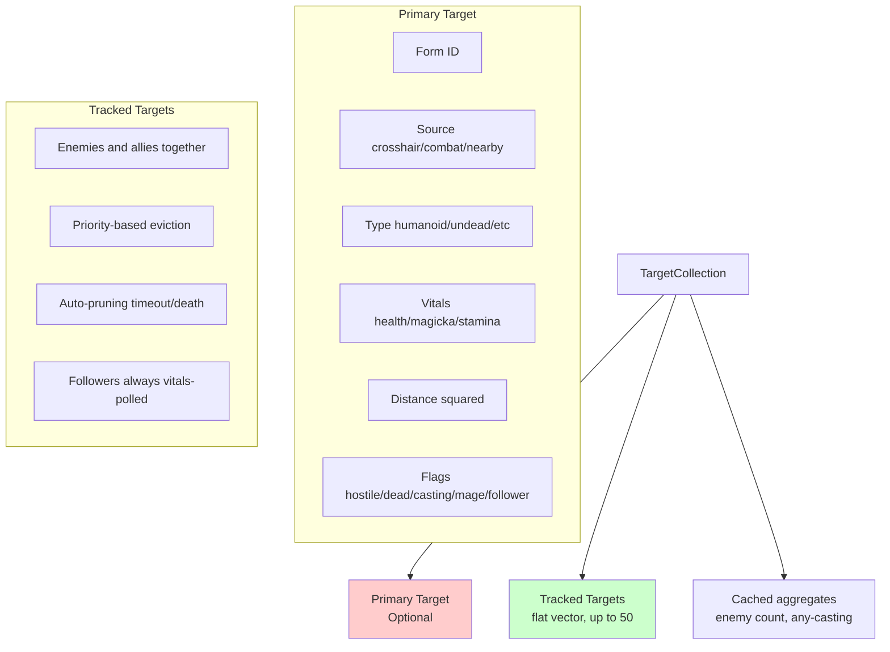

#### Primary Target (Optional)
| Field | Type | Description |
|-------|------|-------------|
| `actorFormID` | `RE::FormID` | Actor form ID |
| `targetType` | `TargetType` | None, Humanoid, Undead, Beast, Dragon, Construct, Daedra |
| `source` | `TargetSource` | None, Crosshair, CombatPrimary, NearbyEnemy, NearbyAlly |
| `vitals` | `ActorVitals` | Health/magicka/stamina (shared component) |
| `effects`, `buffs` | `ActorEffects`, `ActorBuffs` | Present for API symmetry; **not polled** — default-initialized |
| `distanceToPlayerSq` | `float` | Squared distance (performance) |
| `isHostile` | `bool` | Target is hostile |
| `isDead` | `bool` | Target is dead |
| `isCasting` | `bool` | Target is casting a spell |
| `level` | `uint16_t` | Actor level for illusion spell caps (v0.6.6) |
| `isStaggered` | `bool` | Target is staggered — damage window (v0.6.6) |
| `isFollower` | `bool` | Target is player's teammate, via `IsPlayerTeammate()` (v0.6.10) |
| `isMage` | `bool` | Target has spell equipped in either hand (v0.6.11) |
| `lastSeenTime` | `float` | Game time when last detected |
| `lastVitalsPollTime` | `float` | Game time when vitals were last polled (v0.6.11) |
| `priority` | `float` | Tracking priority score |

#### Tracked Targets
- A flat `std::vector<TargetActorState>`, pre-reserved to `MAX_TRACKED_TARGETS`
  (50, from `Config::MAX_TRACKED_TARGETS`), with linear `Find()`. It is **not** a
  map — for N ≤ 50 a contiguous vector beats `unordered_map` on both lookup and
  the whole-collection copy-out.
- It holds **enemies and allies together**; `isHostile` separates them.
- Automatic pruning: `LAST_SEEN_TIMEOUT` 3s, `DEAD_ACTOR_TIMEOUT` 5s.
- Priority-based eviction when full (`EvictIfFull`, floor
  `NEW_TARGET_MIN_PRIORITY` 0.5).
- Two aggregates are cached alongside and kept in sync by
  `InsertOrUpdate`/`Remove`/`Clear`: `cachedEnemyCount` and `cachedAnyCasting`.
  Code that mutates `targets` directly must call `UpdateCachedCounts()` first.

**Poll Method:** `PollTargets()` at 100ms interval (combat responsiveness)

Detection ranges (`StateManagerConstants.h::TargetTracking`):
`DETECTION_RANGE` 2048 units for hostiles and followers, `ALLY_DETECTION_RANGE`
512 units for non-follower allies (guards, merchants) so a city does not fill the
collection.

Secondary-target vitals are throttled: `SECONDARY_VITALS_INTERVAL_MS` 500ms and a
`VITALS_POLL_DISTANCE` of 1024 units, except followers, which
`ALWAYS_POLL_FOLLOWER_VITALS` exempts.

#### Ally/Follower Tracking

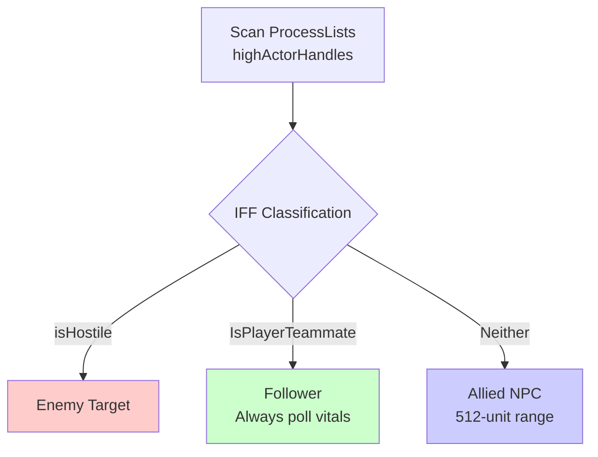

**Detection:** Both the enemy scan and the ally scan iterate
`ProcessLists::highActorHandles` **only**. Actors inside `DETECTION_RANGE` (2048)
or `ALLY_DETECTION_RANGE` (512) are always in the high list; the middle process
lists were dropped because they add iteration cost in modded games (hundreds of
distant actors) for no practical benefit.

> The v0.6.12 three-list scan described by earlier revisions of this document no
> longer exists. A stale comment above the ally block in
> [StateManager_Targets.cpp](../../src/state/StateManager_Targets.cpp) still claims
> "Scan ALL process levels"; the loop immediately under it reads
> `highActorHandles` and nothing else.

**Crosshair hysteresis:** when the crosshair raycast momentarily misses, the last
detected target stays "sticky" for `PERSISTENCE_TIMEOUT_SEC` (0.3s ≈ 3 polls)
provided it is still within `MAX_STICKY_RANGE_SQ` (2048²), alive, enabled and not
deleted. This is what stops primary-target flicker driving the UI.

**Follower HP Tracking:** followers (`isFollower=true`) always have their vitals
polled regardless of distance (`ALWAYS_POLL_FOLLOWER_VITALS`). This is what makes
healing recommendations react to an injured follower.

**IFF Classification:**
- `isHostile=true` → Hostile (enemy)
- `isFollower=true` → Follower (player teammate)
- `isHostile=false && isFollower=false` → Allied (friendly NPC like guards, merchants)

**Target Priority Formula** (`TargetActorState::CalculatePriority`, constants in
`StateManagerConstants.h::TargetTracking`):
```cpp
priority = (PRIORITY_DISTANCE_WEIGHT / max(distance, 1.0f))
         + sourceBonus + stateBonus
  where:
    PRIORITY_DISTANCE_WEIGHT = 10.0
    sourceBonus = crosshair(15.0) | combatPrimary(10.0) | otherwise(0.0)
    stateBonus  = hostile(5.0) + health<30%(3.0)
```

### 4. HealthTrackingState ([src/state/StateTypes.h](../../src/state/StateTypes.h))

Tracks recent damage and healing for ward/shield spell recommendations and
elemental resist context.

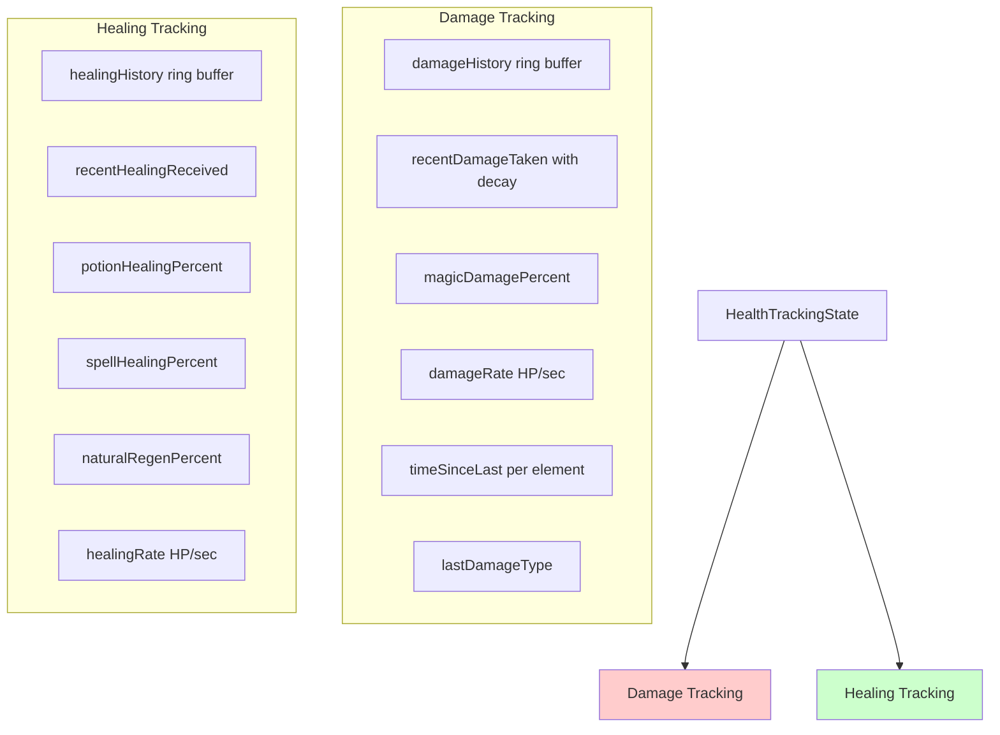

#### Damage Tracking
| Field | Type | Description |
|-------|------|-------------|
| `damageHistory` | `EventRingBuffer<DamageEvent, 10>` | Recent damage events (max 10) |
| `recentDamageTaken` | `float` | Total damage in the active window (with decay) |
| `magicDamagePercent` | `float` | % of recent damage that was magic (0.0-1.0) |
| `takingMagicDamage` | `bool` | Any recent damage was magic |
| `damageRate` | `float` | HP/sec damage rate |
| `timeSinceLastHit` | `float` | Seconds since last damage (99 = not recent) |
| `lastDamageType` | `DamageType` | Most recent damage type (v0.6.7) |
| `timeSinceLastFire` | `float` | Seconds since last fire damage (v0.6.7) |
| `timeSinceLastFrost` | `float` | Seconds since last frost damage (v0.6.7) |
| `timeSinceLastShock` | `float` | Seconds since last shock damage (v0.6.7) |
| `timeSinceLastPoison` | `float` | Seconds since last poison damage (v0.6.7) |
| `damageIncreasing` | `bool` | Damage rate is accelerating |
| `damageDecreasing` | `bool` | Damage rate is decelerating |

#### Healing Tracking
| Field | Type | Description |
|-------|------|-------------|
| `healingHistory` | `EventRingBuffer<HealingEvent, 10>` | Recent healing events (max 10) |
| `recentHealingReceived` | `float` | Total healing in the active window (with decay) |
| `potionHealingPercent` | `float` | % from potions (0.0-1.0) |
| `spellHealingPercent` | `float` | % from spells (0.0-1.0) |
| `naturalRegenPercent` | `float` | % from natural regen (0.0-1.0) |
| `healingRate` | `float` | HP/sec healing rate |
| `timeSinceLastHeal` | `float` | Seconds since last healing (99 = not recent) |
| `healingIncreasing` | `bool` | Healing rate is accelerating |
| `healingDecreasing` | `bool` | Healing rate is decelerating |

**Poll Method:** `PollHealthTracking()` at 100ms interval

`EventRingBuffer<T, N>` is now a compatibility alias for
`Huginn::RingBuffer<T, N>` (`core/RingBuffer.h`); new code should use the latter
directly.

**Sub-threshold accumulation:** health deltas below
`VitalTracking::HEALTH_DAMAGE_THRESHOLD` (5.0 HP) do not emit an event
immediately. They accumulate in `ResourceTracker::accumulated` with decay until
the total crosses the threshold — which is what catches chip damage in
high-resistance scenarios that per-tick thresholding would drop entirely.

**Enrichment:** queued events from `DamageEventSink` (instant elemental hits) are
drained and merged with health-delta polling. `PollHealthTracking()` also
maintains `m_elementalWindowActive` — a flag the *outer* pipeline-skip gate reads,
because the elemental window decays on wall-clock time with no state delta at all.
`PipelineCoordinator::EnrichElementalDamage()` then bridges the elemental timers
into `PlayerActorState.effects` flags before scoring. The window is
`VitalTracking::ELEMENTAL_DAMAGE_ENRICHMENT_WINDOW` = 5.0s.

**DamageType enum** (v0.6.7):
- `Physical` - Melee, arrows, fall damage
- `Fire` - Fire spells, dragon breath
- `Frost` - Frost spells, ice traps
- `Shock` - Shock spells, lightning
- `Poison` - Poison damage over time
- `Disease` - Disease damage (rare)
- `Magic` - Generic magic damage
- `Unknown` - Unable to classify

Only Fire/Frost/Shock/Poison have dedicated `timeSinceLast*` fields;
`TookDamageTypeRecently()` falls back to `lastDamageType + timeSinceLastHit` for
the rest.

### 5. StaminaTrackingState ([src/state/StateTypes.h](../../src/state/StateTypes.h))

Tracks stamina consumption and recovery for stamina-related recommendations (v0.6.9).

| Field | Type | Description |
|-------|------|-------------|
| `usage` | `ResourceFlowTracker<StaminaUsageEvent>` | Usage history, rate, trends |
| `regen` | `ResourceFlowTracker<StaminaRegenEvent>` | Regen history, rate, trends |
| `powerAttackPercent` | `float` | % of recent usage from power attacks (0.0-1.0) |
| `sprintPercent` | `float` | % of recent usage from sprinting (0.0-1.0) |

**Poll Method:** `PollStaminaTracking()` at 100ms interval

**StaminaUsageSource enum:**
- `Unknown` - Unable to classify
- `PowerAttack` - Heavy melee swing
- `Sprint` - Running
- `Block` - Shield block
- `Jump` - Jumping
- `ShieldBash` - Offensive bash
- `Swimming` - Swimming movement

### 6. MagickaTrackingState ([src/state/StateTypes.h](../../src/state/StateTypes.h))

Tracks magicka consumption and recovery for magicka-related recommendations (v0.6.9).

| Field | Type | Description |
|-------|------|-------------|
| `usage` | `ResourceFlowTracker<MagickaUsageEvent>` | Usage history, rate, trends |
| `regen` | `ResourceFlowTracker<MagickaRegenEvent>` | Regen history, rate, trends |
| `isChanneling` | `bool` | Concentration spell active |
| `isHoldingWard` | `bool` | Ward being maintained |
| `instantCastPercent` | `float` | % of recent usage from instant casts (0.0-1.0) |
| `concentrationPercent` | `float` | % of recent usage from concentration spells (0.0-1.0) |

**Poll Method:** `PollMagickaTracking()` at 100ms interval

**MagickaUsageSource enum:**
- `Unknown` - Unable to classify
- `SpellCast` - Instant cast
- `Concentration` - Sustained spell (flames, healing)
- `Ward` - Ward maintenance
- `Staff` - Staff discharge

`MagickaUsageEvent` also carries `spellFormID`, so usage can be correlated back to
the spell that spent the magicka.

### ResourceFlowTracker Template

Both `StaminaTrackingState` and `MagickaTrackingState` use
`ResourceFlowTracker<EventType, MaxEvents = 10>`, a generic tracker for resource
consumption/recovery with exponential decay:

| Field | Type | Description |
|-------|------|-------------|
| `history` | `EventRingBuffer<EventType, MaxEvents>` | Event ring buffer |
| `recentAmount` | `float` | Total in active window |
| `rate` | `float` | Units per second |
| `timeSinceLast` | `float` | Seconds since last event (99 = sentinel) |
| `isIncreasing` | `bool` | Rate accelerating |
| `isDecreasing` | `bool` | Rate decelerating |

Its `operator==` compares `timeSinceLast` through
`VitalTracking::TimeBucket()`, **not** with an epsilon. `timeSinceLast` grows
without bound, so an epsilon comparison would keep the dirty flag firing forever;
everything past the largest bucket edge collapses into one "stale" bucket. Never
epsilon-compare a raw `timeSince*` float in an `operator==`.

---

## Data Flow: Polling Loop

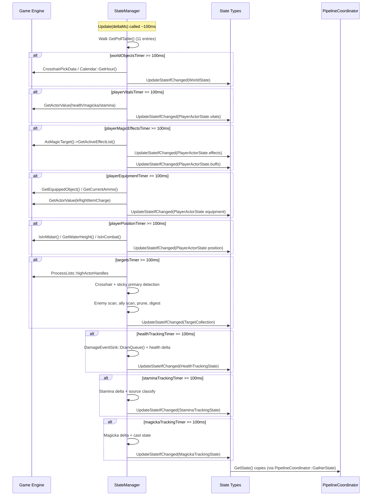

The two slow polls — `PollPlayerSurvival()` at 1000ms and
`PollPlayerResistances()` at 500ms — are omitted from the diagram for space;
they are rows 5 and 9 of the same poll table.

**Thread Safety:**
- Each poll method builds state locally, then atomically updates via `UpdateStateIfChanged()`
- `UpdateStateIfChanged()` acquires a unique lock for compare-and-swap
- Copy-out pattern for consumer access (shared locks for reads)
- Short critical sections minimize lock holding time

**Target change digest.** `PollTargets` does not compare whole
`TargetCollection`s to decide whether anything changed. It computes a small
`TargetDigest` — primary FormID, primary target type, primary distance bucket,
enemy count, ally count, has-injured-ally, any-casting — and compares that. The
digest fields are exactly the ones that feed `GameState`, and
`ComputeTargetDigest()` **must** bucket distance identically to
`StateEvaluator::EvaluateDistance` (both read
`DistanceThresholds::EVAL_*_MAX_SQ`) or the skip check silently misses distance
transitions.

---

## Data Flow: State Types → Consumers

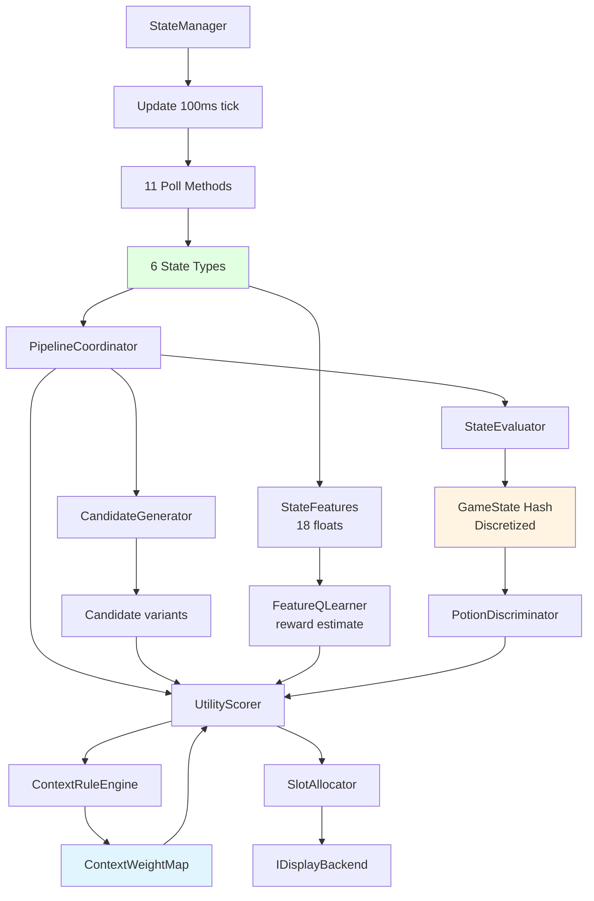

**State Consumers:**

| Consumer | Uses | Purpose |
|----------|------|---------|
| **PipelineCoordinator** | WorldState, PlayerActorState, TargetCollection, HealthTrackingState | Snapshots state once per tick into `PipelineContext`, passes it to each step |
| **StateEvaluator** | PlayerActorState, TargetCollection | Discretize to `GameState` + hash (72,576 states) |
| **CandidateGenerator** | PlayerActorState | Gather available spells/potions/weapons/ammo/scrolls/soul gems |
| **ContextRuleEngine** | PlayerActorState, TargetCollection, WorldState | Evaluate context rules → `ContextWeightMap`; also names the tick's `ContextReason` |
| **StateFeatures** | PlayerActorState, TargetCollection | Build the 18-float feature vector for `FeatureQLearner` |
| **PotionDiscriminator** | GameState (bucketed vitals + enemy count) | Potion value/timing multiplier |
| **UtilityScorer** | All of the above | Combine context weight, learning score, priors, multipliers |
| **OverrideManager** | PlayerActorState, WorldState | Override condition checks |

> `PipelineCoordinator` no longer snapshots `StaminaTrackingState` or
> `MagickaTrackingState` per tick — nothing downstream consumed them once the
> display reason moved onto the context weights (#10). The accessors still exist
> and the polls still run; only the per-tick copy was removed.

> `StateEvaluator::EvaluateCurrentState()` still takes a `WorldState&` in its
> signature, but the body never reads it. Harmless, but the parameter is dead.

**StateManager Public Accessors:**

| Method | Returns | Thread Safety |
|--------|---------|---------------|
| `GetWorldState()` | `WorldState` | `shared_lock(m_worldMutex)` copy-out |
| `GetPlayerState()` | `PlayerActorState` | `shared_lock(m_playerMutex)` copy-out |
| `GetTargets()` | `TargetCollection` | `shared_lock(m_targetsMutex)` copy-out |
| `GetPrimaryTarget()` | `std::optional<TargetActorState>` | `shared_lock(m_targetsMutex)` copy-out |
| `GetHealthTracking()` | `HealthTrackingState` | `shared_lock(m_trackingMutex)` copy-out |
| `GetStaminaTracking()` | `StaminaTrackingState` | `shared_lock(m_trackingMutex)` copy-out |
| `GetMagickaTracking()` | `MagickaTrackingState` | `shared_lock(m_trackingMutex)` copy-out |
| `Update(float deltaMs)` | void | Walks the poll table, records `m_lastUpdateChanged` |
| `ForceUpdate()` | void | Polls everything and resets timers |
| `ResetTrackingState()` | void | Resets all accumulated state on save load / new game |
| `PollAll()` | `bool` | Forces all polls, returns true if any changed |
| `DidLastUpdateChangeState()` | `bool` | Tier-1 pipeline skip check |
| `IsElementalWindowActive()` | `bool` | Outer-gate bypass while an elemental window is open |
| `IsInCombat()` | `bool` | Lightweight combat check (no `PlayerActorState` copy) |
| `ConsumeCombatTransition()` | `CombatTransition` | Destructive read of the combat edge |

---

## Example: Healing Spell Context Weight

**State Model → Context Weight Calculation:**

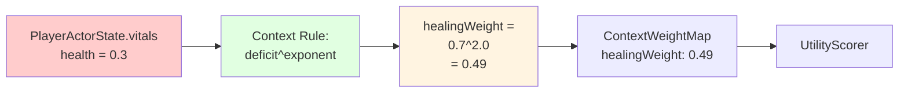

**Calculation Details** — the rule is a *pure continuous curve* with no
thresholds, deliberately: hard thresholds produced a 10× discontinuity at 50% HP
in the pre-`ContextRuleEngine` scheme.

```cpp
// StateManager provides state models
PlayerActorState player = mgr.GetPlayerState();

// ContextRuleEngine::EvaluateVitalRules — raw continuous state in, [0,1] out
const float healthPct = player.vitals.health;          // 0.0-1.0
if (healthPct < 1.0f) {
    const float deficit    = 1.0f - healthPct;
    const float curveValue = std::pow(deficit, m_config.fHealthSmoothingExponent);
    result.healingWeight   = std::clamp(curveValue, 0.0f, 1.0f);
}

// Examples at the default exponent of 2.0 (quadratic):
// health = 1.00 → weight = 0.00 (not relevant)
// health = 0.50 → weight = 0.25 (moderate)
// health = 0.30 → weight = 0.49 (high)
// health = 0.25 → weight = 0.56 (high)
// health = 0.10 → weight = 0.81 (critical)
```

Magicka uses `fMagickaSmoothingExponent` and stamina a gentler exponent; all three
are INI-tunable under `[ContextWeights]`. The whole `ContextWeightMap` is
normalized to `[0,1]` — 0.0 means "won't surface", 0.05 is the always-available
noise floor (`baseRelevanceWeight`), 1.0 is critical. That normalization is what
makes the multiplicative utility formula below well-behaved.

**GameState Hash → what actually uses it:**

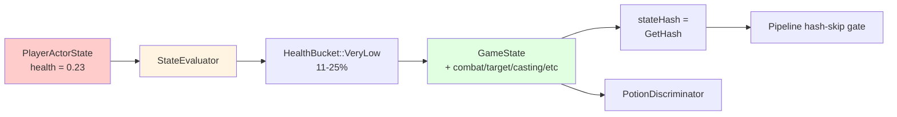

**Discretization:**

```cpp
// StateEvaluator buckets the raw state models
GameState gameState = evaluator.EvaluateCurrentState(world, player, targets);
// gameState.health     = HealthBucket::VeryLow (11-25%)
// gameState.inCombat   = CombatStatus::InCombat
// gameState.targetType = TargetType::Humanoid
// gameState.anyCasting = CastingStatus::EnemyCasting
// ... etc

uint32_t stateHash = gameState.GetHash();  // 0-72,575
```

There is **no tabular Q-table**. The hash exists for two things only: the
pipeline's hash-skip gate, and `LogStateTransition`'s change diff. Learning is
keyed on the continuous `StateFeatures` vector instead — see
[4-contextual-bandits.md](4-contextual-bandits.md).

**Combined Utility** (`UtilityScorer::ComputeUtility`, the single source of truth
for the formula):
```cpp
utility = contextWeight                        // [0,1] relevance gate
        × (1 + λ(confidence) × learningScore)  // learning boost
        × correlationBonus
        × potionMultiplier
        × favoritesMultiplier

// λ(confidence) = lambdaMin + confidence × (lambdaMax - lambdaMin)
//               = 0.5 at zero confidence, 3.0 at full confidence (defaults)
// learningScore = α·Q + (1-α)·prior + β·UCB + recencyBoost,  α = confidence

// Example: contextWeight=0.8, confidence=0.6 (λ=2.0), learningScore=0.85
utility = 0.8 × (1 + 2.0 × 0.85) × 1.0 × 1.0 × 1.0
        = 0.8 × 2.7
        = 2.16
```

The additive v0.12.x formula is documented as history in the
[UtilityScorer.h](../../src/learning/UtilityScorer.h) header comment, but it is
**not selectable at runtime** — `ComputeUtility()` implements only the
multiplicative form and no config key switches it.

---

## State Representation Levels

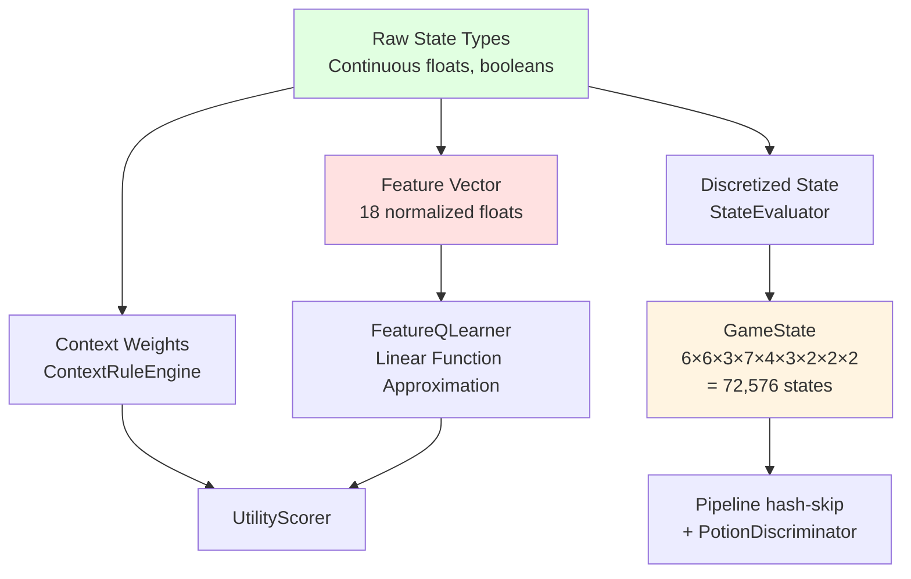

**Why Multiple Representations?**

| Level | Purpose | Granularity | Consumer |
|-------|---------|-------------|----------|
| **Raw State** (6 state types) | Context weights, candidate gathering, slot allocation | Continuous floats, booleans | ContextRuleEngine, CandidateGenerator, OverrideManager |
| **Discretized State** (`GameState`) | Pipeline skip gate + potion discrimination | Bucketed enums, 9 hashed dimensions (stamina excluded from the hash but kept in the struct) | `CheckHashSkip`, `PotionDiscriminator` |
| **Feature Vector** (`StateFeatures`) | Feature-based contextual bandit learning | 18 normalized floats | FeatureQLearner (linear function approximation) |

**`GameState` dimensions** ([GameState.h](../../src/state/GameState.h)):

| Dimension | Type | States | Buckets |
|---|---|---|---|
| `health` | `HealthBucket` | 6 | Critical ≤10%, VeryLow ≤25%, Low ≤40%, Medium ≤60%, High ≤80%, VeryHigh >80% |
| `magicka` | `MagickaBucket` | 6 | Same edges |
| `stamina` | `StaminaBucket` | 6 | Same edges — **in the struct, excluded from the hash** |
| `distance` | `DistanceBucket` | 3 | Melee ≤256, Mid ≤768, Ranged >768 units |
| `targetType` | `TargetType` | 7 | None, Humanoid, Undead, Beast, Dragon, Construct, Daedra |
| `enemyCount` | `EnemyCountBucket` | 4 | None(0), One(1-10), Few(11-30), Many(31+) — thresholds are 20%/60% of `MAX_TRACKED_TARGETS` |
| `allyStatus` | `AllyStatus` | 3 | None, Present, InjuredPresent (any non-hostile living target below 30% HP) |
| `anyCasting` | `CastingStatus` | 2 | NoneCasting, EnemyCasting — from `TargetCollection::cachedAnyCasting` |
| `inCombat` | `CombatStatus` | 2 | NotInCombat, InCombat |
| `isSneaking` | `SneakStatus` | 2 | NotSneaking, Sneaking |

`GetHash()` is a multi-radix encode over bases `{6, 6, 3, 7, 4, 3, 2, 2, 2}`, with
the multipliers computed at compile time, giving
`kTotalStates = 72,576`. The un-reduced space — stamina hashed, and ally count
kept separate from the injured flag — would be 870,912; excluding stamina removes
a factor of 6 and collapsing the two ally dimensions into `AllyStatus` removes
another factor of 2, for the 12× reduction.

`anyCasting` **must** stay a hash dimension: it drives ward and counter weights in
`ContextRuleEngine`, so dropping it would make the skip gate blind to an enemy
starting to cast.

**`StateFeatures` vector** ([StateFeatures.h](../../src/learning/StateFeatures.h)),
in `ToArray()` order — which is also the cosave wire order:

| Index | Feature | Source |
|---|---|---|
| 0-2 | `healthPct`, `magickaPct`, `staminaPct` | `player.vitals`, clamped [0,1] |
| 3-4 | `inCombat`, `isSneaking` | `player`, 0.0/1.0 |
| 5 | `distanceNorm` | `sqrt(GetClosestEnemy()->distanceToPlayerSq) / 4096`, clamped; 1.0 with no enemy |
| 6-12 | `targetNone`, `targetHumanoid`, `targetUndead`, `targetBeast`, `targetConstruct`, `targetDragon`, `targetDaedra` | One-hot from `targets.primary->targetType` |
| 13-16 | `hasMeleeEquipped`, `hasBowEquipped`, `hasSpellEquipped`, `hasShieldEquipped` | `player`, 0.0/1.0 |
| 17 | `bias` | Always 1.0 (intercept) |

`NUM_FEATURES = 18`, asserted inside `ToArray()`. The layout is **append-only**:
`QLearnerSerializer` migrates saved `FQLW` weights positionally, so a new feature
goes at the end and a retired feature keeps its slot fed with a constant 0.
Reordering silently reassigns every player's learned weights.

Note that index 5 and indices 6-12 can describe *different actors*: distance comes
from the closest enemy, the one-hot from the crosshair/combat primary. That is
intentional — proximity and focus are different signals.

**Examples:**

1. **Raw State** (continuous): precise heuristic calculations
   - `health = 0.23f` → `healingWeight = 0.77² = 0.59` (smooth scaling)

2. **GameState** (discretized): cheap change detection
   - `health = 0.23f` → `HealthBucket::VeryLow` (11-25% bucket)
   - A drift from 0.23 → 0.24 produces the same hash, so the pipeline skips

3. **Feature Vector** (FeatureQLearner): smooth generalization
   - `health = 0.23f` → feature stays 0.23 (continuous)
   - Linear model interpolates between similar states

---

## Performance Characteristics

Measured figures come from [profiling/tracy-traces.md](../profiling/tracy-traces.md)
(2026-07-25 capture at `99cbb48`, real playthrough save, ~6,916 poll ticks).
**These are DEBUG + TRACY builds — valid for ranking and cross-build comparison,
never as absolute frame-budget claims.** All 11 polls carry a `Huginn_ZONE_NAMED`
zone, so any of them can be re-measured directly.

| Poll Method | Measured MTPC | Interval | Notes |
|-------------|---------------|----------|-------|
| PollPlayerMagicEffects | 113 µs | 100ms | Largest cumulative poll (780 ms over the session) — active-effect iteration, critique #12-adjacent |
| PollTargets | 94 µs | 100ms | Process-list scan under the write lock (649 ms cumulative) — critique #12 |
| PollPlayerVitals | 35 µs | 100ms | From the 2026-07-24 small-save capture |
| `StateManager::Update` (whole table) | 8.9 µs | 100ms | From the same small-save capture; the remaining vital polls sat in the 7-17 µs band |
| PollWorldObjects | not separately published | 100ms | Crosshair detection + cached ore-vein lookup |
| PollPlayerEquipment | not separately published | 100ms | Early-exit inventory scan |
| PollPlayerPosition | not separately published | 100ms | Boolean reads + FallTracker |
| PollHealthTracking | not separately published | 100ms | Delta calculation + `DamageEventSink` merge |
| PollStaminaTracking | not separately published | 100ms | Delta calculation + source classify |
| PollMagickaTracking | not separately published | 100ms | Delta calculation + cast state |
| PollPlayerResistances | not separately published | 500ms | 5 actor value reads |
| PollPlayerSurvival | not separately published | 1000ms | Cached globals, no effect-name parsing |

The declared budget in [StateManager.h](../../src/state/StateManager.h) is
`Update() ≤ 0.5 ms`, target tracking ≤ 0.1 ms, memory ≤ 10 KB. The 2026-07-25
capture shows the two hot polls (`PollPlayerMagicEffects`, `PollTargets`) as the
standing optimization targets.

**Memory Overhead:**

<!-- UNVERIFIED: the byte figures below are hand-computed from the field layout in
the headers (natural alignment, MSVC x64). They have NOT been checked with a
static_assert on sizeof, and the pre-v0.19 numbers this table replaced were
demonstrably wrong (they still assumed a std::string ammo name and a 50-entry
unordered_map of targets). Treat as order-of-magnitude. -->

| Component | Approx. size | Notes |
|-----------|--------------|-------|
| WorldState | ~20 B | 2 floats, 1 int, 4 bools, 1 uint8 |
| PlayerActorState | ~190 B | vitals 36 B + effects 8 B + buffs 19 B + resistances 20 B + flat equipment/survival/position fields; all POD since the ammo name became a FormID |
| TargetActorState | ~100 B | Shared components + identity + flags + timestamps |
| TargetCollection | ~5 KB | ~136 B inline + a heap vector reserved to 50 × ~100 B |
| HealthTrackingState | ~250 B | 2 × RingBuffer(10) + aggregates |
| StaminaTrackingState | ~200 B | 2 ResourceFlowTrackers + source % |
| MagickaTrackingState | ~250 B | 2 ResourceFlowTrackers + cast state |
| **Total** | **~6 KB** | **Declared target: <10 KB** |

The dominant cost is `TargetCollection`, and it is copied whole on every
`GetTargets()`. That is deliberate — the copy-out pattern is what makes the
accessors safe — but it is why the pipeline snapshots it exactly once per tick
into `PipelineContext` rather than calling the accessor repeatedly.

---

## Thread Safety

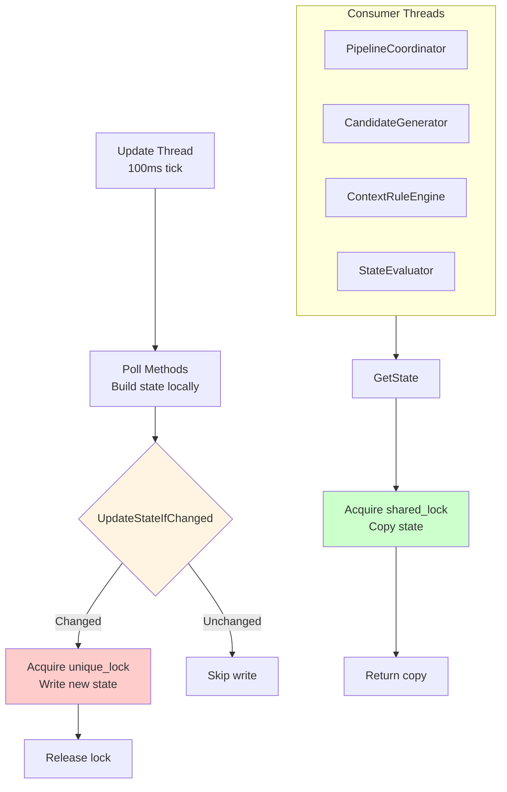

**Thread Safety Patterns:**

1. **Copy-out pattern:** Accessors return copies, not references
   ```cpp
   PlayerActorState GetPlayerState() const noexcept {
       std::shared_lock lock(m_playerMutex);
       return m_playerState;  // Copy
   }
   ```

2. **Compare-and-swap:** `UpdateStateIfChanged()` only writes if state actually changed
   ```cpp
   template <typename StateType>
   bool UpdateStateIfChanged(std::shared_mutex& mutex, StateType& currentState,
                             const StateType& newState) noexcept {
       std::unique_lock lock(mutex);
       if (currentState != newState) {
           currentState = newState;
           return true;
       }
       return false;
   }
   ```

3. **Short critical sections:** Build state outside lock, then copy in
   ```cpp
   bool PollPlayerVitals() {
       // Build state locally (no lock)
       ActorVitals newVitals;
       newVitals.health = /* actor value reads */;

       // Atomically update (locked)
       return UpdateStateIfChanged(m_playerMutex, m_playerState.vitals, newVitals);
   }
   ```

**Lock structure** (4 coarse-grained `std::shared_mutex`):
- `m_worldMutex` — Protects `WorldState`
- `m_playerMutex` — Protects `PlayerActorState`
- `m_targetsMutex` — Protects `TargetCollection` (and the sticky-target hysteresis
  fields, which are only touched from `PollTargets` under that lock)
- `m_trackingMutex` — Protects `HealthTrackingState`, `StaminaTrackingState` and
  `MagickaTrackingState` together

> The class comment in `StateManager.h` still says "3 locks (down from 7 sensor
> locks)" and "POLL TIMERS (7 float accumulators)". Both are stale: there are four
> mutexes and eleven timers. The `m_trackingMutex` is real and every tracking
> accessor takes it.

The transient per-resource state (`m_healthTracker`, `m_staminaTracker`,
`m_magickaTracker`, `m_fallTracker`, `m_wasInCombat`, `m_prevTargetDigest`) is
**single-writer** — only mutated from its own poll method on the update thread —
and therefore unlocked. The cross-thread signals out of the poll layer are
`std::atomic`: `m_lastUpdateChanged`, `m_elementalWindowActive`,
`m_combatTransition`, `m_isInCombat`.

---

## Event Enrichment

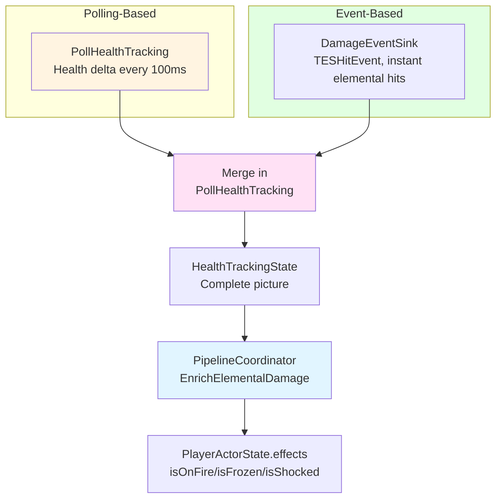

**Why Hybrid Approach:**

| Aspect | Polling | Events |
|--------|---------|--------|
| **Coverage** | All damage types | Only specific events |
| **Latency** | 100ms delay | Instant |
| **Reliability** | Always works | Event API limitations |
| **Use Case** | General damage tracking | Elemental classification |

**DamageEventSink** (v0.6.8) — [DamageEventSink.h](../../src/state/DamageEventSink.h):
- A `BSTEventSink<RE::TESHitEvent>`. Instant damage spells (Fireball, Firebolt,
  Ice Spike) have a ~20-50ms effect lifetime; by the time the 100ms poll runs the
  ActiveEffect is gone and the damage type is unclassifiable.
- Captures the type at impact, queues it under a mutex, and
  `PollHealthTracking()` drains it with `DrainQueue()`.
- Handles sub-threshold hits (high-resist scenarios where the health delta alone
  would never cross `HEALTH_DAMAGE_THRESHOLD`).
- `ResetTrackingState()` drains the queue so a stale hit cannot survive a save load.

> Earlier revisions of this document also drew a "TESEquipEventSink" feeding
> StateManager. No such class exists and nothing writes StateManager from an
> equip event. There are two `TESEquipEvent` sinks in the codebase and neither is
> part of the state layer:
> [`SpellRegistry`](../../src/spell/SpellRegistry.h) (immediate spell
> equip/unequip detection for the registry) and
> [`ExternalEquipListener`](../../src/learning/ExternalEquipListener.h) (attributes
> equips that Huginn did not initiate, for the learner).

---

## Observable State Only (Anti-Cheat)

**Allowed Information:**
- Player's own stats (health, magicka, stamina)
- What player is looking at (crosshair target)
- Player's inventory and equipment
- Active effects on player
- Environmental conditions (underwater, time, light)
- Target vitals (observable via UI)
- Follower vitals (always polled for healing recommendations)

**Forbidden Information:**
- Enemy spell lists or abilities
- Hidden trap locations
- NPC inventories (before pickpocketing)
- Locked container contents
- Future events or predictions

`TargetActorState::isMage` is derived from what the target has *equipped in hand*
— visible to the player — not from its spell list, which would be forbidden.

**Distance Limits:**
- Enemy/follower tracking: `DETECTION_RANGE` 2048 units
- Non-follower allies: `ALLY_DETECTION_RANGE` 512 units
- Sticky crosshair recovery: `MAX_STICKY_RANGE_SQ` = 2048² for up to 0.3s
- Feature-vector distance normalization: `StateFeatures::MAX_DISTANCE` 4096 units
- Target tracking: up to 50 actors, pruned by priority

<!-- UNVERIFIED: earlier revisions claimed Skyrim's CrosshairPickData only detects
actors within ~400 units. That is an assertion about the game engine, not about
this codebase, and nothing in src/ encodes or tests it. The observable behaviour
it was written to explain — distant allies appearing as tracked targets but never
becoming primary — is real and follows from the crosshair raycast being the only
source of TargetSource::Crosshair. -->

---

## Current vs Target

| Aspect | Current (v0.19.10) | Target (v1.0) | Status |
|--------|--------------------|---------------|--------|
| **Poll Methods** | 11 methods, data-driven poll table, split files | No change needed | ✅ Complete |
| **State Types** | 6 types (3 core + 3 tracking) | No change needed | ✅ Complete |
| **Event Enrichment** | `DamageEventSink` (TESHitEvent) → HealthTrackingState → effect flags | Working well | ✅ Complete |
| **Thread Safety** | Copy-out + compare-and-swap, 4 mutexes, atomics for cross-thread flags | Correct pattern | ✅ Complete |
| **Pipeline Skip** | Two-tier: sensor dirty flag + hash comparison, with unhashed-state bypasses | Implemented | ✅ Complete |
| **State Space** | 72,576 hashed states (12× reduction from the un-reduced 870,912) | Skip gate + potion discrimination only | ✅ Complete |
| **Memory Usage** | ~6 KB (hand-computed) | Within the 10 KB budget | ✅ Complete |
| **Learning Persistence** | SKSE cosave, `FQLW` records, positional feature migration | Per-character persistence | ✅ Complete |
| **Pipeline State Cache** | Caches scored candidates per cycle; timestamp refreshed even on a skip | External equip attribution | ✅ Complete |
| **Feature Learning** | `FeatureQLearner`, 18-float linear model — the only learner | No tabular fallback remains | ✅ Complete |

### Pipeline Skip Optimization

A two-tier skip system prevents unnecessary pipeline work.

**Tier 1 — sensor-level** (`RunPipelineIfNeeded` in
[UpdateLoop.cpp](../../src/UpdateLoop.cpp)): `StateManager` records whether any
poll method detected a change. If nothing changed, no page was cycled, no
elemental window is open and the coordinator has no forced run pending, the
entire recommendation pipeline is skipped.

**Tier 2 — hash-level** (`PipelineCoordinator::CheckHashSkip`): even when raw
sensor values change (health 85.1% → 85.2%), the discretized `GameState` hash may
be identical (both `VeryHigh`). Scoring is skipped when the hash is unchanged.

Both tiers need escape hatches for state the hash cannot see:

```cpp
// Tier 1 (UpdateLoop.cpp)
if (!stateChanged && !pageChanged && !stateManager.IsElementalWindowActive() &&
    !PipelineCoordinator::GetSingleton().NeedsForcedRun()) {
    Learning::PipelineStateCache::GetSingleton().RefreshTimestamp();
    return;  // Huge win when idle
}

// Tier 2 (PipelineCoordinator::CheckHashSkip)
const bool unhashedStateActive = ctx.elementalDamageActive || ctx.fallingActive ||
                                 ctx.underwaterActive;
if (ctx.stateHash == m_lastPipelineHash && !pageChanged &&
    !unhashedStateActive && !NeedsForcedRun()) {
    Learning::PipelineStateCache::GetSingleton().RefreshTimestamp();
    return true;  // Skip — catches within-bucket shifts
}
```

Three conditions bypass the hash gate because they change no hashed bucket:

- **Elemental damage window** (5s, decays on wall-clock time — no state delta at
  all, so Tier 1 needs a live query and Tier 2 a rising-edge check)
- **Falling** (#60) — stepping off a ledge changes no bucket
- **Underwater** (#61) — submerging is not sneaking, combat, or a target

Their *falling* edges live in `NeedsForcedRun()`, which grants one further run so
stale fire/slow-fall scoring clears; a pending reason downgrade (#62) rides along
there too. All three are bounded: a fall ends in about a second, the elemental
window is fixed-length, and a reason hold expires within
`REASON_HOLD_MS / UPDATE_INTERVAL_MS` runs.

Note that both tiers still call `PipelineStateCache::RefreshTimestamp()` on the
skip path, so external equip events are not rejected as stale during a quiet
scene.

---

## See Also

- [0-pipeline.md](0-pipeline.md) - Recommendation pipeline using state models
- [2-classifiers.md](2-classifiers.md) - How candidates are typed and classified
- [4-contextual-bandits.md](4-contextual-bandits.md) - `StateFeatures` and the learning update rule
- [5-slots.md](5-slots.md) - Slot allocation and locking
- [../ARCHITECTURE.md](../ARCHITECTURE.md) - Overall system design
- [../profiling/tracy-traces.md](../profiling/tracy-traces.md) - Measured poll costs
