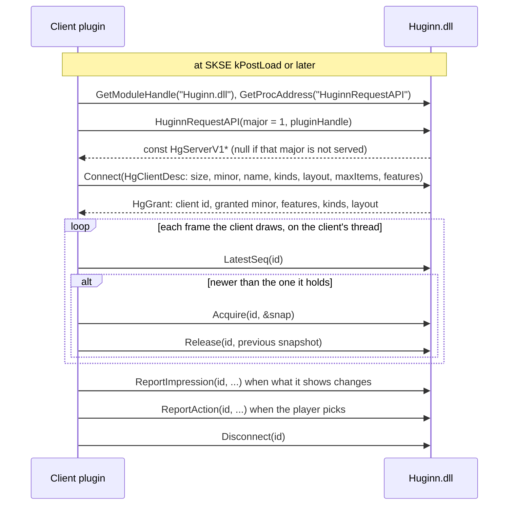

# Huginn as a recommendation server: the client API

**Status: proposal (2026-10-09). Nothing here is built.** Sections 1 and 2
describe the code as it is at `0f49bac` (v0.23.19) and cite it by file and line.
Everything from section 3 on is a proposal, and is marked so where it could be
mistaken for a description. The header in 3.11 is a sketch, not an interface
anyone should compile against.

Citations into the wheelerAPI fork (`LandingCrew/wheelerAPI`) are to branch
`perf/lazy-item-descriptions` at `db9466f`, written `wheelerAPI@db9466f:`; line
numbers differ on its `main`.

The user's request (2026-10-09): "i want other UI/UX to dial huginn and then we
start pushing out recommendations through the negotiated api schema. so let the
client figure out what they are good at."

## Summary

- **Today Huginn drives two UIs by writing into them.** It knows Wheeler's
  model (wheels, entries, items, uniqueIDs, edit mode, wheel indices that shift)
  and writes into it from its update tick. About 4,200 lines are there only for
  that (section 1.2).
- **That write sits in the frame.** In 48 minutes of LoreRim play under Tracy,
  7 Wheeler pushes took over 16.6 ms, and the 6 that could be measured each
  stretched the main thread's frame by 20–29 ms (section 2.2).
- **Huginn cannot tell what was on screen, and times some picks by guesswork**
  (section 2.3).
- **Proposed:** Huginn publishes an immutable, numbered snapshot of its
  recommendations after each run that changes something. UIs connect ("dial"),
  say what they can show and do, take the newest snapshot on their own thread
  when they draw, and report back what they showed and what the player picked.
  Huginn never calls into a UI from its tick.
- **Migration:** Huginn's own widget becomes the first client. Wheeler either
  becomes a native client (the user maintains the wheelerAPI fork) or Huginn
  ships an adapter client. Section 4.

---

## 1. Today

### 1.1 The display backends

`PipelineCoordinator` keeps a fixed list of two backends, Wheeler first
(`src/pipeline/PipelineCoordinator.cpp:38-44`), and at the end of each pipeline
run calls `Push` on every enabled one with the same `DisplayContext`
(`PushDisplay`, `:621-655`). The interface is three methods
(`src/display/IDisplayBackend.h:62-78`): `Push`, `IsEnabled`, and
`GetDesiredPage`, through which a backend can choose the page for everyone
(`ResolveDisplayPage`, `PipelineCoordinator.cpp:677`). `DisplayContext`
(`IDisplayBackend.h:24-49`) passes references to the slot assignments, the whole
scored list, the overrides, and the player and world state.

| Backend | What its `Push` does | Thread of the call |
|---|---|---|
| `IntuitionBackend` (`src/display/IntuitionBackend.cpp:17`) | Hides itself while a Huginn wheel is open (unless `HideWhileWheelOpen` is off), diffs against the last push, and calls `IntuitionMenu::SetSlot` etc., which queue the GFx work with `AddUITask` (`src/ui/IntuitionMenu.cpp:233-246`) | The tick's thread; the GFx work runs later in the UI task |
| `WheelerBackend` (`src/display/WheelerBackend.cpp:32-316`) | Recovers lost wheels, skips while a wheel is open unless an urgent override is up (`:82-85`) or the editor is up, allocates every page the player is not viewing (`:179-188`), builds subtext labels, drops weapons and armour with no uniqueID (`:288-297`), and calls `WheelerClient::UpdateRecommendationsForPage` per page (`:314`), which ends in `WheelSync::UpdatePage` | The tick's thread, and every Wheeler API call on it |

`IntuitionBackend` sends a confidence value per slot that the widget never reads
(`src/display/IntuitionBackend.h:33-42`: `Intuition.as` takes the parameter
and ignores it).

### 1.2 Huginn is a client of Wheeler's API

Wheeler exposes its API through one exported function. `WheelerConnection::TryConnect`
finds the module with `GetModuleHandleA("Wheeler.dll")`, resolves the export
`GetWheelerAPI` with `GetProcAddress`, and gets back a pointer to a struct of
function pointers with a `version` field (`src/wheeler/WheelerConnection.cpp:27-45`).
Huginn accepts versions 1 to 5 and only warns above 5, on the assumption that
Wheeler only appends to the struct (`:51-68`; `src/wheeler/WheelerAPI.h:23-24`).
The struct is `IWheelerAPI` (`WheelerAPI.h:119-184`): status queries, managed
wheels, entries, items, three callbacks (`:115-117`), and later-version
functions that the caller must gate on `version`. The wheel's `clientName` is
copied by Wheeler (`WheelerAPI.h:58-62`); the header states no rule for other
strings. The fork documents the API as callable from any thread and its
callbacks as running on the render/input thread
(`wheelerAPI@db9466f:src/bin/API/WheelerAPI.h:5`, `:13-27`). An exported function
that returns a versioned interface is the common pattern for SKSE plugin APIs.

How Huginn writes a page into Wheeler (`WheelSync::UpdatePage`,
`src/wheeler/WheelSync.cpp:1262`): it takes `m_pageDataMutex`, checks the wheel
with `IsManagedWheel`, `IsWheelEmpty` and `GetEntryCount`, compares the page
with its cache and returns if nothing changed, and otherwise, inside the
`WheelSync::WriteSlots` zone (`:1388`), for each changed slot calls
`RemoveItem` or `ClearEntry`, `AddItemByFormID(wheel, entry, formID, uniqueID)`
(`:1616`) and `SetManagedWheelEntrySubtext` (`:1740`). Weapons and armour need a
uniqueID, and for about a second after a load they have none
(`WheelSync::RequiresUniqueID`, `:30` and its comment).

Code that exists only to keep Wheeler's model in step: `src/wheeler/` (3,841
lines) and `src/display/WheelerBackend.*` (348 lines), by `wc -l`. It handles
wheel indices that shift when the player edits wheels, the editor being open, a
retry and cooldown cache for rejected adds, a uniqueID wait after loads, the
post-activation policies, and urgent auto-focus.

### 1.3 Pages and slots

Huginn's own layout is up to 10 pages of up to 10 slots
(`src/slot/SlotSettings.h:17-18`). Each slot has a classification
(`src/slot/SlotConfig.h:21`), and `SlotAllocator` fills them; `SlotLocker`,
home keys, Remembrance, overrides and wildcards keep the page stable from one
run to the next ([5-slots.md](5-slots.md)). A `SlotAssignment`
(`src/slot/SlotAssignment.h:75`) carries the slot index, type, classification,
formID, uniqueID, score and subtext label. Wheeler shows one wheel per page and
chooses which page is current (`WheelerBackend::GetDesiredPage`,
`WheelerBackend.cpp:23-30`).

### 1.4 How picks are attributed

Every pick goes through `SelectionTracker::Select`, which records a pending
selection that confirms later: a consumable when its count drops, an equip when
it is still equipped after the confirm window
(`src/learning/SelectionTracker.h:13-43`). The source is one of three labels
(`src/learning/EquipEvent.h:19-25`):

| Source | Where `Select` is called | How Huginn knows |
|---|---|---|
| `Hotkey` | the equip callback of `EquipManager` (`src/Main.cpp:773-777`) | Huginn equipped it itself (`EquipManager.cpp:840`, `:1002`) |
| `Wheeler` | `publishWheelerEquip` (`src/Main.cpp:609-611`), from `WheelerClient::OnItemActivated` (`src/wheeler/WheelerClient.cpp:116`) | Wheeler's callback, which arrives **after** Wheeler has equipped the item; the equip is first seen as an outside pick and then relabelled (`WheelerClient.cpp:221-229`) |
| `External` | `ExternalEquipLearner` (`src/learning/ExternalEquipLearner.cpp:80`) | Inferred: `PlayerInputGate::Explain` (`src/learning/PlayerInputGate.h:84-111`) looks at open menus, a menu closed in the last 2 s, a recent vanilla hotkey, a recent pick on a non-Huginn wheel, or any wheel being open |

The selection log v3 keeps that detail: its `via` field says `own wheel`,
`vanilla hotkey`, `Wheeler wheel`, `menu (just closed)` and so on
([9-selection-log-v3.md](9-selection-log-v3.md), the `dec` table). Its outcome
`out` is `menu` for every pick that is not a Huginn key or Huginn's wheel, by
definition ("Outcomes" in the same doc): an own wheel or a vanilla hotkey is a
reach past Huginn's page. The page it logs as `shown` is the page Huginn
allocated in its last run (`PipelineStateCache`,
`src/learning/PipelineStateCache.h:66`, `:106`). Whether that page was on screen
is not recorded: nothing in `SelectionLogV3*.cpp`, `PipelineStateCache.h`,
`SelectionTracker.cpp` or `EquipEventBus.cpp` reads widget visibility or the
wheel's open state (grep for `visible`, `hidden`, `IsWheelOpen`).

---

## 2. Why change

### 2.1 Huginn has to know each UI's model

Every new UI would need its own backend inside Huginn, written against that UI's
data model and kept in step with its quirks, as section 1.2 shows for Wheeler.
The UI knows best how to present a ranked set of items: how many fit, how to
group them, whether a label fits under an icon. Huginn knows which items fit the
moment. Today Huginn also does the UI's part.

### 2.2 The push runs on the tick, and the tick is in the frame

From a LoreRim capture on 2026-10-09 (Huginn 0.23.18, Debug + Tracy, 48.5
minutes of unpaused play), its analysis, and an independent verification of the
analysis. The capture and both write-ups are local and untracked, so they are
summarised here, not linked
([performance-profiling-guide.md](../testing/performance-profiling-guide.md):
never link a `.tracy` or `traces/` file). The numbers are also in
[profiling/tracy-traces.md](../profiling/tracy-traces.md).

| Measured | Value |
|---|---|
| Wheeler pushes (`Display::Wheeler`) | 2,711 (verified); 302 wrote anything to Wheeler (analysis only, not re-checked by the verification) |
| Pushes over 5 ms / over 16.6 ms | 18 / 7 (the capture before it, 0.23.16: also 18 / 7) |
| Share of a push over 16.6 ms spent in `WheelSync::WriteSlots` | 95.3–97.8% |
| `Display::Wheeler` self time, any push | at most 0.41 ms |
| Job-thread ticks overlapping a main-thread zone | 0 of 26,565 (shifting the ticks at random by ±50 ms gives 1,454–1,494 overlaps) |
| Gap from the end of a job tick to the next main-thread player update | p50 1.99 ms, flat whatever the tick's length |
| Frame stretch from a push over 16.6 ms | +19.9 to +28.9 ms (the 6 that could be measured) |
| HUD widget update | its log line comes after the Wheeler push in the same tick, by the push's ~20 ms (analysis only, not re-checked); consistent with Wheeler being first in the backend list (section 1.1) |

What this does and does not show:
- `WriteSlots` contains the Wheeler API calls plus a little Huginn code (the
  retry-cache lookup, `RequiresUniqueID`, subtext strings, debug log lines). The
  verification ruled the Huginn part out by reading the code and by the absence
  of log lines inside the slow writes, not by timing. So "the time is inside
  Wheeler" is a well-supported inference.
- The slow writes were adds of a weapon instance (uniqueID not 0) to wheel 0,
  the wheel Wheeler had active, early in the session, and not every time: the
  same item went onto wheel 1 in the same push in about 0.1 ms. What inside
  Wheeler costs the time is not measured (section 4, path (a)).
- "The main thread waits for the tick" is inferred from the zero overlaps and the
  flat 2 ms gap; the main thread is not instrumented between frames. The code
  comment above `OnUpdate` says the same (`src/UpdateLoop.cpp:541-573`).

The point for this design: whatever the cause inside Wheeler, Huginn pays it on
a thread the frame waits for, and the HUD widget waits behind it.

### 2.3 What Huginn cannot see, and what it guesses

Two gaps, neither of which a better log format can close, because the
information is in the UI, not in Huginn:
- **What was on screen.** The learner's choice model is P(chose i | page) over
  the page the player saw ([9-context-as-learner-input.md](9-context-as-learner-input.md),
  "Proposed model"). Huginn logs the page it allocated (section 1.4), whether or
  not the widget was hidden or the wheel closed.
- **Timing guesses.** A Wheeler pick is first seen as an outside equip and
  relabelled when the callback arrives; an outside pick is credited to the
  player by timing (`PlayerInputGate`). The roadmap's known bug of 2026-10-09
  shows the cost: LoreRim's "Arcane Anchor" spell, equipped by a script just
  after a menu closes, is credited to the player because any equip within 2 s
  of a menu closing reads as "menu (just closed)" (`PlayerInputGate.h:93-96`),
  and the learner trains on it. That one comes from a vanilla menu, which no
  client API reaches, so the API would not fix it. A UI that reports "the
  player picked this item at this position" leaves nothing to guess for the
  picks made through it.

---

## 3. Proposal

### 3.1 Roles

| | Huginn (server) | A UI (client) |
|---|---|---|
| Decides | which items fit the moment, their order, the reason, and (if asked) Huginn's page layout | what to show, how many, where, how it looks, when it refreshes |
| Owns | the snapshot, the learner, attribution, confirmation | its own data model (wheels, slots, widgets), input, rendering |
| Calls | nothing in the client, ever, from the tick | Huginn's functions, from its own threads |

**Push or pull.** The user asked for Huginn to push recommendations out. Huginn
still does: every run that changes something publishes a new snapshot without
being asked. What changes is who does the UI work. Huginn no longer writes into
the UI's model; the UI takes the newest snapshot when it draws. That is what
keeps UI work off Huginn's tick.

### 3.2 Dialing

Proposed: an exported function, the same pattern as Wheeler's `GetWheelerAPI`
(section 1.2), plus the caller's version and SKSE plugin handle.



- A client may connect at any time after Huginn's DLL is loaded. Before the
  first game load there is no snapshot (`Acquire` says so).
- On a game load Huginn bumps a load generation; the client keeps its id.
- An SKSE message broadcast ("Huginn ready") is not needed for v1 (section 5).

### 3.3 Negotiation

The client declares what it can show and do. Huginn answers with what it
grants, which is never more than was asked for and never more than Huginn
supports.

| The client declares | Values | What Huginn does with it |
|---|---|---|
| Item kinds | a bit mask: spell, potion, food, alcohol, poison, scroll, melee weapon, ranged weapon, staff, ammo, armour, torch, soul gem; power and shout reserved | Grants the kinds Huginn recommends. Powers, shouts and ingredients are not recommended ([roadmap.md](../roadmap.md), "Decided against") and are never granted |
| How many it shows at once | `maxItems`, `maxPages` | The snapshot holds at least `maxItems` of each granted kind |
| Shape | ranked list; ranked list grouped by kind; or Huginn's page layout | The ranked list is always there; the page layout section is filled only if granted |
| Equipping | equips itself, or asks Huginn to | Grants `RequestUse` if asked (section 3.9) |
| Text | can show a reason label | Fills `label` strings for it |
| Icons | can show icons | Informational only. Huginn sends no icons; the client resolves them from the formID and kind |
| Share | can use a 0–1 share (section 3.5) | Fills `share` |
| Refresh | the interval it wants updates at, as a hint | With pull delivery the client sets its own pace; the hint is kept for a later notifier |
| Feedback | will report impressions; will report actions | Decides how its picks are learned (section 3.7) |

Version rules, proposed:
- **Major** changes break; Huginn serves the majors it lists and refuses others.
  No compatibility layers across majors (the user is the only user today).
- **Minor** versions only add. Every struct starts with `size`; each side reads
  only the fields both know. Every array carries a stride, so a newer element
  struct with more fields is still read correctly by an older client. Unknown
  feature bits are ignored, never rejected.

### 3.4 The snapshot

One immutable snapshot per pipeline run that changed something, with a
sequence number that only grows. Proposed contents:

| Field | Meaning |
|---|---|
| `seq` | Increases by one per publish. A client compares it with the one it holds |
| `loadGeneration` | Changes on every game load. A dynamic `FF` formID means nothing across loads ([9-selection-log-v3.md](9-selection-log-v3.md), row column `form`) |
| `publishedAtUs` | Huginn's clock (`NowUs`, section 3.10), microseconds |
| `items[]` | The ranked list, best first (below) |
| `pages[]` | Only if the page layout was granted: per page, per slot, an index into `items[]` or empty, and the slot's classification name. Plus the current page |

Each item:

| Field | Meaning |
|---|---|
| `ref` | formID, uniqueID, load generation. The uniqueID is the `ExtraUniqueID` of a weapon or armour stack and 0 for everything else, as Wheeler and the selection log already use it (`WheelSync.cpp:30`; `9-selection-log-v3.md`, column `uid`) |
| `flags` | `exploration` (a wildcard), `urgent` (an override), `kept` (a slot lock, Remembrance or home key is keeping it; not the selection log's `held`, which means carried), `noInstance` (a weapon or armour whose uniqueID is not known yet, as after a load: a client that needs an instance must skip it) |
| `kind`, `rank` | as above; rank 0 is best |
| `share` | section 3.5 |
| `reasonId`, `label` | the need the item answers, as its `needs.csv` id (e.g. `health_deficit`; 93 needs, `src/core/NeedIds.h:126`), or empty; and a short text for it ("Fire", "Critical HP"). Under the old engine the reason is `ContextReason`; after R8 it is the largest need × effect term (doc 9, "Proposed model") |
| `name`, `count` | the display name and the stack count, read when the snapshot was built, so a client that only renders need not touch the game |
| `hand` | which hands the item can go in (one-handed, two-handed, either hand for a spell). A suggested hand is not computed today; the field is reserved for it |

The whole need vector is **not** published in v1 (section 3.12 says why; section
5 asks whether it should be later).

Size: the ranked list is the top N overall plus enough of each granted kind for
the client with the largest `maxItems`, not the whole held list (the menu is
for that). With two clients of 10 positions each, that is a few dozen items.

### 3.5 Scores: rank and share, not the raw score

Proposed: publish the rank and a **share**, and keep the raw score out of the
stable fields.

- The raw score's scale is about to change. Under R7's bridge it is ln(utility)
  (`src/core/SlotScoreMath.h:83-90`); R8 replaces it with a learned score. A
  client that hard-codes a threshold on it breaks at R8.
- The share is Huginn's relative preference among the snapshot's items:
  exp(score) normalised over them. After R8 that is the choice model's
  probability of each item **given that the player picks one of them**; doc 9's
  model also has "menu" and "nothing" as outcomes, which the share leaves out.
  Under today's bridge it is utility / Σ utility, a normalisation of hand-tuned
  numbers, not a fitted probability.
- A client that shows only some items can renormalise the shares over what it
  shows. That is exact only for a logit with no position term. If the learner
  gains a per-client position term (R5's notes; section 3.7), the shares become
  an approximation for any client whose positions differ from the snapshot's
  ranking.
- A client can use the share to dim weak items or decide how many to show. The
  only UI that ever had a score did not use it (section 1.1).
- Overrides have no finite score (R7 made them +inf, never compared;
  [roadmap.md](../roadmap.md), R7), so an `urgent` item carries the flag and
  share 0, and the shares are computed over the other items. Wildcards keep
  their low share; the `exploration` flag says why they are there.
- The raw score can go in a debug-only field, marked unstable. After R9 a
  spread (σ) per item exists; a later minor version can add it.

### 3.6 Delivery and threads

Proposed contract:

| Who | Thread | May | Must not |
|---|---|---|---|
| Huginn's tick | Whatever thread runs the loop (R8 decides) | Build the snapshot, publish it, drain the clients' report queues | Call any client function; wait on a client; hold a lock a client can take for longer than a pointer copy and a reference-count increment |
| A client reading | Any thread it owns: its render thread, a worker | `LatestSeq`, `Acquire`, `Release`, `NowUs` | Keep more snapshots than its cap (below) |
| A client reporting | Any thread | `ReportImpression`, `ReportAction` (each a bounded, non-blocking enqueue; when full, the oldest is dropped and counted) | Expect the report to be applied before the next tick |
| A client equipping | Its own decision (section 3.9) | Equip through the game, or through `RequestUse` | Assume Huginn equips on the calling thread |

- **Publish and acquire.** Each snapshot carries a reference count. Huginn
  keeps the current one behind a short mutex: publish swaps the pointer under
  it, and `Acquire` copies the pointer and increments the count under it, so a
  snapshot cannot be freed between the load and the increment. (A
  `std::atomic<std::shared_ptr>` does the same; MSVC implements it with a lock
  too.) `LatestSeq` is one atomic load, outside the mutex. A snapshot is freed
  when the last holder releases it and a newer one has been published. Every
  string in it lives as long as the snapshot.
- **Per-client cap.** Huginn records each snapshot a client holds. At the cap
  (proposed: 4), `Acquire` returns `HG_LIMIT` and nothing; the client releases
  one first. `Disconnect` releases everything the client still holds; its
  pointers are invalid after it. `Release` of a pointer the client does not hold
  returns `HG_BAD_ARG`, is counted, and changes nothing.
- **Notification.** In v1 the client polls `LatestSeq` once per frame. A
  callback is not proposed for v1, and SKSE's task queue (`AddTask`) is not a
  way to deliver one: those tasks run on game job threads in gameplay (seen by
  a verifier, `9-implementation-map.md:62`, not in a Tracy trace), the same kind
  of thread the frame appears to wait for. (`AddUITask` is a separate queue,
  not traced.) If a client without a per-frame hook needs a callback, a later
  minor version can add one from a Huginn-owned thread that is not a game
  thread, coalesced, with the rule that it only sets a flag.
- **What this does to the hitch.** Once the UIs read snapshots (C2, C3 in
  section 4), the tick's display cost is building a snapshot of a few dozen
  items and swapping a pointer. Whatever a UI does with it runs on the UI's
  thread. This holds whichever option R8 picks for the loop: under the
  `PlayerCharacter::Update` hook option the tick runs on the main thread itself
  ([roadmap.md](../roadmap.md), R8), where a slow push would cost the frame
  directly. Other work after the push stays on the tick
  (`LogRecommendations`, and in Debug `UpdateDebugWidgets`,
  `PipelineCoordinator.cpp:107-111`). A UI that does slow work on its own
  render thread can still hitch; that is then the UI's budget, and section 4
  says what it means for Wheeler.
- **Work a client must do on a game thread.** Equipping, and reading the
  inventory, are not safe from an arbitrary thread. The snapshot carries the
  name and count so a renderer need not do either.

### 3.7 Feedback: impressions and actions

Proposed reports:

| Report | Contents | When |
|---|---|---|
| Impression | client id; an impression id the client numbers upwards; the `seq` it was built from; the page (layout clients); the visible items as (ref, position); when they became visible (`NowUs`) | When the visible set changes or the view hides (a wheel closes, the HUD hides for a menu): one report per change, not per frame. A view stays in force until the client's next impression |
| Action | client id; the id of the impression the pick was made from (0: none); `seq`; the item; its position, or "not offered" (a pick from the client's own content, such as the player's own wheel); the input (key, wheel, mouse, gamepad); who equips; when (`NowUs`) | On the pick |
| Dismissal | client id; the item; the position | Optional, for a UI with a "not now" gesture. Reserved; nothing reads it yet |

Because impressions are sent on change, Huginn keeps each client's latest
impression; an action names the impression it came from, so the join is
exact, and the action's time against the impression's tells how long the view
had been up.

Why Huginn needs them:
- **The choice set.** The R8 learner trains on the page the player saw (section
  2.3). An impression is that page.
- **The R4 and R6 data.** The selection log v3's `shown` rows and its "nothing
  pressed" episodes (the page at the need's onset) can be checked against what
  was on screen. The R5 cheap test found key position alone gives 41% hit@1 on
  the shown page ([roadmap.md](../roadmap.md), R5), so positions per client are
  worth having for a position term.
- **Attribution.** An action report replaces the relabel after Wheeler's
  callback and the timing guesses of `PlayerInputGate` for picks made through a
  client.

What stays Huginn's:
- **Confirmation.** A reported action opens a pending selection like any other,
  and it confirms only when the game says so: the count drops, or the item is
  still equipped after the window (`SelectionTracker.h:21-27`). A buggy client
  cannot train the learner on a pick that never happened.
- **The fallback.** For a client that does not report, and for the vanilla
  menus, `ExternalEquipLearner` and `PlayerInputGate` keep working as today.

**The selection log (C4).** Proposed: additive within v3, which allows new
fields and keys readers ignore ([9-selection-log-v3.md](9-selection-log-v3.md),
"Versioning"). New `dec` fields `client` (name) and `imp` (the impression: id,
page, positions, age), and a new row flag `seen` (on screen per the impression
in force). `shown` keeps its meaning (the allocated page), and `out` keeps its
four values, so `menu` and the menu cost κ that metric 1 is fitted to are
unchanged: an own-wheel or vanilla-hotkey pick stays `out: menu` with its `via`.
A new `out` value (a pick through a third-party client) or a change to `shown`'s
meaning is a v4, and belongs with C5, when third-party clients exist.

### 3.8 Several clients

- Each `Connect` gets an id and gives a name for the logs. Every impression,
  action and log record carries the id. `EquipSource`'s three values become
  "which client, or none".
- **One snapshot for everyone,** sized to cover every connected client's
  declared kinds and `maxItems` (section 3.4). Clients filter and trim it
  themselves. There is no per-client scoring: the learner models the player,
  not the UI.
- **The current page,** for layout clients, follows the client that most
  recently reported a page change, as Wheeler drives it today
  (`GetDesiredPage`). The player looks at one UI at a time.
- **Conflicting equips** are not arbitrated. The game's equipped state is the
  truth: if two clients equip different items into one hand, the last one wins,
  each pick is attributed to its client, and the confirm rule decides which one
  teaches (the one still equipped). `SelectionTracker` already merges duplicate
  picks of one item (`SelectionTracker.h:31-32`). `RequestUse` calls run in
  order of arrival.

### 3.9 Equipping

Both, proposed:
- **The client equips** (the default; Wheeler does this today) and reports the
  action.
- **The client asks Huginn**, with `RequestUse(ref, hand)`, for a thin client
  that renders and forwards input. `RequestUse` returns at once with a request
  id (or a refusal: kind not granted, item unknown); the client polls
  `UseStatus(id, request)` for pending, done or failed. Huginn runs the request
  through `EquipManager`, which already handles spells, scrolls, potions,
  weapons, apparel, torches, ammo and soul gems, both hands and instances
  (`src/input/EquipManager.cpp:58-806`), from the thread it equips on today,
  and records the action itself.

Huginn's own number keys stay a Huginn feature, part of the widget client.
Read-only mode (`bReadOnly`, `src/input/InputHandler.cpp:195-204`,
[6-ui-ux.md](6-ui-ux.md#read-only-mode-breadonly-01911)) becomes a setting of
that client: it renders, and its keys do not equip.

### 3.10 ABI rules

- C linkage for the one export; everything else through a struct of function
  pointers that starts with `size`, `major`, `minor`.
- Only fixed-width integers, `float`, plain structs and `const char*` cross the
  boundary. No `std::` types, no C++ classes, no exceptions: every function is
  `noexcept` on Huginn's side, catches everything, and returns a result code.
- Strings are UTF-8. Strings Huginn hands out are owned by the snapshot and live
  until `Release`; a client that keeps one copies it (into Scaleform with
  `CreateString`, CLAUDE.md). Strings and arrays a client passes in are copied
  during the call.
- Ids are integers. The only pointers into Huginn's memory are the server
  struct, which lives as long as the process, and a snapshot, valid from
  `Acquire` to `Release` or `Disconnect`.
- **One clock.** `NowUs()` returns Huginn's steady clock in microseconds
  (`std::chrono::steady_clock`, which MSVC builds on QueryPerformanceCounter).
  Every time in the API is on it.
- Huginn never unloads, and does not pin a client's module. A client that
  unloads calls `Disconnect` first.

### 3.11 Header sketch

**A sketch to argue over, not an interface.** Names and fields will change.

```c
/* HuginnAPI.h -- SKETCH ONLY (docs/architecture/10-client-api.md). */
#include <stdint.h>

#define HG_API_MAJOR 1
#define HG_API_MINOR 0

typedef int32_t  HgResult;      /* HG_OK = 0, HG_NONE = 1 (nothing yet), errors < 0 */
enum { HG_OK = 0, HG_NONE = 1, HG_BAD_ARG = -1, HG_UNKNOWN_CLIENT = -2,
       HG_LIMIT = -3, HG_NOT_GRANTED = -4, HG_QUEUE_FULL = -5 };
typedef uint32_t HgClientId;    /* 0 = none */

enum HgKindBit {                /* bit index into a kind mask */
    HG_KIND_SPELL, HG_KIND_POTION, HG_KIND_FOOD, HG_KIND_ALCOHOL, HG_KIND_POISON,
    HG_KIND_SCROLL, HG_KIND_WEAPON_MELEE, HG_KIND_WEAPON_RANGED, HG_KIND_STAFF,
    HG_KIND_AMMO, HG_KIND_ARMOR, HG_KIND_TORCH, HG_KIND_SOUL_GEM,
    HG_KIND_POWER, HG_KIND_SHOUT          /* reserved: never granted today */
};
enum HgLayout  { HG_LAYOUT_RANKED = 0, HG_LAYOUT_GROUPED = 1, HG_LAYOUT_PAGES = 2 };
enum HgFeature {
    HG_FEAT_LABELS      = 1u << 0,  /* fill item.label */
    HG_FEAT_SHARE       = 1u << 1,  /* fill item.share */
    HG_FEAT_IMPRESSIONS = 1u << 2,  /* the client WILL report impressions */
    HG_FEAT_ACTIONS     = 1u << 3,  /* the client WILL report actions */
    HG_FEAT_REQUEST_USE = 1u << 4,  /* the client wants Huginn to equip */
    HG_FEAT_DEBUG_SCORE = 1u << 15  /* raw score; unstable, debug only */
};
enum HgItemFlag { HG_ITEM_EXPLORATION = 1, HG_ITEM_URGENT = 2, HG_ITEM_KEPT = 4,
                  HG_ITEM_NO_INSTANCE = 8 };
enum HgUseState { HG_USE_PENDING = 0, HG_USE_DONE = 1, HG_USE_FAILED = 2 };

typedef struct HgClientDesc {
    uint32_t    size;           /* sizeof as the client compiled it */
    uint32_t    minor;
    const char* name;           /* UTF-8, copied during Connect */
    uint64_t    kindMask;
    uint32_t    features;
    uint16_t    maxItems, maxPages;
    uint8_t     layout;         /* HgLayout */
    uint8_t     reserved[3];
    uint32_t    refreshHintMs;
} HgClientDesc;

typedef struct HgGrant {
    uint32_t   size, minor;
    HgClientId id;
    uint32_t   features;        /* a subset of what was asked */
    uint64_t   kindMask;        /* a subset of what was asked */
    uint8_t    layout;
    uint8_t    reserved[7];
} HgGrant;

typedef struct HgItemRef { uint32_t formID; uint16_t uniqueID; uint16_t pad; uint32_t loadGeneration; } HgItemRef;

typedef struct HgItem {
    uint32_t    size;
    HgItemRef   ref;
    uint16_t    kind, rank;
    uint16_t    flags;          /* HgItemFlag */
    uint8_t     hand;           /* which hands it fits; suggested hand reserved */
    uint8_t     reserved;
    uint32_t    count;
    float       share;          /* 0..1 over this snapshot's non-urgent items */
    float       debugScore;     /* HG_FEAT_DEBUG_SCORE only */
    const char* name;           /* UTF-8, owned by the snapshot */
    const char* reasonId;       /* needs.csv id, or "" */
    const char* label;          /* UTF-8, owned by the snapshot, may be "" */
} HgItem;

typedef struct HgSlot { uint32_t size; uint16_t item; uint16_t pad; const char* classification; } HgSlot; /* item: 0xFFFF = empty */
typedef struct HgPage { uint32_t size; uint32_t slotCount, slotStride; const char* name; const HgSlot* slots; } HgPage;

typedef struct HgSnapshot {
    uint32_t        size, minor;
    uint64_t        seq;
    uint64_t        publishedAtUs;           /* NowUs clock */
    uint32_t        loadGeneration;
    uint32_t        itemCount, itemStride;   /* step through every array by its stride */
    const HgItem*   items;
    uint32_t        pageCount, pageStride, currentPage;   /* 0 pages unless HG_LAYOUT_PAGES */
    const HgPage*   pages;
} HgSnapshot;

typedef struct HgImpression {
    uint32_t size; uint32_t impressionId;    /* numbered upwards by the client */
    uint64_t seq; uint64_t shownAtUs;        /* NowUs clock */
    uint16_t page; uint16_t count;           /* count == 0: the view is hidden */
    const HgItemRef* refs; const uint16_t* positions;   /* copied during the call */
} HgImpression;

typedef struct HgAction {
    uint32_t size; uint32_t impressionId;    /* 0 = not picked from a reported view */
    uint64_t seq; uint64_t atUs; HgItemRef ref;
    uint16_t page, position;                 /* 0xFFFF = not offered by Huginn */
    uint8_t  input;                          /* key, wheel, mouse, gamepad, other */
    uint8_t  equippedBy;                     /* 0 = the client, 1 = Huginn via RequestUse */
    uint8_t  reserved[2];
} HgAction;

typedef struct HgServerV1 {
    uint32_t size, major, minor;
    uint64_t (*NowUs)(void);
    HgResult (*Connect)(const HgClientDesc* desc, HgGrant* out);
    void     (*Disconnect)(HgClientId id);   /* releases every snapshot the client holds */
    uint64_t (*LatestSeq)(HgClientId id);
    HgResult (*Acquire)(HgClientId id, const HgSnapshot** out);   /* HG_NONE before the first publish, HG_LIMIT at the cap */
    HgResult (*Release)(HgClientId id, const HgSnapshot* snap);   /* HG_BAD_ARG if not held */
    HgResult (*ReportImpression)(HgClientId id, const HgImpression* imp);
    HgResult (*ReportAction)(HgClientId id, const HgAction* act);
    HgResult (*RequestUse)(HgClientId id, HgItemRef ref, uint8_t hand, uint32_t* outRequest);
    HgResult (*UseStatus)(HgClientId id, uint32_t request, uint8_t* outState);  /* HgUseState */
} HgServerV1;

/* The one export, "HuginnRequestAPI": a client resolves it with GetProcAddress.
   Returns null if `major` is not served. */
typedef const HgServerV1* (*HuginnRequestAPIFn)(uint32_t major, uint32_t pluginHandle);
```

### 3.12 The Core Principle and the API

CLAUDE.md: recommend only from what the player has or could easily perceive,
and never read the Forbidden Information list. The roadmap's perception line
says what the HUD shows (target bars, type, race, equipped weapons, a visibly
cast spell) is fair, and spell lists and hidden numbers are not
([roadmap.md](../roadmap.md), "The perception line").

The API inherits the needs' own perception limits; it cannot be stricter than
the needs it reports. One known gap: the needs read every hostile in combat,
with no line-of-sight test. The casting element reads every hostile in combat,
and the target families are OR-ed over all living hostiles that are in combat
themselves (`9-implementation-map.md:58`, `:60`). So a need, and a reason built
on it, can reflect a hostile the player has not seen. Line-of-sight logic was
decided against (2026-10-08: combat is all or nothing in the engine;
[roadmap.md](../roadmap.md), "Decided against"), so this is an accepted limit
of the needs, to be fixed there if at all.

For the API, proposed:
- **Only the player's own items** (held, or spells known), their ranks and
  shares, and per item one reason (a need id and a short label). No fields
  about targets or the world.
- **No need vector in v1.** Publishing every need's value would show, for
  example, the target families of unseen hostiles directly; a per-item reason
  shows only the need that put an item there. Whether to add the vector later
  is section 5, question 12.
- **No sensor inputs** (the selection log's `in`, such as a drop in game units)
  and **no query API.** A client is a DLL in the same process and can read the
  game itself; the API cannot stop that. The principle binds what Huginn
  publishes and recommends.

---

## 4. Migration

Proposed order. Each step leaves the game playable.

| Step | What | Done when |
|---|---|---|
| C1 | **In-process snapshot.** Build the snapshot at the end of `RunPipeline` and publish it; `IntuitionBackend` and `WheelerBackend` read it instead of `DisplayContext`. No export yet. The backends still run on the tick; only their input changes | Host tests for the snapshot builder in `src/core/`; `hg recs 40` identical to the base build; the same pages and the same Wheeler writes |
| C2 | **The widget as a client.** `IntuitionMenu` polls `LatestSeq` in `AdvanceMovie` (`src/ui/IntuitionMenu.h:115`) and renders from the snapshot, instead of one `AddUITask` per call from the tick (`IntuitionMenu.cpp:233-246`). It reports impressions, since it knows when it is visible | The widget shows the same pages; no `Display::Intuition` zone on the tick |
| C3 | **Wheeler off the tick:** (a) native client or (b) adapter, below | No `Display::Wheeler` zone on the tick; no frame stretch from wheel writes in a LoreRim Tracy session, with Wheeler's own Tracy client connected (**in game, you**) |
| C4 | **Feedback into learning.** Client ids replace `EquipSource`; action reports replace the Wheeler relabel; the selection log v3 gains `client`, `imp` and the `seen` flag (section 3.7) | The v3 log records them; the replay tool reads them; `out` and `shown` unchanged |
| C5 | **The export.** `HuginnRequestAPI`, the header, a short guide for mod authors, a test client in `tests/`; the v4 log if third-party picks need their own `out` | A test client connects, reads, reports, and disconnects in a host test against the core |

**Wheeler, path (a): a native client** in the wheelerAPI fork, which the user
maintains. Wheeler reads the snapshot in its own update, which already takes
the wheel-data lock (shared) every frame (`wheelerAPI@db9466f:src/bin/Wheeler/Wheeler.cpp:135-143`),
so no other thread waits on that lock for Huginn's sake. It reports impressions
only while a wheel is on screen, which only Wheeler knows exactly, and actions
from its activation path, including picks from the player's own wheels. Most of
`src/wheeler/` goes: index re-resolution, the editor gate, the retry and defer
caches.

What (a) does with the cost depends on its cause, which no capture has split.
What the code shows:
- Building an item is cheap-looking work. `AddItemByFormID` looks up the form
  (`wheelerAPI@db9466f:src/bin/API/WheelerAPI.cpp:594`), builds the item
  (`:612`) and only then takes the wheel lock exclusively (`:619`). For a weapon
  the build is `CreateWheelItemMutable` (`WheelItemMutable.h:38-43`): the
  `WheelItemWeapon` constructor sets the uniqueID and picks an icon by weapon
  type and keyword (`WheelItemWeapon.cpp:41-87`, `Texture::GetIconImage`,
  `TextureManager.cpp:19-40`), and the item is registered with
  `WheelItemMutableManager`. It does not walk the inventory. (On this branch the
  description is built on first hover; on `main` the constructor also builds
  it.)
- The inventory walk is at **draw time**. While a wheel is on screen
  (opening, open, closing, or shown in the editor), `Wheeler::Update` copies
  the player's inventory (`Wheeler.cpp:235`) and each weapon or armour item
  finds its instance in it (`GetItemExtraDataAndCount`,
  `WheelItemMutable.cpp:26`), all on Wheeler's frame thread under the shared
  wheel lock.
- So the code-consistent candidate is **lock contention**: Huginn's exclusive
  `AddItemByFormID` waiting for the render thread's shared hold, longest while
  the active wheel is being drawn with weapon instances on it. Huginn skips
  pushes while a wheel is open except for urgent overrides (section 1.1), so
  this needs the push to overlap a closing fade, the editor, or the brief
  per-frame hold when no wheel is shown. It is a candidate, not a measurement;
  the inventory-walk explanation in the Wheeler-side report of 2026-10-09 (a
  local, unpublished note in the fork's working tree) was a hypothesis, and
  the code does not support it for construction.

If the cost is lock contention, (a) removes it. If it is in construction after
all, (a) moves it to Wheeler's frame thread, where Wheeler can pay it lazily
(only changed entries, only when a wheel is about to show). A Wheeler Tracy
capture (its client on port 8087) during C3 settles which.

**Wheeler, path (b): an adapter client in Huginn.** Today's `WheelSync` moves
behind the client API and runs on a Huginn-owned worker thread that polls the
snapshot. It is off the frame, but only after showing that Wheeler's API is
safe off the game's threads. The header says it may be called from any thread
(`WheelerAPI.h:5`), and its own lock protects the wheel data, but
`AddItemByFormID` reads game data outside that lock: `TESForm::LookupByID`
(`WheelerAPI.cpp:594`), weapon-type and keyword reads in the item constructor
(`HasKeywordString`), and the icon lookup, which uses the non-const
`operator[]` of a plain `std::map` (`TextureManager.cpp:26-27`,
`TextureManager.h:115`). From a game job thread the main thread waits for,
those reads are serialised with the game today; from a free thread they are
not.

Recommendation: (a). Use (b) only as a stopgap, and only after that check.

**Related backlog:**
- Read-only widget: already exists as `bReadOnly` (0.19.11). Under the API it is
  a setting of the widget client (section 3.9).
- A dMenu toggle to connect or disconnect Wheeler at runtime (a backlog idea,
  not yet in the roadmap) falls out: with a native client it is Wheeler's
  setting; with the adapter, the adapter connects or disconnects.
- "Default slot keys are the number row" ([roadmap.md](../roadmap.md),
  "Mod compatibility"): unchanged. Read-only mode is still one of its fixes.

---

## 5. Open questions for the user

| # | Question | Recommendation (and where it is argued) |
|---|---|---|
| 1 | Expose raw scores? | Rank + share; raw score only behind a debug bit (3.5) |
| 2 | Does Huginn keep slot allocation as a service? | Yes, as the optional page layout: locks, home keys, Remembrance, overrides and wildcards are where stability lives, R9 and R10 build on it, and the one-page end state needs it (3.3) |
| 3 | Do clients equip? | Both: the client by default, `RequestUse` for thin clients (3.9) |
| 4 | Papyrus or MCM clients? | Native only in v1; a read-only Papyrus shim later if a real client asks. MCM is settings, not a client |
| 5 | One snapshot or one per client? | One, sized to the union of the clients' declarations (3.8) |
| 6 | Impression reporting required? | Optional to connect, needed for learning: a client that reports none still gets snapshots, but its picks are learned as outside picks, since its choice set is unknown. Huginn's own clients always report (3.7) |
| 7 | Discovery | The exported function; SKSE messaging only if a client needs it (3.2) |
| 8 | Change notification | Poll in v1 (3.6) |
| 9 | Current page with several layout clients | The last client to report a page change (3.8) |
| 10 | When to build C1–C4 | After R8 and before R12's soak, as the roadmap has it, so the baseline soak runs on the final display path. This enlarges what R12's soak gates: the display path and the new log fields become part of the baseline. Earlier only if the hitch is ruled to block play; C5 after R12 |
| 11 | Does the snapshot include items Huginn would not show? | Top N plus per-kind depth; the whole held list is the menu's job (3.4) |
| 12 | Publish the need vector? | Not in v1: it would show the needs' known perception gap directly (3.12). Revisit if a UI needs it and the gap is closed |
| 13 | Own-wheel picks as their own outcome? | Keep them `out: menu` (the v3 definition; κ and metric 1 stay comparable). A separate outcome is a v4 decision (3.7) |

---

## 6. Out of scope / non-goals

- **A game-state API** (3.12).
- **Rendering for clients.** No icons, layout, styling or animation from Huginn.
- **Anything out of process.** No sockets, files or IPC; in-process SKSE plugins
  only.
- **Per-UI learning.** One learner for the player; a per-client position term
  may come later from the impression data.
- **Arbitrating equips between clients** (3.8).
- **Replacing Wheeler's own API.** Huginn stops managing wheels; it does not
  become a wheel manager for others.
- **Compatibility across majors** (3.3).
- **Changing what is recommended.** That is the engine rewrite (R-series).

## Sources

Code at `0f49bac`: `src/display/` (all), `src/wheeler/WheelerAPI.h`,
`WheelerConnection.cpp`, `WheelerClient.cpp`, `WheelSync.cpp`;
`src/pipeline/PipelineCoordinator.cpp`; `src/learning/EquipEvent.h`,
`SelectionTracker.h`, `PlayerInputGate.h`, `ExternalEquipLearner.cpp`,
`PipelineStateCache.h`, `SelectionLogV3.cpp`; `src/Main.cpp`;
`src/input/EquipManager.cpp`, `InputHandler.cpp`; `src/ui/IntuitionMenu.*`;
`src/slot/SlotSettings.h`, `SlotConfig.h`, `SlotAssignment.h`;
`src/core/SlotScoreMath.h`, `NeedIds.h`; `src/UpdateLoop.cpp`. The wheelerAPI
fork at `db9466f` (`perf/lazy-item-descriptions`): `src/bin/API/WheelerAPI.h`,
`WheelerAPI.cpp`, `src/bin/Wheeler/Wheeler.cpp`, `WheelItems/WheelItemWeapon.cpp`,
`WheelItemMutable.h`, `WheelItemMutable.cpp`, `src/bin/Rendering/TextureManager.*`.
Not published: the 2026-10-09 LoreRim trace analysis and its verification
(local, untracked; summarised in section 2.2) and the Wheeler-side push-spike
note (an untracked file in the fork's working tree).
