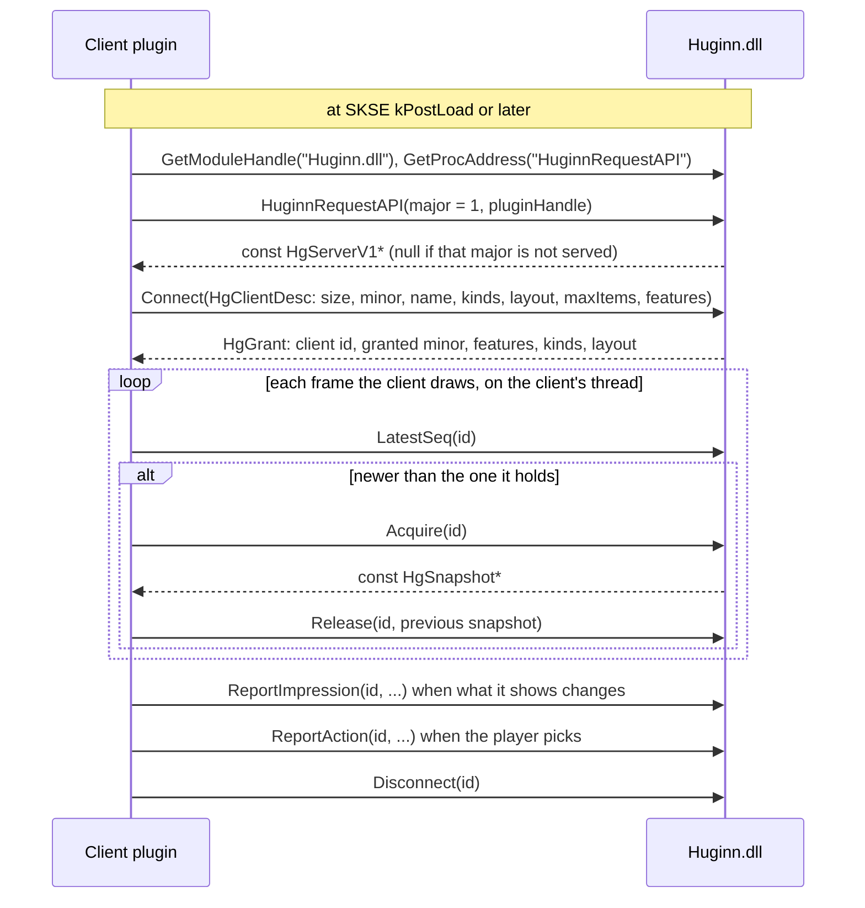

# Huginn as a recommendation server: the client API

**Status: proposal (2026-10-09). Nothing here is built.** Sections 1 and 2
describe the code as it is at `0f49bac` (v0.23.19) and cite it by file and line.
Everything from section 3 on is a proposal, and is marked so where it could be
mistaken for a description. The header in 3.11 is a sketch, not an interface
anyone should compile against.

The user's request (2026-10-09): "i want other UI/UX to dial huginn and then we
start pushing out recommendations through the negotiated api schema. so let the
client figure out what they are good at."

## Summary

- **Today Huginn drives two UIs by pushing into them.** It knows Wheeler's model
  (wheels, entries, items, uniqueIDs, edit mode, wheel indices that shift) and
  writes into it from its update tick. About 4,200 lines are there only for that
  (section 1.2).
- **That push sits in the frame.** In 48 minutes of LoreRim play under Tracy, 7
  Wheeler pushes took over 16.6 ms, and each one that could be measured
  stretched the main thread's frame by 20–29 ms (section 2.2).
- **Huginn also guesses who picked what.** A pick is attributed from timing and
  menu state, not from what the UI saw the player do (section 2.3).
- **Proposed:** Huginn publishes an immutable, numbered snapshot of its
  recommendations. UIs connect ("dial"), say what they can show and do, read the
  snapshot on their own thread, and report back what they showed and what the
  player picked. Huginn never calls into a UI from its tick.
- **Migration:** Huginn's own widget becomes the first client. Wheeler either
  becomes a native client (the user maintains the wheelerAPI fork) or Huginn
  ships an adapter client. Section 4.

---

## 1. Today

### 1.1 The display backends

`PipelineCoordinator` keeps a fixed list of two backends
(`src/pipeline/PipelineCoordinator.cpp:38-44`) and, at the end of each pipeline
run, calls `Push` on every enabled one with the same `DisplayContext`
(`PushDisplay`, `:621-655`). The interface is three methods
(`src/display/IDisplayBackend.h:62-78`): `Push`, `IsEnabled`, and
`GetDesiredPage`, through which a backend can choose the page for everyone
(`ResolveDisplayPage`, `PipelineCoordinator.cpp:677`). `DisplayContext`
(`IDisplayBackend.h:24-49`) passes references to the slot assignments, the whole
scored list, the overrides, and the player and world state.

| Backend | What its `Push` does | Thread of the call |
|---|---|---|
| `IntuitionBackend` (`src/display/IntuitionBackend.cpp:17`) | Hides itself while a Huginn wheel is open (unless `HideWhileWheelOpen` is off), diffs against the last push, and calls `IntuitionMenu::SetSlot` etc., which queue the GFx work with `AddUITask` (`src/ui/IntuitionMenu.cpp:233-246`) | The tick's thread; the GFx work runs later in the UI task |
| `WheelerBackend` (`src/display/WheelerBackend.cpp:32-316`) | Recovers lost wheels, skips while the wheel is open or the editor is up, allocates every page the player is not viewing (`:179-188`), builds subtext labels, drops weapons and armour with no uniqueID (`:288-297`), and calls `WheelerClient::UpdateRecommendationsForPage` per page (`:314`), which ends in `WheelSync::UpdatePage` | The tick's thread, and every Wheeler API call on it |

`IntuitionBackend` sends a confidence value per slot that the widget never reads
(`src/display/IntuitionBackend.h:33-42`: `Intuition.as` takes the parameter
and ignores it).

### 1.2 Huginn is a client of Wheeler's API

Wheeler exposes its API the plain way. `WheelerConnection::TryConnect` finds the
module with `GetModuleHandleA("Wheeler.dll")`, resolves the export
`GetWheelerAPI` with `GetProcAddress`, and gets back a pointer to a struct of
function pointers with a `version` field (`src/wheeler/WheelerConnection.cpp:27-45`).
Huginn accepts versions 1 to 5 and only warns above 5, on the assumption that
Wheeler only appends to the struct (`:51-68`; `src/wheeler/WheelerAPI.h:23-24`).
The struct is `IWheelerAPI` (`WheelerAPI.h:119-184`): status queries, managed
wheels, entries, items, three callbacks (`:115-117`), and later-version
functions that the caller must gate on `version`. Strings passed in are copied
by Wheeler (`WheelerAPI.h:58-62`). The wheelerAPI fork documents the API as
callable from any thread and its callbacks as running on the render/input
thread (`wheelerAPI/src/bin/API/WheelerAPI.h:5`, `:13-27`).

Other SKSE plugins in this ecosystem publish APIs in one of two ways. This is
from memory of their public headers and has **not** been checked against a copy
in this repo:
- an exported function that returns an interface, given a requested version:
  Wheeler's `GetWheelerAPI` (checked, above) and TrueHUD's `RequestPluginAPI`,
  which also takes the caller's SKSE plugin handle and has calls to request and
  release control of a feature;
- an SKSE message exchange: SmoothCam's client sends an interface request
  through `SKSE::MessagingInterface` and receives the interface pointer in a
  reply message.

How Huginn writes a page into Wheeler (`WheelSync::UpdatePage`,
`src/wheeler/WheelSync.cpp:1262`): it takes `m_pageDataMutex`, checks the wheel
with `IsManagedWheel`, `IsWheelEmpty` and `GetEntryCount`, compares the page
with its cache and returns if nothing changed, and otherwise, inside the
`WheelSync::WriteSlots` zone (`:1388`), for each changed slot calls
`RemoveItem` or `ClearEntry`, `AddItemByFormID(wheel, entry, formID, uniqueID)`
(`:1616`) and `SetManagedWheelEntrySubtext` (`:1740`). Weapons and armour need a
uniqueID, and for about a second after a load they have none
(`WheelSync::RequiresUniqueID`, `:30` and its comment).

Code that exists only to keep Wheeler's model in step: `src/wheeler/` (3,841
lines) and `src/display/WheelerBackend.*` (348 lines), by `wc -l`. It handles
wheel indices that shift when the player edits wheels, the editor being open, a
retry and cooldown cache for rejected adds, a uniqueID wait after loads, the
post-activation policies, and urgent auto-focus.

### 1.3 Pages and slots

Huginn's own layout is up to 10 pages of up to 10 slots
(`src/slot/SlotSettings.h:17-18`). Each slot has a classification
(`src/slot/SlotConfig.h:21`), and `SlotAllocator` fills them; `SlotLocker`,
home keys, Remembrance, overrides and wildcards keep the page stable from one
run to the next ([5-slots.md](5-slots.md)). A `SlotAssignment`
(`src/slot/SlotAssignment.h:75`) carries the slot index, type, classification,
formID, uniqueID, score and subtext label. Wheeler shows one wheel per page and
chooses which page is current (`WheelerBackend::GetDesiredPage`,
`WheelerBackend.cpp:23-30`).

### 1.4 How picks are attributed

Every pick goes through `SelectionTracker::Select`, which records a pending
selection that confirms later: a consumable when its count drops, an equip when
it is still equipped after the confirm window
(`src/learning/SelectionTracker.h:13-43`). The source is one of three labels
(`src/learning/EquipEvent.h:19-25`):

| Source | Where `Select` is called | How Huginn knows |
|---|---|---|
| `Hotkey` | the equip callback of `EquipManager` (`src/Main.cpp:773-777`) | Huginn equipped it itself (`EquipManager.cpp:840`, `:1002`) |
| `Wheeler` | `publishWheelerEquip` (`src/Main.cpp:609-611`), from `WheelerClient::OnItemActivated` (`src/wheeler/WheelerClient.cpp:116`) | Wheeler's callback, which arrives **after** Wheeler has equipped the item; the equip is first seen as an outside pick and then relabelled (`WheelerClient.cpp:221-229`) |
| `External` | `ExternalEquipLearner` (`src/learning/ExternalEquipLearner.cpp:80`) | Inferred: `PlayerInputGate::Explain` (`src/learning/PlayerInputGate.h:84-111`) looks at open menus, a menu closed in the last 2 s, a recent vanilla hotkey, a recent pick on a non-Huginn wheel, or any wheel being open |

The selection log v3 turns these into outcomes: `Hotkey` is a key press,
`Wheeler` a wheel pick, and every `External` pick, including one from the
player's own Wheeler wheel or a vanilla hotkey, is logged as a menu pick
(`src/learning/SelectionLogV3.cpp:1252-1254`). The page it logs as `shown` is
the page Huginn allocated in its last run (`PipelineStateCache`,
`src/learning/PipelineStateCache.h:66`, `:106`). Whether that page was on screen
is not recorded: nothing in `SelectionLogV3*.cpp`, `PipelineStateCache.h`,
`SelectionTracker.cpp` or `EquipEventBus.cpp` reads widget visibility or the
wheel's open state (grep for `visible`, `hidden`, `IsWheelOpen`).

---

## 2. Why change

### 2.1 Huginn has to know each UI's model

Every new UI would need its own backend inside Huginn, written against that UI's
data model and kept in step with its quirks, as section 1.2 shows for Wheeler.
The UI knows best how to present a ranked set of items: how many fit, how to
group them, whether a label fits under an icon. Huginn knows which items fit the
moment. Today Huginn also does the UI's part.

### 2.2 The push runs on the tick, and the tick is in the frame

From a LoreRim capture on 2026-10-09 (Huginn 0.23.18, Debug + Tracy, 48.5
minutes of unpaused play), with its analysis and an independent verification.
The capture and both write-ups are local and untracked, so they are summarised
here, not linked
([performance-profiling-guide.md](../testing/performance-profiling-guide.md):
never link a `.tracy` or `traces/` file).

| Measured | Value |
|---|---|
| Wheeler pushes (`Display::Wheeler`) | 2,711; only 302 wrote anything to Wheeler |
| Pushes over 5 ms / over 16.6 ms | 18 / 7 (the capture before it, 0.23.16: also 18 / 7) |
| Share of a push over 16.6 ms spent in `WheelSync::WriteSlots` | 95.3–97.8% |
| `Display::Wheeler` self time, any push | at most 0.41 ms |
| Job-thread ticks overlapping a main-thread zone | 0 of 26,565 (shifting the ticks at random by ±50 ms gives about 1,450–1,490 overlaps) |
| Gap from the end of a job tick to the next main-thread player update | p50 1.99 ms, flat whatever the tick's length |
| Frame stretch from a push over 16.6 ms | +19.9 to +29.0 ms (the 6 cases that could be measured) |
| HUD widget update | waits behind the Wheeler push in the same tick (its log line comes after the push, by the push's ~20 ms); Wheeler is first in the backend list (`PipelineCoordinator.cpp:41-44`) |

What this does and does not show:
- `WriteSlots` contains the Wheeler API calls plus a little Huginn code (the
  retry-cache lookup, `RequiresUniqueID`, subtext strings, debug log lines). The
  verification ruled the Huginn part out by reading the code and by the absence
  of log lines inside the slow writes, not by timing. So "the time is inside
  Wheeler" is a well-supported inference.
- The slow writes were adds of a weapon instance (uniqueID not 0) to wheel 0,
  the wheel Wheeler had active, early in the session, and not every time: the
  same item went onto wheel 1 in the same push in about 0.1 ms.
- "The main thread waits for the tick" is inferred from the zero overlaps and the
  flat 2 ms gap; the main thread is not instrumented between frames. The code
  comment above `OnUpdate` says the same (`src/UpdateLoop.cpp:541-573`).

The point for this design: whatever the cause inside Wheeler, Huginn pays it on
a thread the frame waits for, and the HUD widget waits behind it. A design where
Huginn never calls a UI from its tick removes that coupling, whichever thread R8
picks for the loop.

### 2.3 Picks are inferred, not told

The roadmap's known bug of 2026-10-09: LoreRim's "Arcane Anchor" spell, equipped
by a script just after the player closes a menu, is read as a menu pick because
any equip within 2 s of a menu closing is explained as "menu (just closed)"
(`PlayerInputGate.h:93-96`), and the learner is trained on it. That case is a
vanilla menu, which no client API reaches, so the API would not fix it by
itself. What it shows is what inference costs: every pick Huginn has to guess
at can be guessed wrong, and the learner trains on the guess. A UI that tells
Huginn "the player picked this item at this position" leaves nothing to guess
for the picks made through it. Section 1.4 shows how much is guessed today: a
wheel pick is relabelled after the fact, and picks through the player's own
wheels and vanilla hotkeys are logged as menu picks.

The learner needs the choice set as much as the pick. Doc 9 trains a choice
model over the page shown, P(chose i | page) ∝ exp(scoreᵢ)
([9-context-as-learner-input.md](9-context-as-learner-input.md), "Proposed
model"). The page Huginn logs is the page it allocated, not what was on screen
(section 1.4). A UI that reports what it showed and when gives the model the
right set.

---

## 3. Proposal

### 3.1 Roles

| | Huginn (server) | A UI (client) |
|---|---|---|
| Decides | which items fit the moment, their order, the reason, and (if asked) Huginn's page layout | what to show, how many, where, how it looks, when it refreshes |
| Owns | the snapshot, the learner, attribution, confirmation | its own data model (wheels, slots, widgets), input, rendering |
| Calls | nothing in the client, ever, from the tick | Huginn's functions, from its own threads |

### 3.2 Dialing

Proposed: an exported function, the same pattern as Wheeler's `GetWheelerAPI`
(section 1.2), plus the caller's version and plugin handle as TrueHUD does.



- A client may connect at any time after Huginn's DLL is loaded. Before the
  first game load there is simply no snapshot (`Acquire` returns null).
- On a game load Huginn bumps a load generation; the client keeps its id.
- Huginn could also broadcast an SKSE message ("Huginn ready, major 1") for
  clients that prefer messaging. Not needed for v1 (open question 7).

### 3.3 Negotiation

The client declares what it can show and do. Huginn answers with what it
grants, which is never more than was asked for and never more than Huginn
supports.

| The client declares | Values | What Huginn does with it |
|---|---|---|
| Item kinds | a bit mask: spell, potion, food, alcohol, poison, scroll, melee weapon, ranged weapon, staff, ammo, armour, torch, soul gem; power and shout reserved | Grants the kinds Huginn recommends. Powers, shouts and ingredients are not recommended ([roadmap.md](../roadmap.md), "Decided against") and are never granted |
| How many it shows at once | `maxItems`, `maxPages` | The snapshot holds at least `maxItems` of each granted kind |
| Shape | ranked list; ranked list grouped by kind; or Huginn's page layout | The ranked list is always there; the page layout section is filled only if granted |
| Equipping | equips itself, or asks Huginn to | Grants `RequestUse` if asked (section 3.9) |
| Text | can show a reason label | Fills `label` strings for it |
| Icons | can show icons | Informational only. Huginn sends no icons; the client resolves them from the formID and kind |
| Share | can use a 0–1 share (section 3.5) | Fills `share` |
| Refresh | the interval it wants updates at, as a hint | With pull delivery the client sets its own pace; Huginn uses the hint only to coalesce a later notifier |
| Feedback | will report impressions; will report actions | Decides how its picks are learned (section 3.7) |

Version rules, proposed:
- **Major** changes break; Huginn serves the majors it lists and refuses others.
  No compatibility layers across majors (the user is the only user today).
- **Minor** versions only add. Each struct starts with `size`; each side reads
  only the fields both know. Unknown feature bits are ignored, never rejected.
- Arrays of structs carry a stride, so a newer item struct with more fields
  is still read correctly by an older client.

### 3.4 The snapshot

One immutable snapshot per pipeline run that changed something, with a
sequence number that only grows. Proposed contents:

| Field | Meaning |
|---|---|
| `seq` | Increases by one per publish. A client compares it with the one it holds |
| `loadGeneration` | Changes on every game load. A dynamic `FF` formID means nothing across loads ([9-selection-log-v3.md](9-selection-log-v3.md), row column `form`) |
| `publishedAt` | Huginn's steady-clock time, microseconds |
| `items[]` | The ranked list, best first (below) |
| `needs[]` | The active needs: need id (the `needs.csv` id, e.g. `health_deficit`; 93 today, `src/core/NeedIds.h:126`) and value 0–1. Logged only until R8 makes the scorer read them |
| `pages[]` | Only if the page layout was granted: per page, per slot, an index into `items[]` or empty, and the slot's classification name. Plus the current page |

Each item:

| Field | Meaning |
|---|---|
| `ref` | formID, uniqueID, load generation. The uniqueID is the `ExtraUniqueID` of a weapon or armour stack and 0 for everything else, as Wheeler and the selection log already use it (`WheelSync.cpp:30`; `9-selection-log-v3.md`, column `uid`) |
| `flags` | `exploration` (a wildcard), `urgent` (an override), `kept` (a slot lock, Remembrance or home key is keeping it; not the selection log's `held`, which means carried), `noInstance` (a weapon or armour whose uniqueID is not known yet, as after a load: a client that needs an instance must skip it) |
| `kind`, `rank` | as above; rank 0 is best |
| `share` | section 3.5 |
| `reason` | the need it answers, as an index into `needs[]`, or none; `label`, a short text for it ("Fire", "Critical HP") |
| `name`, `count` | the display name and the stack count, read when the snapshot was built, so a client that only renders need not touch the game |
| `hand` | which hands the item can go in (one-handed, two-handed, either hand for a spell). A suggested hand is not computed today; the field is reserved for it |

Size: the ranked list is the top N overall plus enough of each granted kind for
the client with the largest `maxItems`, not the whole held list (the menu is
for that). With two clients of 10 positions each, that is a few dozen items.

### 3.5 Scores: rank and share, not the raw score

Proposed: publish the rank and a **share**, and keep the raw score out of the
stable fields.

- The raw score's scale is about to change. Under R7's bridge it is ln(utility)
  (`src/core/SlotScoreMath.h:83-90`); R8 replaces it with a learned score. A
  client that hard-codes a threshold on it breaks at R8.
- The share is the choice model's own output: the probability that the player
  picks the item, among the items in the snapshot, P ∝ exp(score) (doc 9). Under
  today's bridge that is utility / Σ utility. Because the model is a logit, a
  client that shows only some of the items can renormalise the shares over what
  it shows and get exactly the model's probability for its own set.
- A client can use the share to dim weak items or decide how many to show. The
  only UI that ever had a score did not use it (section 1.1).
- Overrides have no finite score (R7 made them +inf, never compared;
  [roadmap.md](../roadmap.md), R7), so an `urgent` item carries the flag and
  share 0, and the shares are computed over the other items. Wildcards keep
  their low share; the `exploration` flag says why they are there.
- The raw score can go in a debug-only field, marked unstable.
- After R9 a spread (σ) per item exists; a later minor version can add it.

### 3.6 Delivery and threads

Proposed contract:

| Who | Thread | May | Must not |
|---|---|---|---|
| Huginn's tick | Whatever thread runs the loop (R8 decides) | Build the snapshot, publish it with one atomic swap, drain the clients' report queues | Call any client function; wait on a client; take a lock a client holds for longer than a pointer copy |
| A client reading | Any thread it owns: its render thread, a worker | `LatestSeq` (one atomic load), `Acquire`, `Release` | Keep more than a few snapshots alive (Huginn caps it per client) |
| A client reporting | Any thread | `ReportImpression`, `ReportAction` (each a bounded, non-blocking enqueue; when full, the oldest is dropped and counted) | Expect the report to be applied before the next tick |
| A client equipping | Its own decision (section 3.9) | Equip through the game or through `RequestUse` | Assume Huginn equips on the calling thread |

- **Publish** is a swap of a reference-counted pointer to an immutable snapshot.
  A client holds it from `Acquire` to `Release`; every string in it lives as
  long as the snapshot. The old snapshot is freed when its last holder releases
  it.
- **Notification.** In v1 the client polls `LatestSeq` once per frame; it costs
  one atomic load. A callback is not proposed for v1, and an SKSE task is not a
  way to deliver one: SKSE tasks run on game job threads in gameplay (seen by a
  verifier, `9-implementation-map.md:62`, not in a Tracy trace), the same kind
  of thread the frame appears to wait for, so nothing guarantees a task is off
  the frame. If a client
  without a per-frame hook needs one, a later minor version can add a callback
  from a Huginn-owned thread that is not a game thread, coalesced, with the rule
  that it only sets a flag.
- **Why this fixes the hitch evidence.** The tick's display cost becomes the
  cost of building a snapshot of a few dozen items and swapping a pointer.
  Whatever a UI does with it, including any wait on its own locks, runs on the
  UI's thread. This holds whichever option R8 picks for the loop: under the
  `PlayerCharacter::Update` hook option the tick runs on the main thread itself
  ([roadmap.md](../roadmap.md), R8), where a slow push would cost the frame
  directly, so the boundary matters more there, not less. A UI that does slow
  work on its own render thread can still hitch; that is then the UI's budget
  to manage, and section 4 says what it means for Wheeler.
- **Work a client must do on a game thread.** Equipping, and reading the
  inventory, are not safe from an arbitrary thread. The snapshot carries the
  name and count so a renderer need not do either. A client that equips does
  it where it does today (Wheeler: in its activation path).

### 3.7 Feedback: impressions and actions

Proposed reports:

| Report | Contents | When |
|---|---|---|
| Impression | client id; the `seq` it was built from; the page (layout clients); the visible items as (ref, position); when they became visible and for how long | When the visible set changes or the view hides (a wheel closes, the HUD hides for a menu): one report per change, not per frame |
| Action | client id; `seq`; the item; its position, or "not offered" (a pick from the client's own content, such as the player's own wheel); the input (key, wheel, mouse, gamepad); who equips (client or Huginn) | On the pick |
| Dismissal | client id; the item; the position | Optional, for a UI with a "not now" gesture. Reserved; nothing reads it yet |

Why Huginn needs them:
- **The choice set.** The R8 learner trains on the page the player saw (section
  2.3). An impression is that page. Without it, Huginn has to assume the client
  showed what Huginn would have shown.
- **The R4 and R6 data.** The selection log v3's `shown` rows and its "nothing
  pressed" episodes (the page at the need's onset) become the reported
  impression instead of the allocated page. The R5 cheap test found key
  position alone gives 41% hit@1 on the shown page
  ([roadmap.md](../roadmap.md), R5), so positions per client are worth having
  for a position term.
- **Attribution.** An action report replaces the relabel after Wheeler's
  callback and the timing guesses of `PlayerInputGate` for picks made through a
  client. A pick from a client's own content (the player's own wheel) becomes
  its own outcome instead of a menu pick.

What stays Huginn's:
- **Confirmation.** A reported action opens a pending selection like any other,
  and it confirms only when the game says so: the count drops, or the item is
  still equipped after the window (`SelectionTracker.h:21-27`). A buggy client
  cannot train the learner on a pick that never happened.
- **The fallback.** For a client that does not report, and for the vanilla
  menus, `ExternalEquipLearner` and `PlayerInputGate` keep working as today.

### 3.8 Several clients

- Each `Connect` gets an id and gives a name for the logs. Every impression,
  action and log record carries the id. `EquipSource`'s three values become
  "which client, or none".
- **One snapshot for everyone.** Its list is sized to cover every connected
  client's declared kinds and `maxItems` (section 3.4). Clients filter and trim
  it themselves. There is no per-client scoring: the learner models the player,
  not the UI.
- **The current page,** for layout clients, follows the client that most
  recently reported a page change, as Wheeler drives it today
  (`GetDesiredPage`). The player looks at one UI at a time.
- **Conflicting equips** are not arbitrated. The game's equipped state is the
  truth: if two clients equip different items into one hand, the last one wins,
  each pick is attributed to its client, and the confirm rule decides which one
  teaches (the one still equipped). `SelectionTracker` already merges duplicate
  picks of one item (`SelectionTracker.h:31-32`). `RequestUse` calls are run in
  order of arrival.

### 3.9 Equipping

Both, proposed:
- **The client equips** (the default; Wheeler does this today) and reports the
  action.
- **The client asks Huginn**, with `RequestUse(ref, hand)`, for a thin client
  that renders and forwards input. Huginn runs it through `EquipManager`, which
  already knows potions, scrolls, soul gems, ammo, torches, both hands and
  instances (`src/input/EquipManager.cpp:58-618`), from the thread it equips on
  today, and reports the result.

Huginn's own number keys stay a Huginn feature, part of the widget client.
Read-only mode (`bReadOnly`, `src/input/InputHandler.cpp:195-204`,
[6-ui-ux.md](6-ui-ux.md#read-only-mode-breadonly-01911)) becomes a setting of
that client: it renders, and its keys do not equip.

### 3.10 ABI rules

- C linkage for the one export; everything else through a struct of function
  pointers that starts with `size`, `major`, `minor`.
- Only fixed-width integers, `float`, plain structs and `const char*` cross the
  boundary. No `std::` types, no C++ classes, no exceptions: every function is
  `noexcept` on Huginn's side, catches everything, and returns a result code.
- Strings are UTF-8. Strings Huginn hands out are owned by the snapshot and live
  until `Release`; a client that keeps one copies it (and into Scaleform with
  `CreateString`, CLAUDE.md). Strings a client passes in are copied during the
  call.
- Ids and handles are integers, never pointers into Huginn's memory, except the
  server struct, which lives as long as the process, and the snapshot pointer,
  which is valid from `Acquire` to `Release`.
- Huginn never unloads, and does not pin a client's module. A client that
  unloads calls `Disconnect` first.

### 3.11 Header sketch

**A sketch to argue over, not an interface.** Names and fields will change.

```c
/* HuginnAPI.h -- SKETCH ONLY (docs/architecture/10-client-api.md). */
#include <stdint.h>

#define HG_API_MAJOR 1
#define HG_API_MINOR 0

typedef int32_t  HgResult;      /* 0 = OK; < 0 = error */
typedef uint32_t HgClientId;    /* 0 = none */

enum HgKindBit {                /* bit index into a kind mask */
    HG_KIND_SPELL, HG_KIND_POTION, HG_KIND_FOOD, HG_KIND_ALCOHOL, HG_KIND_POISON,
    HG_KIND_SCROLL, HG_KIND_WEAPON_MELEE, HG_KIND_WEAPON_RANGED, HG_KIND_STAFF,
    HG_KIND_AMMO, HG_KIND_ARMOR, HG_KIND_TORCH, HG_KIND_SOUL_GEM,
    HG_KIND_POWER, HG_KIND_SHOUT          /* reserved: never granted today */
};
enum HgLayout  { HG_LAYOUT_RANKED = 0, HG_LAYOUT_GROUPED = 1, HG_LAYOUT_PAGES = 2 };
enum HgFeature {
    HG_FEAT_LABELS      = 1u << 0,  /* fill item.label */
    HG_FEAT_SHARE       = 1u << 1,  /* fill item.share */
    HG_FEAT_IMPRESSIONS = 1u << 2,  /* the client WILL report impressions */
    HG_FEAT_ACTIONS     = 1u << 3,  /* the client WILL report actions */
    HG_FEAT_REQUEST_USE = 1u << 4,  /* the client wants Huginn to equip */
    HG_FEAT_DEBUG_SCORE = 1u << 15  /* raw score; unstable, debug only */
};
enum HgItemFlag { HG_ITEM_EXPLORATION = 1, HG_ITEM_URGENT = 2, HG_ITEM_KEPT = 4,
                  HG_ITEM_NO_INSTANCE = 8 };

typedef struct HgClientDesc {
    uint32_t    size;           /* sizeof as the client compiled it */
    uint32_t    minor;
    const char* name;           /* UTF-8, copied during Connect */
    uint64_t    kindMask;
    uint32_t    features;
    uint16_t    maxItems, maxPages;
    uint8_t     layout;         /* HgLayout */
    uint8_t     reserved[3];
    uint32_t    refreshHintMs;
} HgClientDesc;

typedef struct HgGrant {
    uint32_t   size, minor;
    HgClientId id;
    uint32_t   features;        /* a subset of what was asked */
    uint64_t   kindMask;        /* a subset of what was asked */
    uint8_t    layout;
    uint8_t    reserved[7];
} HgGrant;

typedef struct HgItemRef { uint32_t formID; uint16_t uniqueID; uint16_t pad; uint32_t loadGeneration; } HgItemRef;

typedef struct HgItem {
    HgItemRef   ref;
    uint16_t    kind, rank;
    uint16_t    flags;          /* HgItemFlag */
    uint16_t    reason;         /* index into HgSnapshot.needs, 0xFFFF = none */
    uint8_t     hand;           /* which hands it fits; suggested hand reserved */
    uint8_t     reserved[3];
    uint32_t    count;
    float       share;          /* 0..1 over this snapshot's items */
    float       debugScore;     /* HG_FEAT_DEBUG_SCORE only */
    const char* name;           /* UTF-8, owned by the snapshot */
    const char* label;          /* UTF-8, owned by the snapshot, may be "" */
} HgItem;

typedef struct HgNeed { const char* id; float value; } HgNeed;   /* id: needs.csv id */

typedef struct HgSlot { uint16_t item; uint16_t pad; const char* classification; } HgSlot; /* item: 0xFFFF = empty */
typedef struct HgPage { const char* name; uint32_t slotCount; const HgSlot* slots; } HgPage;

typedef struct HgSnapshot {
    uint32_t        size, minor;
    uint64_t        seq;
    uint64_t        publishedAtUs;
    uint32_t        loadGeneration;
    uint32_t        itemCount, itemStride;   /* step through items by itemStride */
    const HgItem*   items;
    uint32_t        needCount, needStride;
    const HgNeed*   needs;
    uint32_t        pageCount, currentPage;  /* 0 pages unless HG_LAYOUT_PAGES */
    const HgPage*   pages;
} HgSnapshot;

typedef struct HgImpression {
    uint32_t size; uint64_t seq; uint16_t page; uint16_t count;
    uint64_t shownAtUs; uint32_t visibleMs;    /* steady clock, microseconds, the same clock as publishedAtUs */
    const HgItemRef* refs; const uint16_t* positions;   /* copied during the call */
} HgImpression;

typedef struct HgAction {
    uint32_t size; uint64_t seq; uint64_t atUs; HgItemRef ref;
    uint16_t page, position;        /* 0xFFFF = not offered by Huginn */
    uint8_t  input;                 /* key, wheel, mouse, gamepad, other */
    uint8_t  equippedBy;            /* 0 = the client, 1 = Huginn via RequestUse */
    uint8_t  reserved[2];
} HgAction;

typedef struct HgServerV1 {
    uint32_t size, major, minor;
    HgResult (*Connect)(const HgClientDesc* desc, HgGrant* out);
    void     (*Disconnect)(HgClientId id);
    uint64_t (*LatestSeq)(HgClientId id);
    const HgSnapshot* (*Acquire)(HgClientId id);            /* null before the first publish */
    void     (*Release)(HgClientId id, const HgSnapshot* snap);
    HgResult (*ReportImpression)(HgClientId id, const HgImpression* imp);
    HgResult (*ReportAction)(HgClientId id, const HgAction* act);
    HgResult (*RequestUse)(HgClientId id, HgItemRef ref, uint8_t hand);
} HgServerV1;

/* The one export, "HuginnRequestAPI": a client resolves it with GetProcAddress.
   Returns null if `major` is not served. */
typedef const HgServerV1* (*HuginnRequestAPIFn)(uint32_t major, uint32_t pluginHandle);
```

### 3.12 The Core Principle and the API

CLAUDE.md: recommend only from what the player has or could easily perceive,
and never read the Forbidden Information list. The roadmap's perception line
says what the HUD shows (target bars, type, race, equipped weapons, a visibly
cast spell) is fair, and spell lists and hidden numbers are not
([roadmap.md](../roadmap.md), "The perception line").

For the API, proposed:
- **The snapshot carries only the player's own items** (held, or spells known),
  their ranks and shares, the active need ids and values, and short labels. No
  fields about targets, the world, or anything else Huginn reads.
- **Reasons inherit the rule.** A reason is a need, and each need is built from
  inputs inside the perception line. Doc 9 switches a mod-dependent need on only
  when its mod is detected, TrueHUD's enemy magicka and stamina among them
  ([9-context-as-learner-input.md](9-context-as-learner-input.md), "Needs and
  effects, enumerated"), so such a reason can only appear when the player can
  see what it is based on.
- **No sensor inputs.** The need's curve input (the selection log's `in`, e.g. a
  drop in game units) stays out: no UI needs it, and it would widen the surface.
- **No query API.** Clients get the snapshot, not a way to ask Huginn about the
  game. A client is a DLL in the same process and can read the game itself; the
  API cannot stop that. The principle binds what Huginn publishes and
  recommends.

---

## 4. Migration

Proposed order. Each step leaves the game playable.

| Step | What | Done when |
|---|---|---|
| C1 | **In-process snapshot.** Build the snapshot at the end of `RunPipeline` and publish it; `IntuitionBackend` and `WheelerBackend` read it instead of `DisplayContext`. No export yet. The backends still run on the tick; only their input changes | Host tests for the snapshot builder in `src/core/`; `hg recs 40` identical to the base build; the same pages and the same Wheeler writes |
| C2 | **The widget as a client.** `IntuitionMenu` polls `LatestSeq` in `AdvanceMovie` (`src/ui/IntuitionMenu.h:115`) and renders from the snapshot, instead of one `AddUITask` per call from the tick (`IntuitionMenu.cpp:233-246`). It reports impressions, since it knows when it is visible | The widget shows the same pages; impressions in the selection log v3 |
| C3 | **Wheeler off the tick:** (a) native client or (b) adapter, below | No `Display::Wheeler` zone on the tick; no frame stretch from wheel writes in a LoreRim Tracy session (**in game, you**) |
| C4 | **Feedback into learning.** Client ids replace `EquipSource`; impressions become the `shown` set; client action reports replace the Wheeler relabel | Selection log v3 records client, impression and action; the replay tool reads them |
| C5 | **The export.** `HuginnRequestAPI`, the header, a short guide for mod authors, a test client in `tests/` | A test client connects, reads, reports, and disconnects in a host test against the core |

**Wheeler, path (a): a native client** in the wheelerAPI fork, which the user
maintains (`LandingCrew/wheelerAPI`). Wheeler reads the snapshot in its own
update on the render thread, which already takes the wheel-data lock every
frame (the lock-wait note at `wheelerAPI/src/bin/API/WheelerAPI.cpp:43-57`), so
no other thread waits on that lock for Huginn's sake. It reports impressions
only while a wheel is open, which only Wheeler knows exactly, and actions from
its activation path, including picks from the player's own wheels. Most of
`src/wheeler/` goes: index re-resolution, the editor gate, the retry and defer
caches.

What (a) does with the cost depends on its cause, which the traces could not
split (section 2.2). If it is lock contention between Huginn's thread and
Wheeler's render thread, (a) removes it. If it is building the item (the
weapon-instance lookup), (a) moves it to the render thread, where it still
costs a frame unless Wheeler builds lazily: only the changed entries, and only
when a wheel opens or is about to. The fork already has a branch that builds
item descriptions on first hover (`perf/lazy-item-descriptions`). A Wheeler
Tracy capture (its client on port 8087) during C3 settles which.

**Wheeler, path (b): an adapter client in Huginn.** Today's `WheelSync` moves
behind the client API and runs on a Huginn-owned worker thread that polls the
snapshot. Off the frame, but with a risk that must be checked first: Wheeler's
API says it may be called from any thread, yet `AddItemByFormID` builds the item
before it takes Wheeler's lock (`wheelerAPI/src/bin/API/WheelerAPI.cpp:612`,
lock at `:619`), and for weapons and armour that build resolves the instance by
walking the player's inventory (the Wheeler-side report of 2026-10-09). Today
that walk runs on a tick the main thread appears to wait for, and that
serialisation, the same one that causes the hitch, may be what keeps the walk
from racing the game's own inventory writes. That is an inference, not a
measurement. On a free-running thread the walk could race.

Recommendation: (a). Use (b) only as a stopgap, and only after showing that
Wheeler's item construction is safe off the game's threads.

**Related backlog:**
- Read-only widget: already exists as `bReadOnly` (0.19.11). Under the API it is
  a setting of the widget client (section 3.9).
- A dMenu toggle to connect or disconnect Wheeler at runtime (a backlog idea,
  not yet in the roadmap) falls out: with a native client it is Wheeler's
  setting; with the adapter, the adapter connects or disconnects.
- "Default slot keys are the number row" ([roadmap.md](../roadmap.md),
  "Mod compatibility"): unchanged. Read-only mode is still one of its fixes.

---

## 5. Open questions for the user

| # | Question | Options | Recommendation |
|---|---|---|---|
| 1 | Expose raw scores? | raw score; rank only; rank + share | **Rank + share.** Raw score only behind a debug bit, unstable (section 3.5) |
| 2 | Does Huginn keep slot allocation as a service? | yes, as an optional layout; no, ranked lists only | **Yes.** The page layout is where stability lives (locks, home keys, Remembrance, overrides, wildcards; R9 and R10 build on it), and the one-page end state needs it. Clients that want a flat list ignore it |
| 3 | Do clients equip? | client only; Huginn only; both | **Both.** Client by default, `RequestUse` for thin clients |
| 4 | Papyrus or MCM clients? | native only; a Papyrus shim | **Native only in v1.** A read-only Papyrus shim later if a real client asks. MCM is settings, not a client |
| 5 | One snapshot or per-client? | one shared; one per client | **One shared**, sized to the union of what clients declare; clients filter. No per-client scoring |
| 6 | Impression reporting required? | required to connect; optional | **Optional to connect; needed for learning.** A client that reports no impressions still gets snapshots, but its picks are learned as outside picks, since its choice set is unknown. Huginn's own clients always report |
| 7 | Discovery | exported function; SKSE messaging; both | **Exported function** (Wheeler's pattern, which the user already maintains). Messaging later if a client needs it |
| 8 | Change notification | poll; callback | **Poll** in v1 (one atomic load per frame) |
| 9 | Current page with several layout clients | last to report a page change; one designated client | **The last client to report a page change** |
| 10 | When to build C1 | with R8's thread decision; after R8; after R12 | **After R8, before R12's soak.** Earlier only if the hitch is ruled to block play |
| 11 | Does the snapshot include items Huginn would not show? | top N plus per-kind depth; every eligible item | **Top N plus per-kind depth.** The whole held list is the menu's job |

---

## 6. Out of scope / non-goals

- **A game-state API.** Clients get recommendations and needs, not targets,
  world state or sensor inputs (section 3.12).
- **Rendering for clients.** No icons, layout, styling or animation from Huginn.
- **Anything out of process.** No sockets, files or IPC; the API is in-process
  SKSE plugins only.
- **Per-UI learning.** One learner for the player. A position term per client
  may come later from the impression data; not in v1.
- **Arbitrating equips between clients.** The game's equipped state decides.
- **Replacing Wheeler's own API.** Huginn stops managing wheels; it does not
  become a wheel manager for others.
- **Compatibility across majors.** One user today; a major change is a clean
  break.
- **Changing what is recommended.** That is the engine rewrite (R-series).
  The API publishes whatever the engine ranks.

## Sources

Code at `0f49bac`: `src/display/` (all), `src/wheeler/WheelerAPI.h`,
`WheelerConnection.cpp`, `WheelerClient.cpp`, `WheelSync.cpp`;
`src/pipeline/PipelineCoordinator.cpp`; `src/learning/EquipEvent.h`,
`SelectionTracker.h`, `PlayerInputGate.h`, `ExternalEquipLearner.cpp`,
`PipelineStateCache.h`, `SelectionLogV3.cpp`; `src/Main.cpp`;
`src/input/EquipManager.cpp`, `InputHandler.cpp`; `src/ui/IntuitionMenu.*`;
`src/slot/SlotSettings.h`, `SlotConfig.h`, `SlotAssignment.h`;
`src/core/SlotScoreMath.h`, `NeedIds.h`; `src/UpdateLoop.cpp`. The wheelerAPI
fork: `src/bin/API/WheelerAPI.h`, `WheelerAPI.cpp`, and its report
`docs/reports/2026-10-09-huginn-push-spikes-after-load.md`. The 2026-10-09
LoreRim trace analysis and its verification (local, untracked; summarised in
section 2.2).
