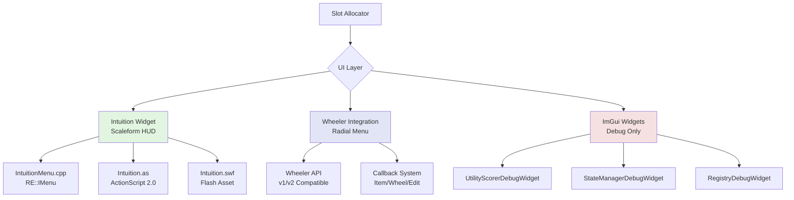
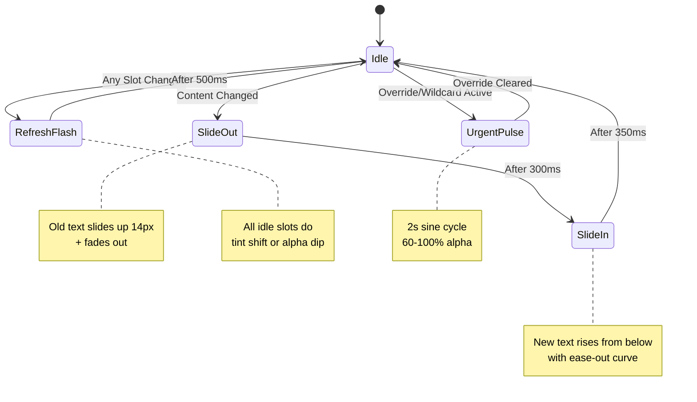
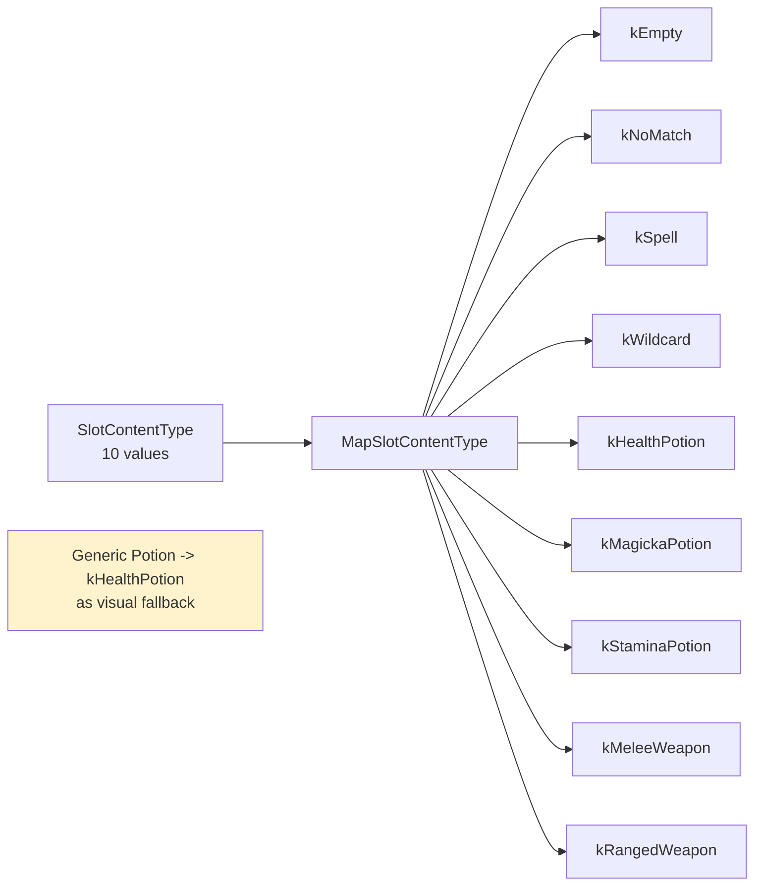
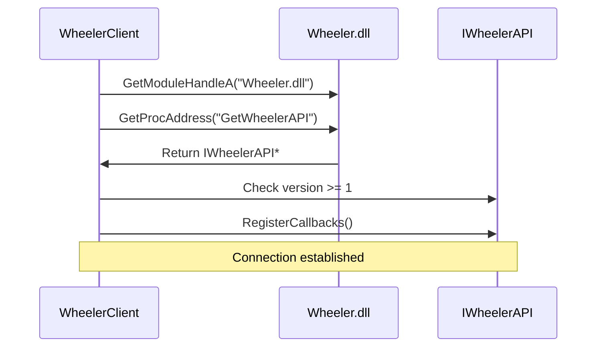
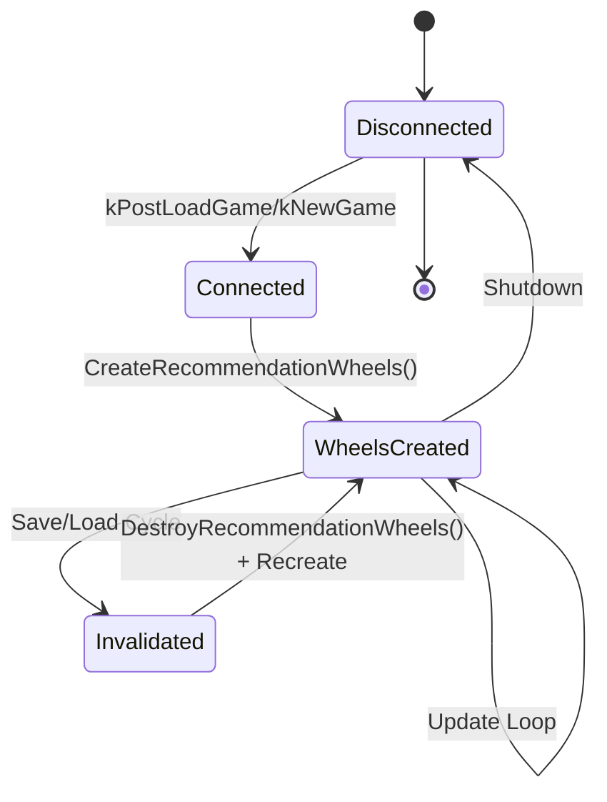
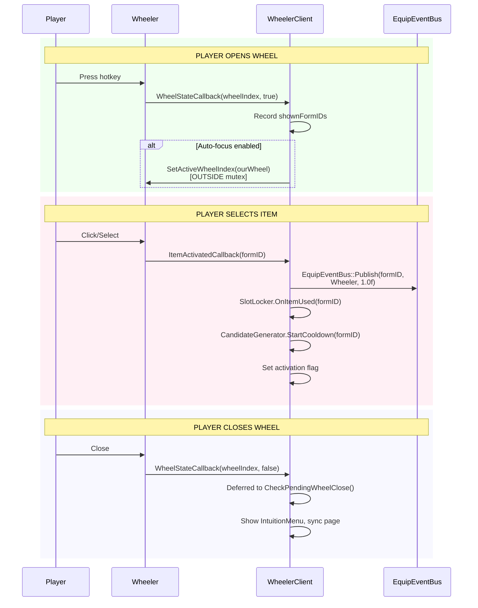
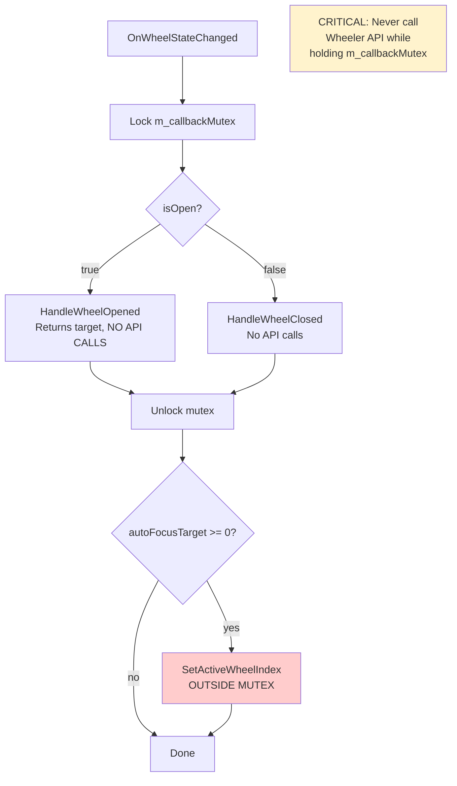
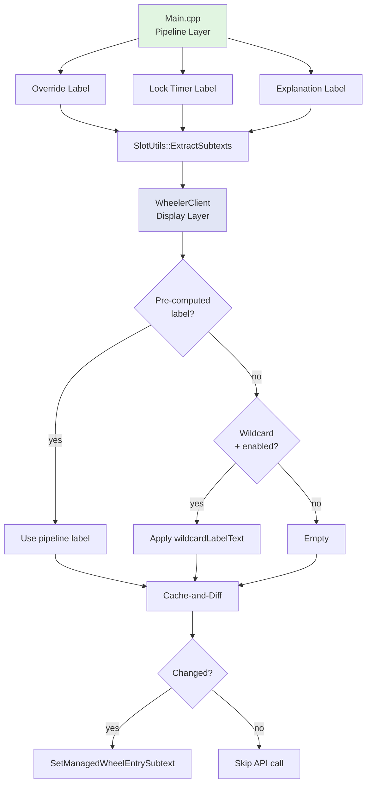
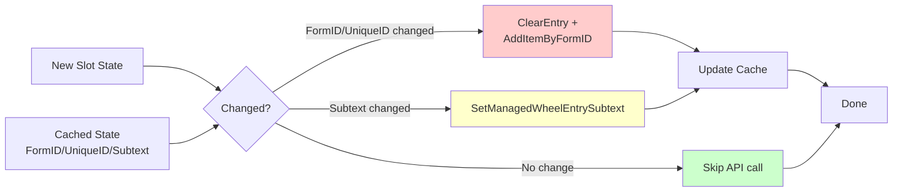
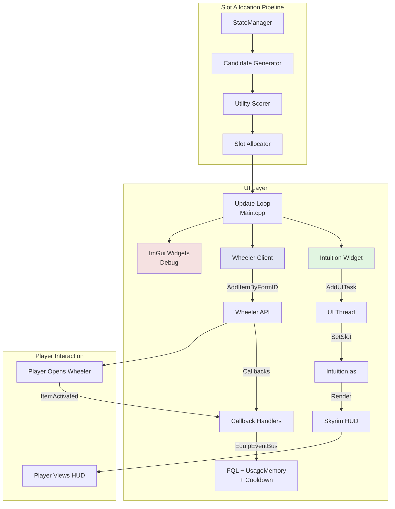

# Huginn UI/UX Architecture

This document describes Huginn's user interface systems: the **Intuition Widget** (primary Scaleform HUD) and **Wheeler Integration** (optional radial menu).

**Current Implementation:**
- Intuition Widget: `src/ui/IntuitionMenu.cpp`, `src/swf/Intuition.as`
- Wheeler Client: `src/wheeler/WheelerClient.cpp`
- Settings: `src/ui/IntuitionSettings.h`, `src/wheeler/WheelerSettings.h`
- INI Sections: `[Widget]`, `[Wheeler]`, `[Subtexts]` in `Huginn.ini`

---

## UI Architecture Overview



Huginn provides **three UI modes**:

1. **Intuition Widget** (Primary) - Native Scaleform HUD, minimal performance impact
2. **Wheeler Integration** (Optional) - Radial menu compatibility for Wheeler users
3. **ImGui Debug Widgets** (Development) - Debug builds only, shows detailed scoring/state

---

## Intuition Widget (Scaleform HUD)

The Intuition widget is Huginn's primary player-facing display — a native Skyrim HUD element built with Scaleform (ActionScript 2.0).

### Architecture

```mermaid
graph LR
    Update[Update Loop] -->|SetSlot| IntuitionMenu[IntuitionMenu.cpp]
    IntuitionMenu -->|AddUITask| UIThread[UI Thread]
    UIThread -->|GFxValue::Invoke| AS[Intuition.as]
    AS -->|MovieClip API| SWF[Huginn/Intuition.swf]
    SWF -->|Render| HUD[Skyrim HUD Layer]

    INI[Huginn.ini<br/>[Widget]] -.->|Position/Alpha/Scale| IntuitionMenu

    style IntuitionMenu fill:#e1f5e1
    style AS fill:#f0f8e1
    style SWF fill:#e1f0f8
```

**Key Components:**
- **IntuitionMenu** - `RE::IMenu` subclass, manages SWF lifecycle and C++ <-> AS2 bridge
- **Intuition.as** - ActionScript 2.0 widget with slot rendering and animations
- **Intuition.swf** - Compiled Flash asset (1280x720 stage, up to 10 slots)
- **IntuitionSettings** - INI-configurable position, alpha, scale, effects via `[Widget]` section

### Public API (C++ -> AS2)

The C++ side communicates with ActionScript via `GFxValue::Invoke()`. All calls are deferred to the UI thread via `SKSE::GetTaskInterface()->AddUITask()`.

| Method | Parameters | Purpose |
|--------|------------|---------|
| `setSlot` | index, name, type, confidence, detail, visualState | Update slot content (triggers slide animation on name change) |
| `clearSlot` | index | Hide a slot |
| `setSlotCount` | count | Set visible slot count + resize background |
| `setPage` | current, total, name | Update page indicator dots |
| `setUrgent` | index, active | Enable/disable urgent pulse animation |
| `setWidgetAlpha` | alpha | Overall widget opacity (0-100) |
| `setChildAlpha` | alpha | Secondary element opacity (0-100, e.g. page labels) |
| `setRefreshEffect` | mode | Refresh effect: 0=none, 1=pulse, 2=tint |
| `setSlotEffect` | mode | Slot change animation: 0=slide, 1=fade, 2=instant |
| `setRefreshStrength` | pct | Refresh effect strength (0-100%) |

**Additional C++ methods** (not direct AS2 calls):
- `SetPosition(x, y)` - Reposition widget (screen %)
- `SetVisible(visible)` - Show/hide widget
- `ReapplySettings()` - Hot-reload all INI settings to live widget

**Thread Safety:** All public API methods defer GFx work to the UI thread via `SKSE::GetTaskInterface()->AddUITask()`. The update handler calls these from its own thread; Scaleform's GFx runtime is **NOT thread-safe**, so direct cross-thread `Invoke` / `CreateString` / `SetMember` would race with the render thread. String parameters are copied into the lambda capture so the backing storage outlives the caller's scope.

### Display Modes

Configured via `sDisplayMode` in `[Widget]` section:

| Mode | Content | Use Case |
|------|---------|----------|
| `minimal` | Item name only | Cleanest HUD (default) |
| `normal` | Name + contextual info (MP cost, damage, charge %, quantity) | Balanced |
| `verbose` | Name + info + utility score + lock timer | Debug/tuning |

### Visual States

Each slot carries a `SlotVisualState` from the allocation pipeline, driving per-slot animation behavior:

| State | Value | Visual Effect | Trigger |
|-------|-------|---------------|---------|
| `Normal` | 0 | Default — no special effect | Standard recommendation |
| `Confirmed` | 1 | Single alpha flash (0.5s dip) | Re-evaluated, same item stayed |
| `Expiring` | 2 | Slow sine pulse (2.5s cycle) | Lock about to expire, content will change |
| `Override` | 3 | Urgent pulse (2s sine cycle, 60-100% alpha) | Override triggered |
| `Wildcard` | 4 | Same visual as Override | Wildcard exploration slot |

### Animations

Animations are driven by C++ — `IntuitionMenu::AdvanceMovie()` calls `tick(dt)` on the AS2 widget each render frame with the actual delta time from the game engine. Scaleform GFx in Skyrim does not reliably fire AS2 `onEnterFrame`, so this direct approach is used instead.



**Animation Details:**
- **Slide Reveal**: Content change -> old text slides up 14px + fades (300ms), new text rises with ease-out (350ms)
- **Refresh Effect**: When any slot changes, all idle slots signal a collective refresh. Mode: `tint` (color shift toward black, default), `pulse` (alpha dip), or `none`. Strength is INI-configurable (default 15%).
- **Urgent Pulse**: Override and Wildcard visual state slots cycle at 60-100% alpha over 2 seconds
- **Confirm Flash**: Confirmed slots do a single alpha dip (0.5s)
- **Expiring Pulse**: Expiring slots do a slow sine pulse (2.5s cycle)

**Slot effects** (`sSlotEffect` in `[Widget]`):
- `slide` (default) — Old text slides up + fades, new text rises in
- `fade` — Crossfade in place (alpha only, no vertical movement)
- `instant` — No animation, content swaps immediately

Change detection uses `_currentName[]` — only actual name changes trigger slide animation. First slot population (`_slotReady[]` guard) suppresses the initial animation to avoid a slide-in when the widget first appears.

### Type Mapping

The widget supports 9 visual slot types, mapped from 10 `SlotContentType` values:



**`IntuitionSlotType` enum** (must stay in sync with `Intuition.as` TYPE_* constants):

| Value | Name | Color |
|-------|------|-------|
| 0 | `kEmpty` | Gray (#808080) |
| 1 | `kNoMatch` | Gray (dimmed) |
| 2 | `kSpell` | Pure white (#FFFFFF), warm white for slot 0 (#FFD4A0) |
| 3 | `kWildcard` | Soft blue (#7EB8FF) |
| 4 | `kHealthPotion` | Soft red (#FF6666) |
| 5 | `kMagickaPotion` | Soft blue (#6699FF) |
| 6 | `kStaminaPotion` | Soft green (#66FF66) |
| 7 | `kMeleeWeapon` | Warm gold (#E6B84D) |
| 8 | `kRangedWeapon` | Warm gold (#E6B84D) |

Generic `Potion` type maps to `kHealthPotion` as visual fallback.

### INI Configuration

```ini
[Widget]
bEnabled = true             ; Enable/disable the widget
fPositionX = 28             ; Horizontal position (screen %)
fPositionY = 83             ; Vertical position (screen %)
fAlpha = 100                ; Widget opacity (0-100)
fScale = 70                 ; Widget scale (50=half, 100=native, 200=double)
fAlphaChild = 70            ; Secondary element opacity (0-100, page labels etc.)
sDisplayMode = minimal      ; Display mode: minimal/normal/verbose
sRefreshEffect = tint       ; Refresh effect: none/pulse/tint
sSlotEffect = slide         ; Slot change animation: slide/fade/instant
fRefreshStrength = 15       ; Refresh effect strength (0-100%)
```

### Build Process

**Build SWF:** `cd src/swf && bash build.sh` (requires swfmill + mtasc on PATH)

The build pipeline:
1. `intuition.xml` (swfmill project) -> **Intuition.swf** shell (graphics/structure)
2. `Intuition.as` (ActionScript 2.0) compiled into **Intuition.swf** (code injected via mtasc `-main`)
3. Copy final `Intuition.swf` to `Data/Interface/Huginn/` for in-game testing

---

## Wheeler Integration (Radial Menu)

Huginn integrates with the Wheeler mod via a C-style function pointer API. This is an **optional secondary display** — players can use Intuition alone, Wheeler alone, or both.

### Wheeler API Versions

Huginn supports both Wheeler API versions with graceful feature detection:

| Version | Wheeler Variant | Key Features |
|---------|-----------------|--------------|
| v1 | C0kAdam's Wheeler | Core wheel/entry/item management, callbacks |
| v2 | Wheeler v2 | Subtext per entry, wheel indicator styling, label customization |

v2-only features (subtext, styling) are gracefully skipped on v1.

### Connection Flow



Huginn obtains the API via `GetProcAddress("GetWheelerAPI")` on `Wheeler.dll` at runtime, then immediately registers callbacks.

### Multi-Page Wheel System (v0.12.0+)

Huginn creates **one Wheeler wheel per page** from the `[Pages]` INI config (up to 10 pages). Each page becomes a separate managed wheel with its own entries.

**Page Wheel Data Structure:**
- Wheeler wheel index (assigned at creation)
- Slot count (from page configuration)
- Page name and wheel label
- Parallel cache vectors (FormIDs, wildcards, uniqueIDs, subtexts, retries)

**Lifecycle:**



### Callback System

All three callbacks are registered and implemented:



**Callback Summary:**

| Callback | Trigger | Huginn Action |
|----------|---------|--------------|
| `ItemActivatedCallback` | Player activates slot | Publish via EquipEventBus (+8.0 EQUIP_REWARD), break slot lock, start cooldown |
| `WheelStateCallback(true)` | Any wheel opens | Record shown FormIDs, auto-focus if configured, hide IntuitionMenu |
| `WheelStateCallback(false)` | Any wheel closes | Deferred close: show IntuitionMenu, sync page, apply post-activation policy |
| `EditModeCallback` | Edit mode toggle | Logged, no action needed |

**Close Handling:**

Wheel close is deferred to `CheckPendingWheelClose()` on the update thread because Wheeler fires the callback BEFORE updating its own `IsWheelOpen()` state. The deferred handler:
1. Checks `IsWheelOpen()` (accurate on update thread) to distinguish scroll-vs-close
2. Syncs `SlotAllocator` page to match the closed wheel
3. Shows IntuitionMenu and forces a pipeline refresh via `MarkPageDirty()`

### Urgent Auto-Focus (Override While Open)

When an override fires while the Wheeler is already open, Huginn can auto-focus to its wheel:

| Condition | Behavior |
|-----------|----------|
| `bAutoFocusOnOverride = true` | Enabled (default) |
| Override priority >= `iAutoFocusMinPriority` | Focus triggers (default: 50 = DROWNING) |
| Already on Huginn wheel | No action needed |

This is implemented via `TryUrgentAutoFocus(overridePriority)`, called from the update loop when an override is detected.

### Thread Safety

Wheeler callbacks may fire **synchronously** from Wheeler API calls, creating potential re-entrant deadlock scenarios.

**Solution:** The HandleWheelOpened/HandleWheelClosed pattern defers API calls outside the mutex:



**Thread Interaction Points:**

| Thread | Huginn Component | Wheeler Component |
|--------|-----------------|-------------------|
| Main/Game thread | Context polling (StateManager) | - |
| Update thread | Slot allocation, Wheeler updates | API calls (ClearEntry, AddItemByFormID, etc.) |
| Wheeler callback thread | Callback handlers | Callback dispatch |
| UI thread | IntuitionMenu GFx calls (via AddUITask) | - |

**Rules:**
- NEVER call Wheeler API functions while holding `m_callbackMutex`
- NEVER call Scaleform GFx functions from non-UI threads — always use `AddUITask()`

### Subtext Labels (v2 API)

Wheeler v2 supports per-entry subtext — a small label displayed below each item's name. Huginn uses this for contextual information.

**Label Types and Priority:**

Only one subtext displays per entry. When multiple apply, the highest priority wins:

| Priority | Label Type | Example | INI Toggle |
|----------|-----------|---------|------------|
| 1 (highest) | Override | "Critical HP" | `bShowOverrideLabel` |
| 2 | Lock Timer | "Locked 2.1s" | `bShowLockTimerLabel` |
| 3 | Wildcard | "Wildcard" | `bShowWildcardLabel` |
| 4 (lowest) | Explanation | "Underwater" | `bShowExplanationLabel` |

**Two-Layer Subtext Pipeline:**



### Slot Update Mechanics

Huginn uses a **cache-and-diff pattern** to minimize Wheeler API calls:



**Retry Logic:**

If `AddItemByFormID` fails:
1. Restore the previous item to prevent blank slots
2. Increment a retry counter
3. After `MAX_SLOT_RETRIES` (3) consecutive failures, cache the failed FormID to stop retrying

**Ownership Validation:**

Before each update cycle, Huginn checks `IsManagedWheel(wheelIndex)` to verify the wheel still exists. This catches wheels invalidated by save/load cycles or deleted by other mods.

### Wheeler Settings

**`[Wheeler]` INI Section:**

| Setting | Type | Default | Description |
|---------|------|---------|-------------|
| `sWheelPosition` | string | `First` | Where Huginn wheels appear: `First`, `Last`, or a number |
| `bAutoFocusOnOpen` | bool | `true` | Snap to Huginn wheel when Wheeler opens |
| `bAutoFocusOnOverride` | bool | `true` | Snap to Huginn wheel when override fires while open |
| `iAutoFocusMinPriority` | int | `50` | Minimum override priority for auto-focus (50=DROWNING, 100=CRITICAL_HEALTH) |
| `sPostActivationPolicy` | string | `Backfill` | Slot behavior after activation: `Backfill`/`Sticky`/`Empty` |

**`[Subtexts]` INI Section:**

```ini
[Subtexts]
bShowWildcardLabel = true
sWildcardLabelText = Wildcard
bShowOverrideLabel = true
bShowLockTimerLabel = false      ; Can be noisy (updates every frame)
bLockTimerShowSeconds = true
sLockTimerPrefix = Locked
bShowExplanationLabel = true
fOffsetX = 0                     ; Subtext X offset (pixels from entry center)
fOffsetY = 20                    ; Subtext Y offset (pixels from entry center)
```

---

## UI Data Flow



---

## Feature Status

### Intuition Widget

| Feature | Status | Version | Notes |
|---------|--------|---------|-------|
| Multi-slot display | Implemented | v0.12.0+ | Up to 10 slots per page |
| Slide reveal animation | Implemented | v0.12.x | 300ms out + 350ms ease-out |
| Refresh effect | Implemented | v0.12.x | Tint (default), pulse, or none; INI-configurable strength |
| Urgent pulse | Implemented | v0.12.x | 2s sine cycle for Override/Wildcard visual states |
| Confirm flash | Implemented | v0.12.x | Single 0.5s alpha dip for confirmed slots |
| Expiring pulse | Implemented | v0.12.x | 2.5s sine cycle for expiring lock slots |
| Page indicator | Implemented | v0.12.0+ | Dots showing current/total pages (up to 10) |
| INI configuration | Implemented | v0.12.x | Position, alpha, scale, effects via `[Widget]` |
| Display modes | Implemented | v0.12.x | minimal/normal/verbose |
| Slot effects | Implemented | v0.12.x | slide/fade/instant (INI-configurable) |
| Type-specific colors | Implemented | v0.12.0+ | 9 slot types with color differentiation |
| Hot-reload | Implemented | v0.12.x | `ReapplySettings()` via `oc reload` console command |

### Wheeler Integration

| Feature | Status | Version | Notes |
|---------|--------|---------|-------|
| Multi-page wheels | Implemented | v0.12.0 | One wheel per page (up to 10 pages) |
| v1/v2 API support | Implemented | v0.8.0+ | Graceful feature detection |
| Item activated callback | Implemented | v0.12.0 | EquipEventBus publish + slot lock break |
| Wheel state callback | Implemented | v0.12.0 | Deferred close + auto-focus |
| Edit mode callback | Implemented | v0.12.0 | Logged, no action |
| Entry subtext (v2) | Implemented | v0.12.7 | Override, lock, wildcard, explanation |
| Auto-focus on open | Implemented | v0.12.0 | INI-configurable |
| Urgent auto-focus | Implemented | v0.12.x | Auto-focus on override while Wheeler open |
| Cache-and-diff updates | Implemented | v0.12.4 | Minimizes API calls |
| Retry logic | Implemented | v0.12.4 | MAX_SLOT_RETRIES with fallback |
| Ownership validation | Implemented | v0.12.4 | IsManagedWheel check per update |
| Post-activation policy | Implemented | v0.12.x | Backfill/Sticky/Empty |

---

## Known Limitations

1. **EditModeCallback** always passes `nullptr, 0` for changes. Fires correctly on enter/exit but doesn't track what changed during edit session.

2. **Single subtext per entry** — Wheeler API limitation. When multiple labels apply, only the highest-priority one is shown.

3. **Lock timer noise** — `bShowLockTimerLabel` is off by default because lock times update every frame, causing rapid subtext changes.

4. **v1 string lifetime** — `clientName` must remain valid for the lifetime of the managed wheel. Huginn stores the label in `PageWheel.wheelLabel` to ensure the `const char*` stays alive.

5. **Scaleform string passing** — Must use `CreateString()` to copy strings into the movie's managed heap. Raw `const char*` pointers will cause silent text disappearance if the backing string is destroyed before render.

6. **onEnterFrame unreliable** — Skyrim's Scaleform GFx does not reliably fire AS2 `onEnterFrame`, so all animation is driven by C++ calling `tick(dt)` via `AdvanceMovie()`.

---

## See Also

- [5-slots.md](5-slots.md) - Slot classification and override system
- [3-candidate-filtering.md](3-candidate-filtering.md) - Candidate scoring pipeline
- [../ARCHITECTURE.md](../ARCHITECTURE.md) - Overall system design
- [1-states.md](1-states.md) - State model architecture
