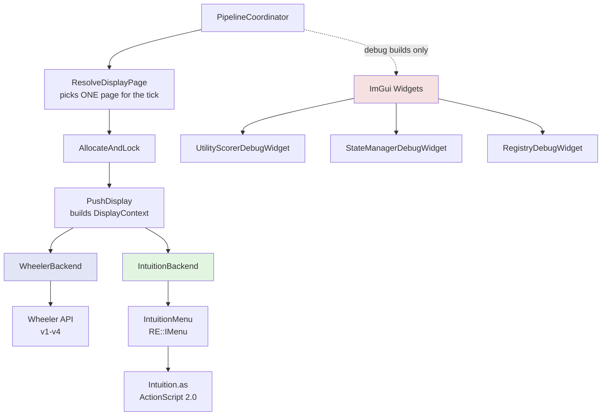
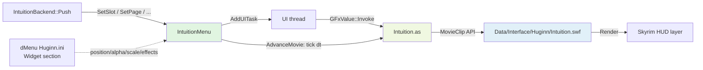
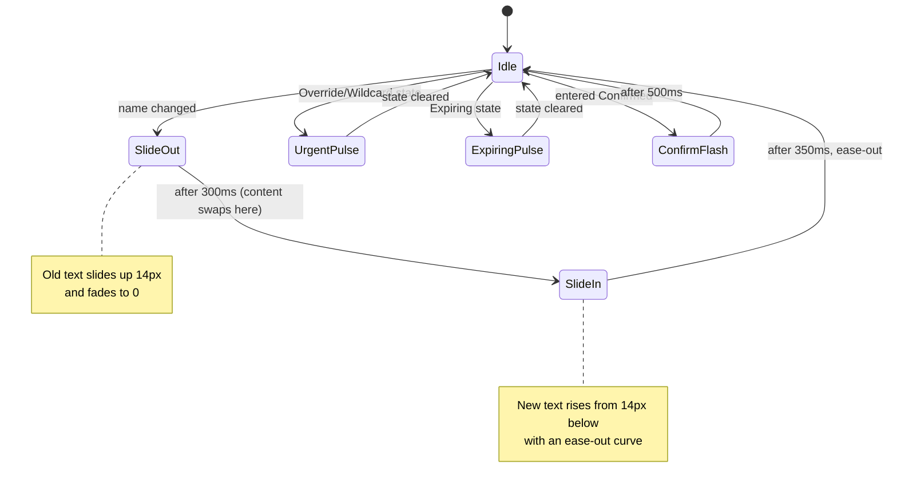
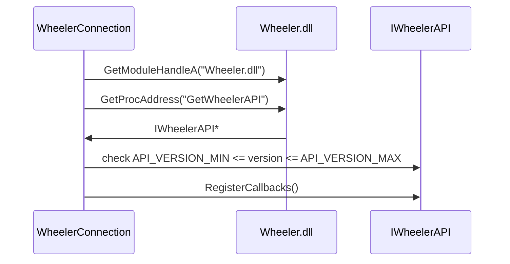
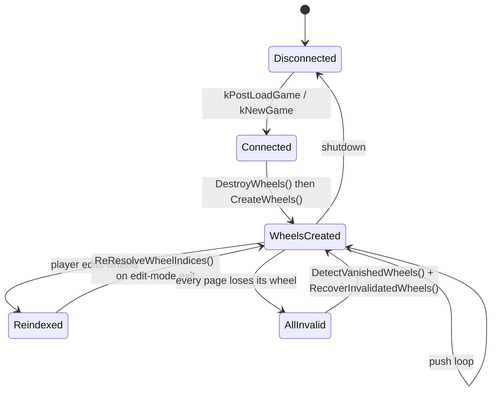
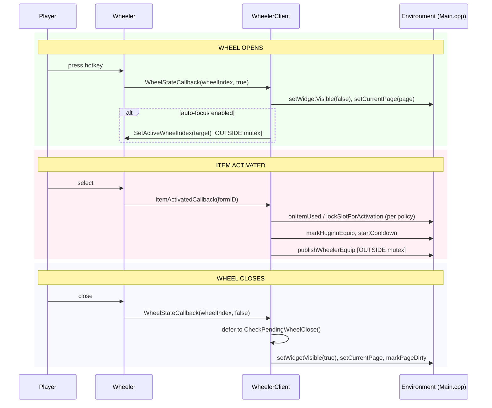
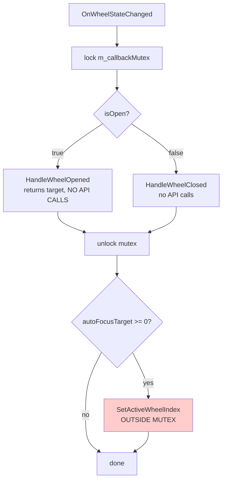
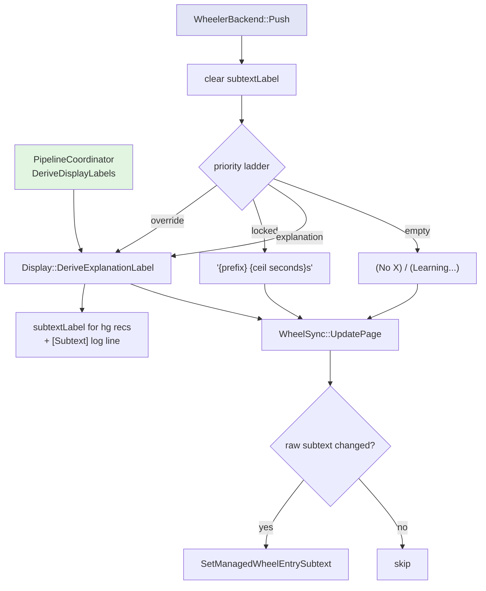
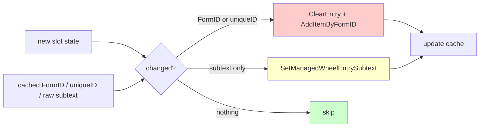
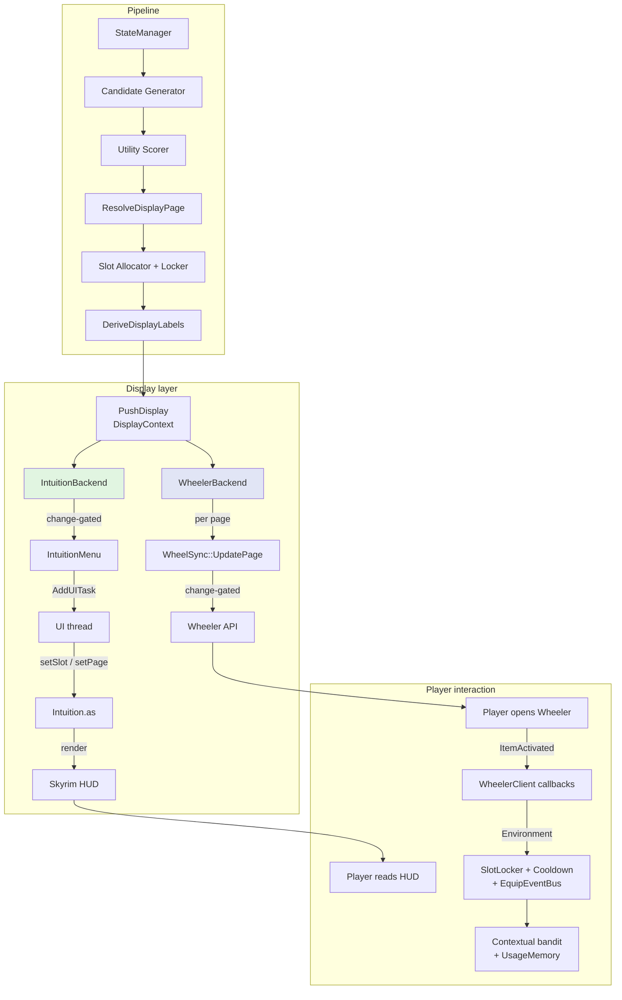

# Huginn UI/UX Architecture

How recommendations reach the player: the **display backend layer** that fans a
tick's slot assignments out to every display target, the **Intuition Widget**
(Scaleform HUD), the **Wheeler backend** (radial menu), and the **ImGui debug
widgets**.

**Verified against v0.19.10** (2026-08-29). Where this document and `src/`
disagree, the code is right — see [../README.md](../README.md).

**Current implementation:**

| Area | Files |
|---|---|
| Backend abstraction | `src/display/IDisplayBackend.h`, `src/display/ExplanationLabel.h` |
| Backends | `src/display/IntuitionBackend.{h,cpp}`, `src/display/WheelerBackend.{h,cpp}` |
| Backend registration + page resolution | `src/pipeline/PipelineCoordinator.cpp` |
| Scaleform HUD | `src/ui/IntuitionMenu.{h,cpp}`, `src/swf/Intuition.as`, `src/ui/IntuitionSettings.{h,cpp}` |
| HUD visibility | `src/ui/HudVisibilityManager.{h,cpp}` |
| Wheeler client | `src/wheeler/WheelerClient.cpp`, `WheelerConnection.cpp`, `WheelSync.cpp`, `WheelerSettings.cpp` |
| ImGui overlay | `src/ui/D3D11Hook.cpp`, `ImGuiRenderer.cpp`, `DebugInputHook.cpp`, `DebugSettings.cpp`, `*DebugWidget.cpp`, `WelcomeBanner.cpp` |

**INI sections and where they live** — this moved since the last revision of
this doc, and it is the single easiest thing to get wrong:

| Section | File |
|---|---|
| `[Widget]`, `[Debug]` | `Data/SKSE/Plugins/dmenu/customSettings/ini/Huginn.ini` (dMenu's own file) |
| `[Wheeler]`, `[Subtexts]`, `[Input]` | `Data/SKSE/Plugins/Huginn.ini` (main INI) |

dMenu owns `[Widget]` and `[Debug]`; the main `Huginn.ini` does **not** define
them ("one key, one home"). `IntuitionMenu::ReapplySettings()` reads
`GetDMenuIniPath()` for exactly this reason — reading the main INI there would
silently reset every widget setting to its compile-time default
(`src/ui/IntuitionMenu.cpp:426`, `src/Globals.cpp:138`). If the dMenu file is
absent, `GetDMenuIniPath()` falls back to the main INI, where the keys are
undefined, so every value lands on its default.

---

## UI Architecture Overview



Three display surfaces:

1. **Intuition Widget** — native Scaleform HUD, always available, the default.
2. **Wheeler** — radial menu, only when `Wheeler.dll` is present. Both can run at
   once; the Intuition widget hides itself while a wheel is on screen.
3. **ImGui debug widgets** — Debug builds only, compiled out of Release.

---

## Display Backend Layer

Added in PR #56. Before it, `Main.cpp` pushed to Wheeler and to the widget by
hand, and each push re-read page state from the `SlotAllocator` singleton.

### `IDisplayBackend`

`src/display/IDisplayBackend.h` — three virtuals:

| Method | Contract |
|---|---|
| `Push(const DisplayContext&)` | Render this tick's assignments. Fine-grained gating (wheel open, menu hidden, edit mode) belongs here. |
| `IsEnabled()` | Coarse gate — `false` skips the backend entirely (e.g. Wheeler not installed). |
| `GetDesiredPage()` | Which page this backend wants shown, or `-1` for "no opinion" (the default). |

`DisplayContext` is the one data bundle every backend receives: the
`SlotAssignments`, the tick's `ScoredCandidate` list, the `OverrideCollection`,
`PlayerActorState`, `WorldState`, the resolved page state (`pageIndex`,
`pageCount`, `slotCount`, `pageName`), the tick's `Context::ContextReason`, and
a single `now` timestamp. Adding a field there is the only change needed when
the pipeline produces something a backend wants.

`pageName` is a `std::string_view` into storage owned by
`PipelineCoordinator::PushDisplay` for the duration of the push — do not retain
it past `Push()`.

### Registration and push order

Backends are static instances in an array at the top of
`src/pipeline/PipelineCoordinator.cpp:40`:

```cpp
static Display::IDisplayBackend* s_displayBackends[] = {
    &s_wheelerBackend,
    &s_intuitionBackend,
};
```

`PushDisplay` walks the array in order and calls `Push()` on every backend whose
`IsEnabled()` returns true. Adding a display target means implementing the
interface and adding one line here.

### Page resolution (one page per tick)

`ResolveDisplayPage` runs **before** allocation, not after, so the whole tick is
page-consistent:

1. Ask each enabled backend for `GetDesiredPage()`; take the first non-negative
   answer. Today only `WheelerBackend` has an opinion — it reports the Huginn
   page whose wheel Wheeler is currently showing (`GetActiveManagedPage()`).
2. If that page is valid and different from the allocator's, `SetCurrentPage()`
   it (which also clears stale locks — correct here, before `ApplyLocks` runs
   for the new page). Out-of-range requests are ignored with a deduped debug
   line rather than clamped, because a clamp would never converge and would pin
   the pipeline's hash-skip gate open.
3. Snapshot `displayPageIndex`, `displayPageCount`, `displaySlotCount`,
   `displayWildcardSlots` and `displayPageName` onto the tick context, all read
   **by index** so they describe the same page even if an off-thread switch
   lands between statements.

A page change returns `true`, which forces the tick to run without pinning the
skip gate open.

Because of this, backends never re-fetch page state at push time — the
`DisplayContext` is authoritative.

### Change-detection gating

Both push paths are gated so an unchanged frame costs nothing.

**Intuition** (`src/display/IntuitionBackend.h`): the backend keeps a `PushView`
of exactly what it last handed to the widget — slot count, page index/count/name,
and per slot the `name`, `type`, `detail` and `visualState`. It builds the
candidate view into a reused `m_scratch` member (keeping vector capacity),
compares, and returns early on a match. On a change it `std::swap`s scratch and
last, then sends **from the stored view** rather than recomputing, so the widget
can never receive values the comparison did not see.

`confidence` is sent but deliberately **excluded** from the comparison: it is
`assignment.utility`, a float that moves on nearly every scoring run, so
including it made the cache miss every time. Measured 2026-08-22: the
`Display::Intuition` call count stayed pinned to the scoring count (188/188) and
mean time per call went *up*, 84 → 92.76 µs. Excluding it is safe because AS2's
`applyItemContent` takes the parameter and never reads it — confidence drives
nothing on screen.

`detail` folds in the display mode, so a `[Widget]` settings change still forces
a repaint.

**Wheeler**: the equivalent early-out lives one level down in
`WheelSync::UpdatePage`, which compares cached FormIDs, uniqueIDs and *raw*
subtexts per slot. This is why the lock-timer label is quantized to whole
seconds (see [Subtext labels](#subtext-labels-v2-api)).

---

## Intuition Widget (Scaleform HUD)

A native Skyrim HUD element built with Scaleform ActionScript 2.0.

### Architecture



**Components:**

- **IntuitionMenu** — `RE::IMenu` subclass registered as `"IntuitionMenu"`,
  loading `"Huginn/Intuition"` (`BSScaleformManager` prepends `Data/Interface/`
  and appends `.swf`). HUD-style menu flags: `kAlwaysOpen`, `kRequiresUpdate`,
  `kAllowSaving`; `depthPriority = 0`; mouse cursor count 0.
- **Intuition.as** — the AS2 widget: slot rendering, animation, page pips.
- **Intuition.swf** — 1280x720 stage, up to 10 slots (`MAX_SLOTS`) and 10 page
  dots (`MAX_DOTS`, matching `Slot::MAX_PAGES`).
- **IntuitionSettings** — `[Widget]` loader plus the immutable `IntuitionConfig`
  snapshot used for hot-reload.

The singleton pointer is a `std::atomic<IntuitionMenu*>` set in the constructor
*before* any deferred call, and cleared with a `compare_exchange_strong` in the
destructor, so a UI task queued against a dying menu finds `nullptr` rather than
a dangling `this`.

### Public API (C++ → AS2)

`IntuitionMenu` invokes on `_root.widget`. Every entry point defers its GFx work
to the UI thread.

| C++ | AS2 | Parameters | Purpose |
|---|---|---|---|
| `SetSlot` | `setSlot` | index, name, type, confidence, detail, visualState | Update one slot; a name change triggers the slot-change animation |
| `ClearSlot` | `clearSlot` | index | Hide a slot and reset its animation state |
| `SetSlotCount` | `setSlotCount` | count | Set visible slot count, resize background |
| `SetPage` | `setPage` | current, total, name | Page pips + inline page-name label (hidden when `total <= 1`) |
| `SetUrgent` | `setUrgent` | index, active | **Inert** — see below |
| `SetWidgetAlpha` | `setWidgetAlpha` | alpha (0–100) | Overall widget opacity |
| — | `setChildAlpha` | alpha (0–100) | Secondary element opacity (page pips/label). Invoked directly from the constructor and `ReapplySettings`; no dedicated C++ method |
| — | `setRefreshEffect` | 0=none, 1=pulse, 2=tint | Refresh effect mode (**currently inert** — see below) |
| — | `setSlotEffect` | 0=slide, 1=fade, 2=instant | Slot change animation |
| — | `setRefreshStrength` | pct (0–100) | Refresh effect strength (**currently inert**) |
| `AdvanceMovie` | `tick` | dt | Per-render-frame animation driver |

**C++-only methods** (no direct AS2 counterpart):

- `SetPosition(percentX, percentY)` — screen-percent → stage coordinates,
  correcting for letterboxing (uniform `min(scaleX, scaleY)` fit against the
  1280x720 stage, then the centring offset).
- `SetVisible(bool)` — toggles `_root`'s `DisplayInfo` visibility.
- `Show()` / `Hide()` — queue `kShow` / `kHide` on `RE::UIMessageQueue`.
- `ToggleUserHidden()` / `IsUserHidden()` / `ResetUserHidden()` — the player's
  hide latch.
- `ReapplySettings()` / `ReapplySettings(const IntuitionConfig&)` — hot-reload.
- `MapSlotContentType()` and `BuildSlotDetail()` — static helpers the backend
  calls while building its change-detection view.

Widget **scale** is not an AS2 call: it is applied by setting `_xscale` and
`_yscale` on `_root` directly.

**`setUrgent` is inert.** `IntuitionMenu::SetUrgent` and the AS2 `setUrgent`
both still exist, and AS2 stores the flag in `_urgentSlots`, but nothing reads
that array any more and no C++ caller invokes `SetUrgent` — urgency is carried
by `SlotVisualState` on each `setSlot` instead. The AS2 field is commented
`deprecated - replaced by visual states`.

### Thread safety

**Every public API method defers GFx work to the UI thread via
`SKSE::GetTaskInterface()->AddUITask()`.** The backend calls these from the
pipeline thread; Scaleform's GFx runtime is **not** thread-safe, so a direct
cross-thread `Invoke` / `CreateString` / `SetMember` would race the render
thread. String parameters are copied into the lambda capture so the backing
storage outlives the caller's scope.

`AdvanceMovie` is the one exception, and legitimately so: the game calls it on
the UI thread already.

**Scaleform string passing** — always `CreateString`, never `.data()`:

```cpp
// WRONG — dangling pointer if the backing string dies before render
arg = myString.data();
// CORRECT — CreateString copies into the movie's managed heap
uiMovie->CreateString(&arg, myString.c_str());
```

Numbers and bools are value types and need no such treatment. This is why
`SetSlot` builds a `std::array<RE::GFxValue, 6>` using `CreateString` for
arguments 1 (name) and 4 (detail) and plain assignment for the rest
(`src/ui/IntuitionMenu.cpp:202`).

### Visibility

Four independent things can hide the widget, and they compose:

| Gate | Owner | Scope |
|---|---|---|
| `bEnabled` (INI) | `IntuitionSettings::IsEnabled()` | Persistent preference |
| Pausing menu open | `HudVisibilityManager` | Automatic |
| Player hide latch | `IntuitionMenu::IsUserHidden()` | Session; resets on load |
| Wheeler wheel open | `IntuitionBackend` and the Wheeler callbacks | While a wheel is up |

`HudVisibilityManager` is a `MenuOpenCloseEvent` sink. On every menu event it
recomputes:

```cpp
visible = !ui->GameIsPaused()
       && IntuitionSettings::GetSingleton().IsEnabled()
       && !IntuitionMenu::IsUserHidden();
```

Console and Favorites do not set `kPausesGame`, so the widget correctly stays up
during those overlays. The manager also re-sends `kShow` when `LoadingMenu`
closes: Skyrim *closes* custom `IMenu` instances across a cell transition
without destroying them, and `SetVisible(true)` does nothing to a closed menu.

**The hide latch** (default key `x` — `iToggleWidgetKey = 45` in the main INI's
`[Input]`; `0` unbinds) has to be a latch rather than a one-shot
`SetVisible(false)`, because `HudVisibilityManager` recomputes from scratch on
every menu event and a bare hide would be undone by the next menu the player
opens. It is therefore enforced in three places: inside `SetVisible` (so the
several independent re-show paths cannot defeat it), inside `Show()` (so a cell
transition's re-show does not resurrect a hidden widget and leave the next
keypress dead), and in the `UpdateVisibility` predicate. It is session-scoped and
reset on load on purpose: it is a "get out of my way for a moment" control, not a
preference — `bEnabled` is the preference, and a latch that survived a restart
would be indistinguishable from the widget being broken. The same latch is
flipped by the dMenu **Show/Hide Widget** button
(`src/settings/SettingsReloader.cpp:201`).

`IntuitionBackend::Push` re-asserts `SetVisible(false)` on *every* tick while a
Wheeler wheel is open, not once on the transition: a game menu opening or closing
makes `HudVisibilityManager` call `SetVisible(true)`, which would surface the
widget behind the wheel. The call is idempotent and defers to the UI task queue,
so repeating it is trivially cheap. The backend tracks `m_widgetHiddenForWheel`
so the widget comes back exactly once on wheel close.

### Display modes

`sDisplayMode` in `[Widget]`. dMenu serializes a dropdown as its integer index,
so both the index and the name are accepted (`0`/`minimal`, `1`/`normal`,
`2`/`verbose`).

| Mode | Content |
|---|---|
| `minimal` (default) | Item name only — `BuildSlotDetail` returns `""` immediately |
| `normal` | Name + type-specific detail |
| `verbose` | Normal detail + the scoring breakdown |

Type-specific detail (`IntuitionMenu::BuildSlotDetail`,
`src/ui/IntuitionMenu.cpp:520`):

| Candidate | Detail |
|---|---|
| Spell | `"{baseCost} MP"`, or `"{baseCost} MP/s"` for concentration |
| Bow / Crossbow | `"{bow + arrow damage} dmg"` plus `· {count} {ammo name}` (falling back to `arrows`/`bolts`) |
| Staff | `"{charge}%"` when enchanted |
| Other weapons | `"{baseDamage} dmg"`, plus `· {charge}%` when enchanted |
| Item / Scroll | `"x{count}"` |
| Ammo | `"{baseDamage} dmg · x{count}"`, or just `"x{count}"` |

Verbose appends `ctx:{contextWeight} q:{qValue} p:{prior}` and, when non-zero,
` rec:{recencyBoost}`. (`qValue` is the contextual bandit's learned value; the
identifier keeps its historical name — see
[../README.md](../README.md).) Verbose does **not** show a lock timer; that
label is a Wheeler subtext only.

### Visual states

Each assignment carries a `Slot::SlotVisualState`
(`src/slot/SlotAssignment.h:45`), passed through as `setSlot`'s sixth argument,
driving per-slot animation.

| State | Value | Visual effect | Trigger |
|---|---|---|---|
| `Normal` | 0 | Base alpha | Standard recommendation |
| `Confirmed` | 1 | Single alpha dip over 0.5 s (`1 - 0.5·sin(πt)`) | Re-evaluated, same item stayed |
| `Expiring` | 2 | Sine pulse, 70–100% alpha, 2.5 s period | Lock about to expire |
| `Override` | 3 | Sine pulse, 60–100% alpha, 2 s period | Override triggered |
| `Wildcard` | 4 | Same as Override | Wildcard exploration slot |

Priority inside `tick()` is strictly ordered: an active slide/fade animation wins
over everything; otherwise Override/Wildcard > Expiring > Confirmed > base alpha.
`Confirmed` re-arms its timer only on *entry* to the state, so a slot that stays
confirmed flashes once rather than continuously.

### Animations

Animation is driven from C++: `IntuitionMenu::AdvanceMovie` calls `tick(dt)` on
the AS2 widget every render frame with the engine's real delta time
(`src/ui/IntuitionMenu.cpp:180`). Skyrim's Scaleform GFx does not reliably fire
AS2 `onEnterFrame`, so this is the only dependable clock. `tick` clamps `dt` to
0.1 s and ignores non-positive values.



- **Slide reveal** — `ANIM_OUT_SEC` 0.30 s out, `ANIM_IN_SEC` 0.35 s in,
  `ANIM_SLIDE_PX` 14 px. Content swaps at the phase boundary, so the new name is
  never seen sliding out.
- **Fade** — identical timing, alpha only, no vertical movement.
- **Instant** — content swaps inside `setSlot` with no animation at all.

If a slot's content changes again mid-animation, the pending name/type/detail is
overwritten and applied at the next swap point rather than restarting the
animation.

Change detection in AS2 uses `_currentName[]`: an identical name only updates the
detail text, and only if the detail itself changed. `_slotReady[]` suppresses the
animation on a slot's first population, so the widget does not slide in when it
first appears.

**The refresh effect is currently inert.** `sRefreshEffect` and
`fRefreshStrength` still load, still push to AS2 via `setRefreshEffect` /
`setRefreshStrength`, and the tint/pulse code still exists in `tick()` — but
`_flashTimer` is only ever initialised to 0 and decremented; nothing sets it
positive any more. The `setSlot` comment records why: *"refresh flash removed —
now handled by per-slot states"*, and the `tick()` branch is labelled
`Priority 4: Global refresh flash (legacy, for backward compat)`. The INI keys
and the dMenu dropdown remain, and changing them has no visible effect.

### Type mapping

`SlotContentType` has **12** values (`src/ui/SlotTypes.h`); the widget renders
**9** `IntuitionSlotType` values (`src/ui/IntuitionMenu.h:20`). Both must stay in
sync with `Intuition.as`'s `TYPE_*` constants.

`IntuitionMenu::MapSlotContentType` (`src/ui/IntuitionMenu.cpp:499`):

| `SlotContentType` | → `IntuitionSlotType` | Note |
|---|---|---|
| `Empty` | `kEmpty` (0) | |
| `NoMatch` | `kNoMatch` (1) | |
| `Spell` | `kSpell` (2) | |
| `Wildcard` | `kWildcard` (3) | |
| `Potion` | `kHealthPotion` (4) | Generic potion → red, as a visual fallback |
| `HealthPotion` | `kHealthPotion` (4) | |
| `MagickaPotion` | `kMagickaPotion` (5) | |
| `StaminaPotion` | `kStaminaPotion` (6) | |
| `MeleeWeapon` | `kMeleeWeapon` (7) | |
| `RangedWeapon` | `kRangedWeapon` (8) | |
| `Ammo` | `kRangedWeapon` (8) | Arrows/bolts share the ranged visual |
| `SoulGem` | `kSpell` (2) | No gem visual; reuses the spell styling |

**Colors** (`Intuition.as`, `getColorForType` / `getAlphaForType`):

| Type | Color | Alpha |
|---|---|---|
| `kEmpty` | `#808080` gray | 50% |
| `kNoMatch` | `#808080` gray | 50% |
| `kSpell` | `#FFFFFF` white; `#FFD4A0` warm white for slot 0 | 100% |
| `kWildcard` | `#7EB8FF` soft blue | 100% |
| `kHealthPotion` | `#FF6666` soft red | 100% |
| `kMagickaPotion` | `#6699FF` soft blue | 100% |
| `kStaminaPotion` | `#66FF66` soft green | 100% |
| `kMeleeWeapon` | `#E6B84D` warm gold | 100% |
| `kRangedWeapon` | `#E6B84D` warm gold | 100% |

Slot key labels are drawn in `#999999` and show `index + 1`. The background is a
40%-alpha black panel with a 15%-alpha white border, auto-sized to the widest
visible slot name (floor: `SLOT_WIDTH` 220 px plus padding).

### INI configuration

`[Widget]`, in **`Data/SKSE/Plugins/dmenu/customSettings/ini/Huginn.ini`**:

```ini
[Widget]
bEnabled = true             ; Master enable
fPositionX = 28             ; Horizontal position (screen %)
fPositionY = 83             ; Vertical position (screen %)
fAlpha = 100                ; Widget opacity (0-100)
fScale = 70                 ; Widget scale % (50=half, 100=native, 200=double)
fAlphaChild = 70            ; Secondary element opacity (page pips/label)
bReadOnly = false           ; Display-only: slot hotkeys ignored (0.19.11)
bHideWhileWheelOpen = true  ; Hide while a Wheeler wheel is open (0.19.18)
sDisplayMode = minimal      ; minimal | normal | verbose   (or 0 | 1 | 2)
sRefreshEffect = tint       ; tint | pulse | none          (or 0 | 1 | 2) — inert
sSlotEffect = slide         ; slide | fade | instant       (or 0 | 1 | 2)
fRefreshStrength = 15       ; 0-100, clamped — inert
```

The values above are the compile-time defaults in `IntuitionDefaults`
(`src/ui/IntuitionSettings.h`); with no dMenu INI present, these are what you
get.

### Read-only mode (`bReadOnly`, 0.19.11)

The widget keeps rendering recommendations; the ten slot hotkeys stop equipping.
Intended for a player who drives selection from Wheeler or another UI and wants
Huginn's ranking on screen without a second set of live bindings.

**Scope is deliberately narrow.** Only slots 0-9 are suppressed. Page cycling
(`-`/`=`) and the visibility toggle still work, because those are ways of
*looking* at the widget rather than ways of acting through it — someone who has
handed selection to Wheeler still wants to page through the recommendations and
still wants to be able to hide the thing.

A suppressed key is still **consumed**, not passed through. It is bound to
Huginn, so letting it fall to whatever else claims that scancode would be a
worse surprise than doing nothing. Nothing is logged per press in the ordinary
case; in read-only mode a key-down logs once at `debug`, naming the setting, so
a player who turned this on months ago and forgot has something to find.

Lives in `[Widget]` because dMenu owns that section and this needs to be a
toggle — see the dMenu entry "Read-Only Mode". Note it is read from the WIDGET
settings, not from the `[Keybindings]` it suppresses, so `SettingsReloader` must
push it after the dMenu INI reload; otherwise a toggle would not take effect
until restart. The reset-to-defaults path pushes it too, or "reset all" would
restore every binding and leave them inert.

The three `s*` keys accept either the name or the dMenu dropdown **index**. The
index order must match the `options` arrays in
`Data/SKSE/Plugins/dmenu/customSettings/Huginn.json` — note that the Refresh
Effect dropdown is ordered `Tint, Pulse, None`, so index 0 is `Tint`, not
`None`. Index 0 is the default in every case, so an unrecognised value lands on
the same setting the name-matching fallback would have chosen. A non-numeric
value (including `1minimal`) falls through to name matching.

**Hot reload:** `hg reload` → `IntuitionMenu::ReapplySettings()` re-reads the
dMenu INI and applies a whole `IntuitionConfig` snapshot; `SettingsReloader`
calls the config-taking overload directly to avoid a second file read. A disabled
widget is hidden and the styling work skipped; an enabled one is `Show()`n (a
no-op if already open), then position, alpha, scale, child alpha and the three
effect modes are pushed in a single deferred GFx batch.

See [7-dmenu-integration.md](7-dmenu-integration.md) for the dMenu panel itself.

### Build process

**Build SWF:** `cd src/swf && bash build.sh` (requires `swfmill` and `mtasc` on
PATH).

1. `intuition.xml` → `swfmill simple` → `Intuition.swf` shell (1280x720, 24 fps,
   SWF version 8, one library clip `IntuitionWidget` linked to class `Intuition`)
2. `mtasc -cp . -swf Intuition.swf -main Intuition.as` injects the compiled AS2
   bytecode into that shell
3. The CMake post-build step (`src/CMakeLists.txt:183`) copies the SWF to `${CompiledPluginsPath}/Interface/Huginn/` on the next build; copy it by hand only if building outside CMake

Full toolchain notes, including JPEXS inspection, are in
[../reference/intuition-scaleform-build.md](../reference/intuition-scaleform-build.md).

---

## Wheeler Backend (Radial Menu)

Wheeler is a display backend like any other — `WheelerBackend::Push` — sitting on
top of a three-class client: `WheelerConnection` (the API handle), `WheelSync`
(the managed wheels and their content), and `WheelerClient` (the callback
trampolines and wheel-session state).

`WheelerBackend::IsEnabled()` is simply `WheelerClient::IsConnected()`, so the
whole backend disappears when Wheeler is not installed.

### API versions

`src/wheeler/WheelerAPI.h` supports versions **1 through 4** with graceful
feature detection:

| Version | Adds |
|---|---|
| v1 | Core wheel/entry/item management, callbacks |
| v2 | Per-entry subtext, wheel indicator styling, label customization |
| v3 | Batch delete-by-client, managed metadata on the wheel |
| v4 | Batch lookup-by-client; managed wheels survive Wheeler's load-time reset |

Features above the detected version are skipped, not attempted — those function
pointers may be garbage on an older API.

**v4 behaviour change:** Wheeler no longer implicitly drops a client's wheels on
save load, so a client that recreates its wheels every load must delete them
first or accumulate duplicates. Huginn already does — `InitializeGameSystems`
calls `DestroyRecommendationWheels()` before `CreateRecommendationWheels()`. Do
not drop that ordering.

### Connection flow



`TryConnect()` is safe to call repeatedly: it early-returns on an existing
handle, and re-registering is a no-op overwrite — Wheeler stores one callback per
type and we hand it the same three trampoline addresses every time.

The effects Huginn runs in response to wheel activity are **injected**, not
called directly: `WheelerClient::Environment` holds eight `std::function`s wired
by the composition root in `Main.cpp`, so `src/wheeler/` no longer includes
`slot/`, `learning/`, `candidate/` or `ui/`. A partially-wired `Environment` is
rejected whole by `SetEnvironment`, and every callback checks
`EnvironmentReady()` as its first statement — a missing effect would otherwise
throw `std::bad_function_call` from a callback, which in an SKSE plugin is a
crash to desktop, not a log line.

### Multi-page wheel system

Huginn creates **one Wheeler wheel per page** from the `[Pages]` INI config (up
to `MAX_PAGES` = 10). Each `PageWheel` record holds the wheel index, slot count,
page name, the heap-owned wheel label, and parallel per-slot caches: FormIDs,
wildcard flags, uniqueIDs, final subtexts, raw subtexts, retry counters,
uniqueID defer counters, and activation-emptied flags.

Pages with zero slots (or a transient creation failure) are stored as
`wheelIndex = -1` placeholders and skipped by the push loop.



### The push path

`WheelerBackend::Push` runs on the pipeline thread and, unlike the Intuition
backend, updates **every** page, not just the visible one — the player can spin
to another wheel without a pipeline tick in between. Only the current page uses
`ctx.assignments`; the others are re-allocated via
`SlotAllocator::AllocateSlotsForPage`.

Order of operations, and each guard's reason:

1. **Urgent override** — if the top override has a candidate *and* its priority
   is at or above `iAutoFocusMinPriority`, focus is pulled to the Huginn wheel
   and the push is allowed through even with a wheel open. The candidate check is
   not belt-and-braces: `EvaluateDrowning` fires on "underwater without
   waterbreathing" and may carry `nullptr`, and focus-stealing the wheel to show
   an empty answer while the player drowns is worse than staying out of the way.
2. **Edit-mode vanish detection** — while the player is in Wheeler's editor,
   `DetectVanishedWheels()` runs each tick (one cross-DLL lookup, by client
   *name*, so a reorder reads as "still there").
3. **`RecoverInvalidatedWheels()`** — deliberately above the has-wheel guard.
   "Every page invalid" is indistinguishable from "wheels were never created",
   and the guard returns false in exactly that state, so recovery placed below it
   could never run (#76).
4. **Has-wheel / wheel-open guard** — skip unless at least one wheel exists and
   either no wheel is open or an urgent override is active.
5. **Edit-mode gate** — skip entirely while the editor is open. Every move in the
   editor shifts our indices and nothing corrects them until edit-mode exit, so
   mid-edit our stored index may name someone else's wheel — and
   `IsManagedWheel()` cannot catch that, because it answers "is this wheel
   managed", not "is it *ours*". Bracketed by a two-lines-per-session transition
   log rather than a per-tick one.
6. **Subtext derivation** and the per-page extraction below.

### Callback system



| Callback | Trigger | Huginn action |
|---|---|---|
| `ItemActivatedCallback` | Player activates a slot | Apply the post-activation policy, mark the equip as Huginn-mediated, start a candidate cooldown (skipped under Sticky), publish an `EquipEventBus` event with `EquipSource::Wheeler` and `wasRecommended = true` |
| `WheelStateCallback(true)` | Any wheel opens | Distinguish a fresh open from scrolling; on a fresh open hide the widget, sync the page, and auto-focus if configured |
| `WheelStateCallback(false)` | Any wheel closes | Defer to `CheckPendingWheelClose()` on the update thread |
| `EditModeCallback` | Edit mode toggled | On *exit*, unconditionally `ReResolveWheelIndices()` |

The learner's reward is not carried by the callback: `publishWheelerEquip`
publishes with weight `1.0f`, and the reward magnitude is
`Config::EQUIP_REWARD` (8.0) on the subscriber side.

**Post-activation policy** (`sPostActivationPolicy`):

| Policy | Behaviour |
|---|---|
| `Backfill` (default) | Break the slot lock so the slot repopulates next tick |
| `Sticky` | Lock the slot so the activated item stays visible; no cooldown |
| `Empty` | Mark the slot activation-emptied, clear the entry, relabel it `"Equipped"` |

**Close handling.** Wheel close is deferred to `CheckPendingWheelClose()` on the
update thread because Wheeler fires the callback *before* updating its own
`IsWheelOpen()` state. The deferred handler re-checks `IsWheelOpen()` (accurate
there) to tell a real close from scrolling between wheels, syncs the allocator
page, shows the widget again, and forces a pipeline run via `markPageDirty()`.

**The edit-mode payload is ignored on purpose.** `EditModeCallback` is declared to
carry a `WheelChange` list, but `Wheeler::exitEditMode()` always passes
`(nullptr, 0)` — an open upstream TODO. Every observed reorder reported
`changeCount = 0` while the indices had in fact moved, so gating on the payload
would be gating on a constant.

### Wheel index re-resolution and recovery

A stored wheel index is identity by **position**, and position is not stable —
Wheeler shifts indices whenever a wheel is inserted or removed, including by the
player in edit mode, with no notification Huginn can act on.

Observed 2026-08-21: wheels created at 0/1/2, a player wheel later displaced 0,
leaving ours at 1/2/3 while Huginn kept writing subtexts to 0/1/2. Those writes
were *accepted*, because `IsManagedWheel()` only answers "is this wheel managed",
not "is it mine".

- **`ReResolveWheelIndices()`** re-derives every page's index from its client
  label — the only key that survives reindexing. Requires API v4
  (`GetManagedWheelsForClient`); on v3 and below it no-ops and warns once per
  wheel generation.
- **`DetectVanishedWheels()`** marks every page invalid when none of our wheels
  exist any more, giving recovery the state it waits for. Also v4-only.
- **`RecoverInvalidatedWheels()`** rebuilds when *every* page that once held a
  wheel has lost it, bounded by an attempt count and a cooldown so a genuinely
  broken Wheeler cannot spin. A single invalid page among healthy ones is a
  different problem and is left alone.
- **Position memory** — Huginn deletes and recreates every wheel on save load,
  and creation passes `sWheelPosition`, so any reordering the player did was
  silently undone on the next load. `WheelSync` now records where the player left
  the block (one anchor for the contiguous block, not a position per page) and
  compares it against where creation actually put them, so "still exactly where
  we put them" is not mistaken for "the player moved them here". Anchor memory is
  session-scoped: a full restart honours `sWheelPosition` again.
  `ForgetRememberedPosition()` drops it when the player re-states the layout via
  a settings reload.

### Urgent auto-focus (override while open)

| Condition | Behaviour |
|---|---|
| `bAutoFocusOnOverride = true` | Enabled (default) |
| Top override has a candidate | Required — an answer-less override never steals focus |
| Priority ≥ `iAutoFocusMinPriority` | Focus triggers (default 50 = DROWNING) |
| Already on a Huginn wheel | No action |

Implemented as `TryUrgentAutoFocus(priority)`, called from `WheelerBackend::Push`
when the top override qualifies and a wheel is open.

Auto-focus navigates left to right, so it cannot reach a wheel that sits *before*
ours. That fact is warned about **once per run** — it is a property of the wheel
layout and of the feature, not of any one open, and warning per open would spam
an on-screen notification onto the UI the player is trying to use. The per-open
`Auto-focus requested` info line still records every occurrence in the log.

### Thread safety

Wheeler callbacks may fire **synchronously** from Wheeler API calls, so calling
the API under the callback mutex is a re-entrant deadlock.



The same pattern covers activation: `MarkActivationEmptied` **returns** the entry
to clear (`DeferredEntryClear`) rather than clearing it, so the cross-DLL call
happens after the lock is dropped.

**Lock ordering:** `WheelerClient::m_callbackMutex` (outer) →
`WheelSync::m_pageDataMutex` (inner). This is now expressed *structurally* —
`WheelerClient` may call `WheelSync`; `WheelSync` never calls back. Do not invert
it. `WheelSync::SetEntrySubtext` deliberately takes no lock (it touches no page
state), which is why `UpdatePage` may call it from inside its critical section;
the mutex is not recursive, so do not "fix" that by adding one.

Nothing outside `WheelSync` ever receives a `PageWheel` reference — callers ask
questions and get answers by value, so a record cannot be examined after the lock
that protected it was released.

**Thread interaction points:**

| Thread | Huginn | Wheeler |
|---|---|---|
| Main/game thread | Context polling (StateManager) | — |
| Pipeline/update thread | Allocation, `WheelerBackend::Push`, `CheckPendingWheelClose` | API calls (ClearEntry, AddItemByFormID, …) |
| Wheeler callback thread | Callback handlers, injected `Environment` effects | Callback dispatch |
| UI thread | `IntuitionMenu` GFx work (via `AddUITask`) | — |

`setCurrentPage` and `setWidgetVisible` can genuinely run concurrently with their
callback-thread counterparts, so an injected effect must be safe under concurrent
invocation: `SlotAllocator`'s page state is atomic, and
`IntuitionMenu::SetVisible` defers to the UI thread.

**Rules:**

- NEVER call a Wheeler API function while holding `m_callbackMutex`.
- NEVER call Scaleform GFx from a non-UI thread — always `AddUITask()`.

### Subtext labels (v2 API)

Wheeler v2 renders a small label below each entry's name. Only one shows per
entry; the highest-priority applicable label wins.

| Priority | Label | Example | INI toggle |
|---|---|---|---|
| 1 | Override | `Critical HP` | `bShowOverrideLabel` |
| 2 | Lock timer | `Locked 3s` | `bShowLockTimerLabel` |
| 3 | Wildcard | `Wildcard` | `bShowWildcardLabel` (applied inside `WheelSync`) |
| 4 | Explanation | `Underwater`, `Favorite` | `bShowExplanationLabel` |
| — | Empty slot | `(No Potion)` / `(Learning...)` | always |

**Where the wording comes from.** `Display::DeriveExplanationLabel`
(`src/display/ExplanationLabel.h`) is the single pure function both the
coordinator and the Wheeler backend call. The context layer decides *which*
reason applies (`ContextRuleEngine::DominantReason`) and *which slots it may
speak for* (`Context::ReasonAppliesTo`, #64); this file decides only how to say
it. A `static_assert` on `CONTEXT_REASON_COUNT` (27) is the tripwire: a new
reason must get wording here and a threshold there.

Two reasons, two burdens of proof. An override's reason was stamped on *that*
candidate by `OverrideManager`, so it is attributed by construction. The tick's
own reason was not — it is one global fact about the situation, and the page it
labels may contain nothing it ranked — so it speaks for a slot only where the
candidate actually draws weight from the field the reason is read off. Otherwise
the ladder falls through to `"Favorite"` for the player's own picks, then to no
label.

**Two-layer pipeline.** `PipelineCoordinator::DeriveDisplayLabels` stamps
`subtextLabel` on the current page's assignments every tick — that is what
`hg recs` prints, and it makes the displayed surface verifiable from a log alone
with no Wheeler installed. `WheelerBackend` then **clears** those labels and
re-derives under the `[Subtexts]` toggles, because a pre-derived label would
otherwise survive every branch that deliberately declines to write, silently
defeating the toggles and stealing the wildcard label — on the current page only,
while other pages behaved correctly. Both sides call the same pure function, so
the explanation text itself cannot diverge.



**The lock timer counts whole seconds, not tenths.** The subtext feeds
`UpdatePage`'s content-unchanged early-out, and a tenths-place countdown changes
on almost every push — with `bShowLockTimerLabel = true` the early-out never
fired while *any* slot was locked, and the whole page paid a full diff plus a
cross-DLL write. It uses `ceil` so the label counts 3 → 2 → 1 and never shows a
`0s` that is really 400 ms of remaining lock.

Lock state is read from **one** `SlotLocker::GetLockSnapshot()` per push, hoisted
above the page loop (only the current page reads it) and taken **only** when the
label is enabled — the previous per-slot `IsSlotLocked()` +
`GetRemainingLockTime()` pair took the locker mutex up to twice per slot per
page, and with the label off (the default) took no lock at all, so an
unconditional snapshot would have traded zero acquisitions for one.

### Slot update mechanics

`WheelSync::UpdatePage` uses a cache-and-diff pattern to minimise cross-DLL
calls:



The backend fills four reusable member vectors (FormIDs, wildcard flags,
uniqueIDs, subtexts) in a single pass per page. They are members rather than loop
locals so their heap capacity survives across ticks instead of re-allocating four
vectors per page per tick; `Push` is single-threaded on the pipeline thread, so
no guard is needed.

**Retry and negative caching.** If `AddItemByFormID` fails, the previous item is
restored (so the slot does not go blank) and a per-slot retry counter increments.
After `MAX_SLOT_RETRIES` (3) consecutive failures of the same
`(formID, uniqueID)` pair, further attempts are suppressed for
`ADD_FAIL_COOLDOWN` (30 s) via a globally-keyed negative cache — slot churn from
lock expiry and re-allocation otherwise restarts the retry cycle every few
seconds (observed: 569 API rejects in 11 minutes from one bad save entry that
Wheeler answers with `UnsupportedFormType`).

**UniqueID defers.** Weapons and armour need a non-zero uniqueID for Wheeler to
accept them, since instances differ by tempering and enchantment. A slot whose
uniqueID has not resolved yet is deferred rather than rejected, up to
`MAX_UNIQUEID_DEFERS` (50) consecutive ticks (#74).

**Soul gems push normally.** They used to be blanked here because Wheeler could
not render `TESSoulGem` forms, which left an empty tile where the widget showed
one. Wheeler renders them now (observed 2026-08-11 on a user wheel carrying
Azura's Star and The Black Star), so the suppression is gone.

**Ownership validation.** `UpdatePage` checks `IsManagedWheel(wheelIndex)` before
writing, catching wheels invalidated by a save/load cycle or deleted by another
mod, and sets `wheelIndex = -1` on failure. Note the limit called out above: it
verifies *managed*, not *ours* — index re-resolution covers the rest. Debug
builds additionally run `ValidateWheelState()`, which compares cached FormIDs
against Wheeler's actual state and warns on mismatch; it is zero-cost in Release.

### Wheeler settings

**`[Wheeler]`** (main `Huginn.ini`):

| Setting | Type | Default | Description |
|---|---|---|---|
| `sWheelPosition` | string | `First` | Where Huginn wheels go: `First`, `Last`, or an index |
| `bAutoFocusOnOpen` | bool | `true` | Snap to a Huginn wheel when Wheeler opens |
| `bAutoFocusOnOverride` | bool | `true` | Snap when an override fires while open |
| `iAutoFocusMinPriority` | int | `50` | Minimum override priority (50 = DROWNING, 70 = CRITICAL_MAGICKA, 100 = CRITICAL_HEALTH) |
| `sPostActivationPolicy` | string | `Backfill` | `Backfill` / `Sticky` / `Empty` |

**`[Subtexts]`** (main `Huginn.ini`):

```ini
[Subtexts]
bShowWildcardLabel = true
sWildcardLabelText = Wildcard
bShowOverrideLabel = true
bShowLockTimerLabel = false      ; off by default — see the whole-second note above
bLockTimerShowSeconds = true
sLockTimerPrefix = Locked
bShowExplanationLabel = true
fOffsetX = 0                     ; subtext X offset from entry center (px)
fOffsetY = 90                    ; subtext Y offset from entry center (px)
```

The shipped INI sets `fOffsetY = 90`; the compile-time default in
`WheelerDefaults::SUBTEXT_OFFSET_Y` is `20`, which is what applies if the key is
absent.

---

## ImGui Debug Widgets

Debug builds only — the widgets and their input hook are `#ifdef _DEBUG` and
compile out of Release. The renderer itself does not: the D3D11 Present hook,
`ImGuiRenderer` and the `WelcomeBanner` are installed in both configurations.

Rendering hangs off a Present hook: `D3D11Hook` writes a call trampoline at
`RELOCATION_ID(75461, 77246)` (`BSGraphics::Renderer::End`) plus a variant
offset, calls the original, then runs `ImGuiRenderer::BeginFrame()`, draws, and
ends the frame. The `WelcomeBanner` (a centred fade-in/out banner) draws first,
then the three debug widgets.

| Widget | Shows |
|---|---|
| `StateManagerDebugWidget` | Player state, world state, target tracking |
| `RegistryDebugWidget` | Spell, item and weapon registries |
| `UtilityScorerDebugWidget` | Candidate scoring breakdown |

**Input.** `DebugInputHook` replaces `BSInputDeviceManager::DispatchEvents`,
translating DirectInput scan codes to Windows VK codes to `ImGuiKey`. **Home**
(`DIK_HOME`) toggles interaction mode: while active, all input is routed to ImGui
and an empty event list is passed to the game (blocking game input), and ImGui
draws its own software cursor. While inactive, events still translate to ImGui
for hover detection but also pass through to the game.

**Settings** — `[Debug]`, in the **dMenu** INI alongside `[Widget]`:

```ini
[Debug]
bShowStateManager = false
bShowRegistry = false
bShowUtilityScorer = false
iRecommendationLog = 1       ; 0=off, 1=compact top-5 on change, 2=full scoring detail
```

Widget visibility is Debug-only, but `iRecommendationLog` works in **Release**
too — it drives `PipelineCoordinator::LogRecommendations`, which is how a release
soak run gets a recommendation trail. `hg recs [N]` queues a one-shot
full-detail dump that bypasses the verbosity, throttle and dedup gates and also
logs the current slot assignments.

---

## UI Data Flow



---

## Feature Status

### Display layer

| Feature | Status | Notes |
|---|---|---|
| `IDisplayBackend` abstraction | Implemented | PR #56; backends registered in `PipelineCoordinator.cpp:40` |
| `DisplayContext` bundle | Implemented | One signature for every backend |
| Page resolution before allocation | Implemented | `ResolveDisplayPage`; Wheeler is the only backend with an opinion today |
| Intuition change gating | Implemented | `PushView` compare; `confidence` excluded by measurement |
| Wheeler change gating | Implemented | Cache-and-diff in `WheelSync::UpdatePage` |
| Shared explanation wording | Implemented | `Display::DeriveExplanationLabel`, used by both the coordinator and Wheeler |

### Intuition widget

| Feature | Status | Notes |
|---|---|---|
| Multi-slot display | Implemented | Up to 10 slots per page |
| Multi-page indicator | Implemented | Up to 10 dots + inline page-name label; hidden at 1 page |
| Slide / fade / instant slot effects | Implemented | `sSlotEffect`; 300 ms out + 350 ms ease-out in |
| Urgent pulse | Implemented | Override/Wildcard, 2 s cycle, 60–100% alpha |
| Expiring pulse | Implemented | 2.5 s cycle, 70–100% alpha |
| Confirm flash | Implemented | Single 0.5 s dip on state entry |
| Type-specific colors | Implemented | 9 widget types |
| Auto-sizing background | Implemented | Widens to the longest visible name |
| Display modes | Implemented | minimal / normal / verbose |
| Hot reload | Implemented | `hg reload` and the dMenu Reload INI button |
| Player hide latch | Implemented | `iToggleWidgetKey` (default `x`), session-scoped |
| Auto-hide behind Wheeler | Implemented | Re-asserted per tick while a wheel is open |
| Refresh effect (tint/pulse) | **Inert** | Settings load and push, but nothing arms `_flashTimer` |
| `setUrgent` | **Inert** | Superseded by `SlotVisualState`; no C++ caller |

### Wheeler integration

| Feature | Status | Notes |
|---|---|---|
| v1–v4 API support | Implemented | Graceful feature detection; v2 = subtext, v3 = batch delete, v4 = lookup-by-client |
| Multi-page wheels | Implemented | One wheel per page, up to 10 |
| Cross-page updates | Implemented | Non-visible pages re-allocated via `AllocateSlotsForPage` |
| Item / wheel-state / edit-mode callbacks | Implemented | Effects injected via `WheelerClient::Environment` |
| Deferred close handling | Implemented | `CheckPendingWheelClose()` on the update thread |
| Auto-focus on open + urgent auto-focus | Implemented | Answer-less overrides never steal focus |
| Entry subtext | Implemented | v2+; override / lock / wildcard / explanation / empty-slot |
| Cache-and-diff updates | Implemented | Plus retry, 30 s negative cache, uniqueID defers |
| Edit-mode push suppression | Implemented | With a two-line transition log |
| Index re-resolution | Implemented | v4 only; on edit-mode exit |
| Vanished-wheel detection + recovery | Implemented | #76; bounded rebuild |
| Wheel position memory | Implemented | Session-scoped anchor; survives save load, not restart |
| Post-activation policy | Implemented | Backfill / Sticky / Empty |
| Soul gems on the wheel | Implemented | Suppression removed 2026-08-11 |

---

## Known Limitations

1. **The refresh effect is dead code.** `sRefreshEffect` / `fRefreshStrength` and
   the dMenu dropdown still exist and still reach AS2, but no code path arms
   `_flashTimer`, so the tint/pulse branch in `tick()` never runs. Either re-arm
   it on a slot change or retire the setting and its AS2 branch.

2. **`setUrgent` is vestigial.** `_urgentSlots` is written and never read.

3. **EditModeCallback carries no payload.** Wheeler always passes
   `(nullptr, 0)`; Huginn re-resolves indices unconditionally instead.

4. **Single subtext per entry** — a Wheeler API limit. When several labels apply,
   only the highest-priority one shows.

5. **Lock-timer noise** — `bShowLockTimerLabel` is off by default. Even quantized
   to whole seconds it changes once a second while a slot is locked, and each
   change costs a page diff plus a cross-DLL write.

6. **`IsManagedWheel` cannot answer "is it mine".** It reports only that a wheel
   is managed by *someone*, so a stale index can be written to another client's
   wheel. Index re-resolution (v4) is the mitigation; on v3 and below there is no
   lookup that distinguishes them.

7. **Another mod inserting a wheel ahead of ours** shifts our indices with the
   player having touched nothing, and the position-memory heuristic reads that as
   a deliberate move. Telling the two apart needs a signal Wheeler does not
   expose.

8. **Scaleform string passing** — always `CreateString()` to copy into the
   movie's managed heap. A raw `const char*` causes silent text disappearance if
   the backing string dies before render.

9. **`onEnterFrame` is unreliable** in Skyrim's Scaleform GFx, so all animation
   is driven by C++ calling `tick(dt)` from `AdvanceMovie()`.

10. **A missing dMenu INI silently defaults the widget.** `[Widget]` and
    `[Debug]` live only in dMenu's file; if it is absent, `GetDMenuIniPath()`
    falls back to the main INI, which does not define those keys, and every value
    lands on its compile-time default.

**No longer a limitation:** strings exported to Wheeler were once modelled as
indefinite borrows, requiring address-stable storage for the lifetime of the
wheel. Verified 2026-08-29 against the Wheeler source, both exported strings are
**copied** on receipt (`WheelManagedInfo::clientName` and `EntrySubtext::text`
are both `std::string`), so no lifetime hazard exists. The heap-owned storage in
`PageWheel` stays as written — it is correct under either model — but do not
reason from the old one.

---

## See Also

- [0-pipeline.md](0-pipeline.md) — the tick that produces what this layer renders
- [5-slots.md](5-slots.md) — slot classification, locking, visual states, overrides
- [3-candidate-filtering.md](3-candidate-filtering.md) — candidate scoring pipeline
- [7-dmenu-integration.md](7-dmenu-integration.md) — the dMenu panel that owns `[Widget]`
- [../reference/intuition-scaleform-build.md](../reference/intuition-scaleform-build.md) — SWF toolchain
- [../reference/ConsoleCommands.md](../reference/ConsoleCommands.md) — `hg reload`, `hg recs`, `hg page`
- [../ARCHITECTURE.md](../ARCHITECTURE.md) — overall system design
