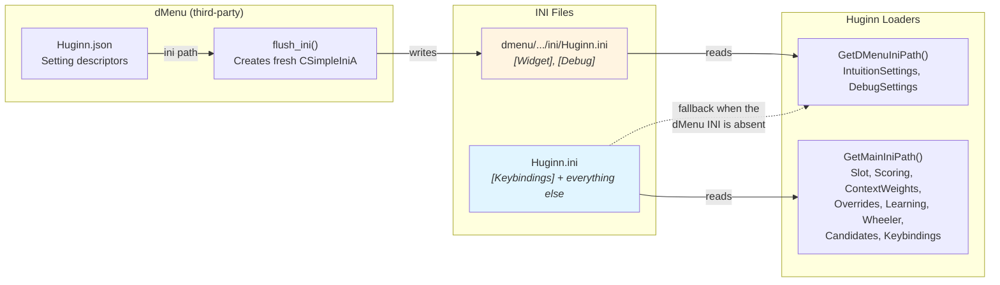
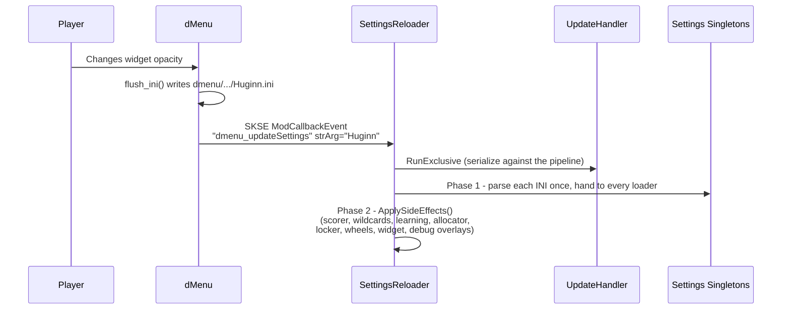

# dMenu Integration

How Huginn integrates with [dMenu](https://www.nexusmods.com/skyrimspecialedition/mods/97221)
for in-game settings management, and what a settings reload actually does.

> **Verified against v0.19.10.** The INI ownership split described here was
> committed at 0.18.47 (`5e3242c`) and shipped in the **0.19.0** cut the same day
> (`b877606`, which also added the Show/Hide Widget button); the roadmap refers to
> it as "the 0.19.0 ownership split". It replaced the older "dMenu owns Widget + Keybindings +
> Debug, with the main INI as a fallback" arrangement that earlier revisions of
> this document described. The layout-gated Wheeler rebuild landed in **0.18.0**
> (`0f452a8`); its narrowing to a separate position check landed in **0.19.5**
> (`38969cb`).

> **Related documentation:**
> - [0-pipeline.md](0-pipeline.md) — recommendation pipeline (the reload serializes against its update loop)
> - [5-slots.md](5-slots.md) — slot system (page layout comes from the main INI)
> - [6-ui-ux.md](6-ui-ux.md) — Intuition widget and Wheeler integration
> - [../reference/ConsoleCommands.md](../reference/ConsoleCommands.md) — `hg reload`, `hg rebuild`, `hg reset qvalues`

---

## Overview

dMenu is a third-party SKSE plugin that provides an in-game settings UI for
Skyrim mods. Huginn registers with dMenu via a JSON descriptor, so players can
adjust widget position, appearance and debug visibility, and fire action buttons,
without editing INI files by hand.

**Zero-coupling integration:** no headers, no DLL linking, no compile-time
dependency. Communication is entirely through a JSON descriptor file and SKSE
`ModCallbackEvent` messages.

**Graceful degradation:**

| Situation | Behaviour |
|---|---|
| dMenu not installed | No events fire. `GetDMenuIniPath()` falls back to the main INI, which does not define `[Widget]`/`[Debug]`, so those take compile-time defaults; everything else loads from `Huginn.ini` as normal |
| dMenu installed, no JSON | Huginn's panel doesn't appear in dMenu; same as above |
| dMenu installed with JSON | Full hot-reload through the dMenu UI |

Because the fallback resolves to the main INI, a hand-written `[Widget]` or
`[Debug]` section added to `Huginn.ini` *is* read when dMenu is absent — the
shipped `configs/Huginn.ini` simply doesn't define one
(`Globals.cpp:138`, `IntuitionSettings.cpp:18`).

`SettingsReloader::ReloadAllSettings` is the **single source of truth for a full
reload**: the dMenu event handler, the dMenu "Reload INI" button and the
`hg reload` console command all delegate to it, so the paths cannot diverge
(`ConsoleCommands.cpp:307`).

---

## INI ownership — exclusive, not layered



**One key, one home.** Nothing is defined in both files, and nothing overlays
anything (`SettingsReloader.h:21`, `SettingsReloader.cpp:161`). That is what
makes it safe for dMenu to fire an update event *after* writing its own INI: the
reload cannot overwrite the value the player just changed.

| INI section | Owner file | Loader |
|---|---|---|
| `[Widget]` | dMenu INI | `UI::IntuitionSettings` |
| `[Debug]` | dMenu INI | `UI::DebugSettings` |
| `[Keybindings]` | **Main INI** | `Input::KeybindingSettings` |
| `[Pages]`, `[PageN]`, `[PageN.SlotM]` | Main INI | `Slot::SlotSettings` |
| `[Scoring]`, `[Favorites]` | Main INI | `Scoring::ScorerSettings` |
| `[ContextWeights]` | Main INI | `State::ContextWeightSettings` |
| `[Overrides]` | Main INI | `Override::Settings` |
| `[Learning]` | Main INI | `Learning::LearningSettings` |
| `[Wheeler]`, `[Subtexts]` | Main INI | `Wheeler::WheelerSettings` |
| `[Candidates]` | Main INI | `LoadCandidateConfigFromINI` |
| `[Wildcards]` | Main INI | `LoadWildcardConfigFromINI` |
| `[SlotLocker]` | Main INI | `LoadSlotLockerConfigFromINI` |

### Why two files at all?

dMenu's `flush_ini()` creates a **fresh** `CSimpleIniA`, writes only the settings
dMenu tracks, then calls `SaveFile()`. The output therefore contains *only*
dMenu-managed sections.
<!-- UNVERIFIED: dMenu's internal flush_ini() behaviour is third-party and cannot
     be checked against src/. It is stated here as Huginn's documented rationale
     for the split (SettingsReloader.cpp:94-96), not as an independent finding. --> If dMenu wrote directly to the main `Huginn.ini`, every
other section would be destroyed (`SettingsReloader.cpp:94`).

The JSON descriptor points dMenu at its own file, and Huginn reads each section
from exactly one place via two path helpers in `Globals.cpp`:

- `GetMainIniPath()` — `Data/SKSE/Plugins/Huginn.ini` (`Globals.cpp:134`)
- `GetDMenuIniPath()` — `Data/SKSE/Plugins/dmenu/customSettings/ini/Huginn.ini`,
  falling back to the main INI when that file does not exist (`Globals.cpp:138`)

> **Changed in 0.19.0:** keybindings used to be dMenu-managed. They are not any
> more — `[Keybindings]` lives in the main `Huginn.ini` only, dMenu no longer
> declares them, and `Main.cpp:557` loads them with `GetMainIniPath()`.

---

## File layout

```
Data/SKSE/Plugins/
    Huginn.ini                              <- Main INI (never written by dMenu)
    Huginn_Overrides.ini                    <- Classification overrides (registry-time, NOT reloaded)
    dmenu/customSettings/
        Huginn.json                         <- dMenu descriptor (setting definitions + "ini" path)
        ini/
            Huginn.ini                      <- dMenu-managed INI ([Widget], [Debug] only)
```

The repository copies live in `configs/Huginn.ini`, `configs/Huginn_Overrides.ini`
and `Data/SKSE/Plugins/dmenu/customSettings/Huginn.json`.

### Huginn.json

The descriptor defines:

- **`"ini"` path** — `Data\SKSE\Plugins\dmenu\customSettings\ini\Huginn.ini`
- **Groups** — *Intuition Widget*, *Debug & Logging*, *Actions*
- **Setting types** — `checkbox`, `slider`, `dropdown`, `button`
- **Action buttons** — Show/Hide Widget, Reset Q-Table, Reset to Defaults, Reload INI

The *Intuition Widget* group covers all ten `[Widget]` keys (`bEnabled`,
`fPositionX`, `fPositionY`, `fAlpha`, `fScale`, `fAlphaChild`, `sDisplayMode`,
`sSlotEffect`, `sRefreshEffect`, `fRefreshStrength`); *Debug & Logging* covers
`iRecommendationLog`, `bShowStateManager`, `bShowRegistry`, `bShowUtilityScorer`.

**Dropdowns serialize as an integer index, not a label.** dMenu writes
`sDisplayMode=0`, not `sDisplayMode=minimal`. `IntuitionSettings::LoadFromIni`
accepts both spellings, and the index order in the loader must stay in sync with
the `options` arrays in `Huginn.json` (`IntuitionSettings.cpp:39`).

---

## Event flow



### Event types

| Event | Trigger | Handler |
|---|---|---|
| `dmenu_updateSettings` | Any slider/checkbox/dropdown change (`strArg == "Huginn"`) | `ReloadAllSettings(GetDMenuIniPath())` (`SettingsReloader.cpp:64`) |
| `dmenu_buttonCallback` | An action button was clicked | `HandleButtonCallback(strArg)` (`SettingsReloader.cpp:189`) |

### Button callbacks

| Button ID | dMenu label | Action |
|---|---|---|
| `Huginn_toggle_widget` | Show/Hide Widget | `IntuitionMenu::ToggleUserHidden()` — deliberately the *same* latch the hotkey flips, not a parallel flag. Resets to shown on load; use `bEnabled` to turn the widget off for good |
| `Huginn_reset_qtable` | Reset Q-Table | `ResetLearningData()` — clears `FeatureQLearner` **and** resets `SlotLocker`, so locked slots stop pinning recommendations scored by the just-cleared table. Shared with `hg reset qvalues` |
| `Huginn_reset_defaults` | Reset to Defaults | `ResetAllToDefaults()` — every settings singleton back to compile-time defaults, then the same side effects as a reload |
| `Huginn_reload_ini` | Reload INI | `ReloadAllSettings(GetDMenuIniPath())`. dMenu-managed sections still come from the dMenu INI, so a manual reload does **not** reset the player's widget customizations |

An unknown button ID logs a warning and shows "Huginn: Unknown action (check logs)".

---

## What a reload does — and does not — rebuild

**Re-read and applied:**

- Every section in the ownership table above
- `UtilityScorer` config, context-weight config and wildcard config
- `ExternalEquipLearner` config
- `SlotAllocator::Initialize()` — re-reads the page count and re-validates
  override placeability. Note it also resets the current page to 0
  (`SlotAllocator.cpp:51`), so a reload sends the player back to the first page
- `SlotLocker::Reset()` + `SetConfig()` — all locks dropped, so the first tick
  after the reload can reassign every slot and the player sees the change within
  roughly one update interval (~100 ms)
- Intuition widget position/alpha/scale/effects, via `IntuitionMenu::ReapplySettings`
- Debug overlay visibility, via `DebugSettings::ApplyToWidgets()`
- Keybindings, pushed into `InputHandler::SetKeyCodes()`

**Not touched by a reload:**

| Not rebuilt | How to refresh it instead |
|---|---|
| Spell/item/weapon/scroll registries | `hg rebuild` (or `hg reset all`) |
| `Huginn_Overrides.ini` classification overrides — read at registry build time only | `hg rebuild`, which re-reads the file (`SpellRegistry.cpp:74`) |
| Learned weights in `FeatureQLearner` | `hg reset qvalues`, or the Reset Q-Table button |
| Wheeler wheels, **when the wheel layout is unchanged** | see below |
| Cosave contents | untouched; a reload is settings-only |

---

## The Wheeler rebuild is gated on the wheel *layout*

This is the part that surprises people: **`hg reload` with no layout change does
not tear the wheels down.** That is deliberate.

Wheel *creation* depends on exactly two things — the wheel position, and, per
page, the page name and its slot count. Everything else Wheeler reads (subtext
labels, auto-focus, post-activation policy) is applied per-tick and needs no
rebuild. So `SettingsReloader` snapshots that much before the reload and compares
after:

```cpp
struct WheelLayout                                       // SettingsReloader.h:111
{
    int32_t wheelPosition = 0;
    std::vector<std::pair<std::string, size_t>> pages;   // (name, slot count)
    bool operator==(const WheelLayout&) const = default;
};
```

`CaptureWheelLayout()` reads `WheelerSettings::GetAPIPosition()` and every page's
name and slot count (`SettingsReloader.cpp:293`). The comparison happens inside
`ApplySideEffects`, and only when Wheeler is actually connected:

```cpp
if (afterLayout != beforeLayout) {                       // SettingsReloader.cpp:361
    wheelerClient.DestroyRecommendationWheels();
    if (positionRestated) {
        wheelerClient.ForgetWheelPositionMemory();
    }
    wheelerClient.CreateRecommendationWheels();
} else {
    // Structure unchanged: don't tear down valid wheels. Create is idempotent —
    // it no-ops when wheels are valid, or recreates them if they went missing.
    wheelerClient.CreateRecommendationWheels();
}
```

Two decisions, deliberately keyed on different things:

| Decision | Keyed on | Line |
|---|---|---|
| Rebuild the wheels | the **whole** `WheelLayout` differs — a renamed page or a changed slot count needs new wheels | `SettingsReloader.cpp:361` |
| Forget a player-dragged wheel position | **only** `wheelPosition` differs (`positionRestated`) | `SettingsReloader.cpp:360` |

Keying the *forget* on the full comparison was a bug: `WheelLayout` also carries
every page name and slot count, so editing something unrelated (`iPage2Slots`, a
page rename) and running `hg reload` threw away a position the player had set by
dragging, and the wheels jumped back to `sWheelPosition`. Narrowed in 0.19.5.

Ordering also matters: the forget must land **after** `DestroyRecommendationWheels()`,
not before. The destroy re-reads the live indices and can record the anchor again,
so forgetting first is undone in the same breath — observed 2026-08-28 with the
calls the other way round (`Forgetting remembered wheel position 1` and
`Remembering wheel position 1 (was -1)` in the same millisecond).

**What you see in the log** (debug level):

```
[SettingsReloader]   [Wheeler] layout unchanged, skipped rebuild
[SettingsReloader]   [Wheeler] wheels rebuilt (layout changed, position restated: true)
```

If you changed a scoring weight and expected the wheels to be recreated, the
first line is the system working as intended.

---

## Initialization timing

```
kDataLoaded (plugin init, before the main menu)
    |-- SettingsReloader::Register()                          Main.cpp:453
    |     subscribes to ModCallbackEvent
    |-- DebugSettings::LoadFromFile(GetDMenuIniPath())         Main.cpp:456
    |     early load so dMenu toggles apply before a save is loaded
    +-- KeybindingSettings::LoadFromFile(GetMainIniPath())     Main.cpp:557
          + InputHandler::SetKeyCodes()

kPostLoadGame / kNewGame  ->  InitializeGameSystems()          Main.cpp:90
    |-- Parse Huginn.ini ONCE, distribute to every loader      Main.cpp:121
    |     WheelerSettings, SlotSettings, ScorerSettings, ContextWeightSettings,
    |     Override::Settings, LearningSettings, CandidateConfig, SlotLocker config
    +-- Parse the dMenu INI once                               Main.cpp:353
          IntuitionSettings (then IntuitionMenu::Show()), DebugSettings + ApplyToWidgets()
```

Debug widget visibility and keybindings are loaded early, at `kDataLoaded`, so
dMenu toggles and slot/page keys work from the main menu. The second load at game
init is harmless — it re-reads the same values.

---

## SettingsReloader

Singleton event sink, registered at `kDataLoaded`
(`src/settings/SettingsReloader.h`, `src/settings/SettingsReloader.cpp`).

```
SettingsReloader
|-- Register()                  <- subscribes to ModCallbackEvent (idempotent, warns on re-entry)
|-- IsRegistered()              <- atomic registration state
|-- ProcessEvent()              <- SKSE event handler
|   |-- "dmenu_updateSettings" (strArg == "Huginn") -> ReloadAllSettings(GetDMenuIniPath())
|   +-- "dmenu_buttonCallback"                      -> HandleButtonCallback(id)
|-- ReloadAllSettings(dMenuIniPath)      <- PUBLIC entry point; wraps RunExclusive
|   +-- ReloadAllSettingsExclusive()     <- requires the update mutex
|       |-- CaptureWheelLayout()             (before)
|       |-- Phase 1: parse both INIs once, hand to every loader
|       |     mainIni:  SlotSettings, ScorerSettings, ContextWeightSettings,
|       |               Override::Settings, LearningSettings, WheelerSettings,
|       |               CandidateConfig, KeybindingSettings
|       |     dMenuIni: IntuitionSettings, DebugSettings
|       +-- Phase 2: ApplySideEffects(&mainIni, layoutBefore)
|-- ResetLearningData()         <- STATIC; clears FeatureQLearner + resets SlotLocker.
|                                  Shared by `hg reset qvalues` and the dMenu button.
|                                  Returns nullopt when the learner isn't initialized
|-- HandleButtonCallback()      <- dispatches the four action buttons
|-- ResetAllToDefaults()        <- wraps RunExclusive
|   +-- ResetAllToDefaultsExclusive()  -> ApplySideEffects(nullptr, layoutBefore)
+-- ApplySideEffects(mainIni, beforeLayout)
```

Each INI is parsed **once** per reload and handed to every loader via
`LoadFromIni(const CSimpleIniA&)`, rather than each settings class re-opening the
file (9+ parses per load before `866f7bb`). `LoadIniFile` in `src/IniLoad.h` is
the shared parse front door. `ApplySideEffects` takes the already-parsed main INI
so the wildcard and slot-locker loaders can reuse it; on the reset-to-defaults
path it is `nullptr` and those two parse `Huginn.ini` themselves.

Graceful degradation inside the reload: if the dMenu INI does not exist, the path
falls back to the main INI with a warning; if the main INI is missing, every
main-INI loader is skipped and keeps its current values, while keybindings fall
back to compile-time defaults.

### ApplySideEffects order

Ordered to avoid inconsistent intermediate state (`SettingsReloader.cpp:308`):

1. **Scorer** — `UtilityScorer::SetConfig()` + `SetContextWeightConfig()` + `LoadWildcardConfigFromINI()`
2. **Learning** — `ExternalEquipLearner::SetConfig()` from `LearningSettings::BuildConfig()`
3. **Slot allocator** — `SlotAllocator::Initialize()` (re-reads the page count) — *first*, so the locker sees the right slot count
4. **Slot locker** — `SlotLocker::Reset()` then `SetConfig()`
5. **Wheeler wheels** — rebuild only if the layout changed (see above); `CreateRecommendationWheels()` is idempotent otherwise
6. **Intuition widget** — `ReapplySettings(IntuitionConfig)`; skipped with a debug line if the menu isn't up
7. **Debug overlays** — `DebugSettings::ApplyToWidgets()` (`LoadFromIni` is a pure loader; this is the apply step)

### Thread safety

`ReloadAllSettings` and `ResetAllToDefaults` **serialize themselves** against the
update loop via `UpdateHandler::RunExclusive`, in the callee, so no caller can
forget it. This is load-bearing rather than belt-and-braces: dMenu dispatches
`ModCallbackEvent` with no thread guarantee, and Phase 1 reassigns non-POD
settings (`std::string` members) that the pipeline reads every tick.

The corollary is that **callers must not wrap these calls in `RunExclusive`
themselves** — the update mutex is not re-entrant, and a caller-side wrap
deadlocks. Both `Cmd_Reload` (`ConsoleCommands.cpp:307`) and `Cmd_ResetQValues`
(`ConsoleCommands.cpp:76`) carry that warning in their comments.

`SlotSettings` additionally has its own `shared_mutex` for page layouts. POD
settings singletons (`ScorerSettings`, `ContextWeightSettings`) are read without
locks; the update mutex is what makes that safe.

---

## Key implementation files

| File | Role |
|---|---|
| `src/settings/SettingsReloader.h` / `.cpp` | Event sink, reload orchestration, button dispatch, wheel-layout gating, side effects |
| `src/Globals.cpp` | `GetMainIniPath()`, `GetDMenuIniPath()`, `LoadIniFile()`, `LoadCandidateConfigFromINI()`, `LoadSlotLockerConfigFromINI()`, `LoadWildcardConfigFromINI()` |
| `src/IniLoad.h` | Shared INI parse front door + `ReadClampedFloat` |
| `src/Main.cpp` | `InitializeGameSystems()` (parse-once load at game init), early `DebugSettings` + `KeybindingSettings` load at `kDataLoaded` |
| `src/console/ConsoleCommands.cpp` | `hg reload`, `hg rebuild`, `hg reset qvalues` — all delegating to the shared entry points |
| `Data/SKSE/Plugins/dmenu/customSettings/Huginn.json` | dMenu UI descriptor |
| `configs/Huginn.ini` | Main INI shipped with the mod |

---

## Extending dMenu settings

### Adding a new dMenu-managed setting

1. Add the entry to `Huginn.json` under the appropriate group.
2. Make its `"ini"` section/id match the keys the settings class reads in
   `LoadFromIni()`. Only `[Widget]` and `[Debug]` are dMenu-owned — a new section
   means a new ownership decision, not a default.
3. In `SettingsReloader::ReloadAllSettingsExclusive()`, load it from `dMenuIni`,
   not `mainIni`.
4. In `Main.cpp::InitializeGameSystems()`, load it from the dMenu INI parse.
5. For a dropdown, remember dMenu writes the **index**; mirror the `options` order
   in the loader and keep accepting the legacy name spelling.

### Adding a new non-dMenu setting

1. Add the section/keys to `configs/Huginn.ini`.
2. Load from `mainIni` in `ReloadAllSettingsExclusive()` and from the main-INI
   parse in `InitializeGameSystems()`.
3. Do **not** add it to `Huginn.json` — dMenu's `flush_ini()` would claim ownership
   of the section, which is exactly what the split exists to prevent.
4. If it needs to reach a running subsystem, add the apply step to
   `ApplySideEffects()`. If it changes the wheel structure, it must also become
   part of `WheelLayout` or the rebuild will be skipped.

### Moving a setting between files

Move it, don't duplicate it. The invariant is that no key is defined in both
files; a key present in both re-introduces the overwrite bug the split fixed —
dMenu's own update event would reload the main INI's stale value over the change
the player just made.
