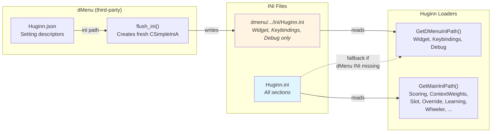
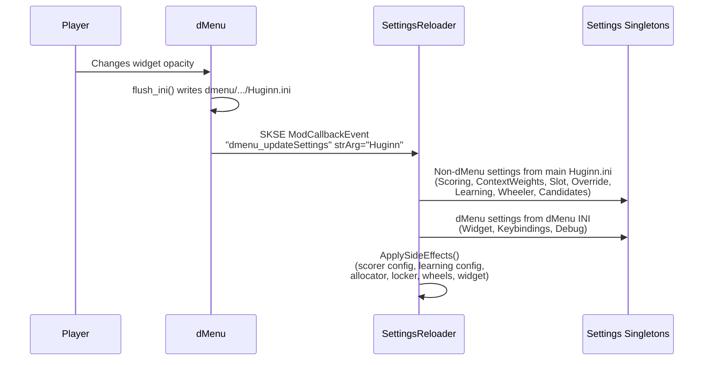

# dMenu Integration

This document describes how Huginn integrates with [dMenu](https://www.nexusmods.com/skyrimspecialedition/mods/97221) for in-game settings management (v0.13.0+).

> **Related documentation:**
> - [0-pipeline.md](0-pipeline.md) - Recommendation pipeline (affected by settings changes)
> - [5-slots.md](5-slots.md) - Slot system (page count configurable via INI)

---

## Overview

dMenu is a third-party SKSE plugin that provides an in-game settings UI for Skyrim mods. Huginn registers with dMenu via a JSON descriptor, allowing players to adjust widget position, keybindings, and debug visibility without editing INI files manually.

**Zero-coupling integration:** No headers, no DLL linking, no compile-time dependency. Communication is entirely through a JSON descriptor file and SKSE `ModCallbackEvent` messages.

**Graceful degradation:**
- dMenu not installed: Huginn loads from `Huginn.ini` normally, no events fire
- dMenu installed but no JSON: Huginn panel doesn't appear in dMenu, still works from INI
- dMenu installed with JSON: Full hot-reload via dMenu UI

---

## Two-INI Architecture



### Why two paths?

dMenu's `flush_ini()` creates a **fresh** `CSimpleIniA` object, writes only dMenu-tracked settings, then calls `SaveFile()`. This means the output file contains **only** the sections dMenu manages. If dMenu wrote directly to the main `Huginn.ini`, it would destroy all other sections (Scoring, ContextWeights, Candidates, Slot, Override, Learning, Wheeler, etc.).

The fix: the JSON descriptor points dMenu at its own INI at `Data/SKSE/Plugins/dmenu/customSettings/ini/Huginn.ini`, and Huginn reads from both files using the appropriate path helper:

| Settings | Source | Path Helper |
|----------|--------|-------------|
| Widget (position, alpha, scale, effects) | dMenu INI | `GetDMenuIniPath()` |
| Keybindings (slot keys, page keys) | dMenu INI | `GetDMenuIniPath()` |
| Debug (widget visibility) | dMenu INI | `GetDMenuIniPath()` |
| Scoring, ContextWeights, Slot, Override, Learning, Wheeler, Candidates | Main INI | `GetMainIniPath()` |

`GetDMenuIniPath()` falls back to the main INI if the dMenu INI doesn't exist (dMenu not installed, or no settings saved yet).

---

## File Layout

```
Data/SKSE/Plugins/
    Huginn.ini                              <- Main INI (all sections, never written by dMenu)
    dmenu/customSettings/
        Huginn.json                         <- dMenu descriptor (setting definitions + "ini" path)
        ini/
            Huginn.ini                      <- dMenu-managed INI (Widget, Keybindings, Debug only)
```

### Huginn.json

The JSON descriptor at `dmenu/customSettings/Huginn.json` defines:

- **`"ini"` path** - Points to `Data\SKSE\Plugins\dmenu\customSettings\ini\Huginn.ini` (the dMenu-specific INI, not the main one)
- **Groups:** Intuition Widget, Keybindings, Debug Widgets, Actions
- **Setting types:** checkbox, slider, keymap
- **Action buttons:** Reset Q-Table, Reset to Defaults, Reload INI

---

## Event Flow



### Event types

| Event | Trigger | Handler |
|-------|---------|---------|
| `dmenu_updateSettings` | User changes any setting slider/checkbox/keymap | `ReloadAllSettings(dMenuIniPath)` - reloads all settings from both INIs |
| `dmenu_buttonCallback` | User clicks an action button | `HandleButtonCallback()` - dispatches by button ID |

### Button callbacks

| Button ID | Action |
|-----------|--------|
| `Huginn_reset_qtable` | Clears all learned reward estimates |
| `Huginn_reset_defaults` | Resets all settings to compile-time defaults |
| `Huginn_reload_ini` | Reloads from main `Huginn.ini` (bypasses dMenu values) |

---

## Initialization Timing

```
kDataLoaded (plugin init, before main menu)
    |-- SettingsReloader::Register()     <- Listens for dMenu events
    |-- KeybindingSettings::LoadFromFile(GetDMenuIniPath())
    |     + InputHandler::SetKeyCodes()  <- Early keybinding setup
    +-- DebugSettings::LoadFromFile()    <- Early load so dMenu changes apply pre-game-load

kPostLoadGame / kNewGame (save loaded)
    |-- Non-dMenu settings from GetMainIniPath()
    |     SlotSettings, ScorerSettings, ContextWeightSettings,
    |     OverrideSettings, LearningSettings, WheelerSettings
    +-- dMenu settings from GetDMenuIniPath()
          IntuitionSettings, KeybindingSettings, DebugSettings
```

Debug widget visibility is loaded at `kDataLoaded` (early) so that dMenu toggles take effect from the main menu, before any save is loaded. Keybindings are also loaded early so slot/page keys work immediately. The duplicate load at game init is harmless - it re-reads the same values ensuring fresh state.

---

## SettingsReloader

Central event handler for dMenu integration. Singleton registered at `kDataLoaded`.

```
SettingsReloader
|-- Register()              <- Called at kDataLoaded, subscribes to ModCallbackEvent
|-- Unregister()            <- Remove from ModCallbackEvent source
|-- IsRegistered()          <- Check registration state (atomic)
|-- ProcessEvent()          <- SKSE event handler
|   |-- "dmenu_updateSettings" -> ReloadAllSettings(dmenuIniPath)
|   +-- "dmenu_buttonCallback" -> HandleButtonCallback(id)
|-- ReloadAllSettings(dMenuIniPath)  <- Re-reads from both INIs, updates all singletons
|   |                        dMenuIniPath passed by caller (ProcessEvent passes hardcoded
|   |                        dmenu path; HandleButtonCallback passes main Huginn.ini)
|   |                        Main INI path hardcoded internally.
|   |-- mainIniPath:  SlotSettings, ScorerSettings, ContextWeightSettings,
|   |                 OverrideSettings, LearningSettings, WheelerSettings, CandidateConfig
|   +-- dMenuPath:    IntuitionSettings, KeybindingSettings, DebugSettings
|-- HandleButtonCallback()  <- Dispatches action buttons by ID
|-- ResetAllToDefaults()    <- Resets all singletons to compile-time defaults
+-- ApplySideEffects()      <- Post-reload: scorer config, learning config,
                               wildcard config, allocator, locker, wheels, widget
```

### ApplySideEffects Detail

After all settings are loaded (or reset to defaults), `ApplySideEffects()` applies them to running subsystems in order:

1. **Scorer config** - `UtilityScorer::SetConfig()` + `SetContextWeightConfig()` + wildcard config
2. **Learning config** - `ExternalEquipLearner::SetConfig()` from `LearningSettings::BuildConfig()`
3. **Slot allocator** - `SlotAllocator::Initialize()` (re-reads page count)
4. **Slot locker** - `SlotLocker::Reset()` + `SetConfig()` (re-reads lock durations)
5. **Wheeler wheels** - Destroy + recreate managed wheels (if connected)
6. **Intuition widget** - `ReapplySettings(IntuitionConfig)` (position, alpha, scale, effects)

### Thread Safety

Settings are read from the update loop thread and written from the game thread (dMenu callback). Both run on the game thread in practice, so no race conditions. POD settings singletons (ScorerSettings, ContextWeightSettings) use simple float/bool members. SlotSettings has its own `shared_mutex` for safe concurrent access to page layouts. Worst case: one update frame (~100ms) sees mixed old/new values, which is acceptable for tuning.

---

## Key Implementation Files

| File | Role |
|------|------|
| `src/Main.cpp` | `GetMainIniPath()`, `GetDMenuIniPath()`, `InitializeGameSystems()` (full settings load for kNewGame/kPostLoadGame), early DebugSettings + Keybindings load at kDataLoaded |
| `src/settings/SettingsReloader.h/.cpp` | Event sink, reload orchestration, button dispatch, side effects |
| `Data/SKSE/Plugins/dmenu/customSettings/Huginn.json` | dMenu UI descriptor |

---

## Extending dMenu Settings

### Adding a new dMenu-managed setting

1. Add the setting entry to `Huginn.json` under the appropriate group
2. Ensure the `"ini"` section/id matches the `LoadFromFile()` keys in the settings class
3. In `SettingsReloader::ReloadAllSettings()`, load the setting from `dMenuPath` (not `mainIniPath`)
4. In `Main.cpp::InitializeGameSystems()`, load from `GetDMenuIniPath()` (not `GetMainIniPath()`)

### Adding a new non-dMenu setting

1. Add the section/keys to `configs/Huginn.ini`
2. Load from `GetMainIniPath()` in `InitializeGameSystems()` and from `mainIniPath` in `ReloadAllSettings()`
3. Do **not** add to `Huginn.json` - dMenu's `flush_ini()` would claim ownership of the section and the two-INI separation exists specifically to prevent this

### Moving a setting from main INI to dMenu-managed

1. Add the entry to `Huginn.json` with matching section/id
2. Switch its loader from `GetMainIniPath()`/`mainIniPath` to `GetDMenuIniPath()`/`dMenuPath`
3. The setting can remain in the main `Huginn.ini` as a fallback (used when dMenu INI doesn't exist)
