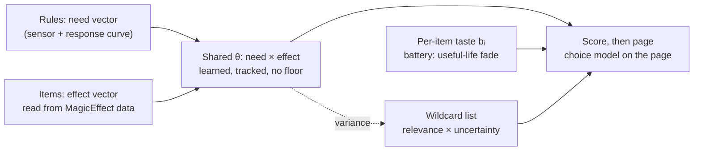

# Rethinking context vs. learner

**Status:** proposal from a design discussion, 2026-10-07. Nothing here is built.
Several points still need to be challenged before any of it is scheduled.

## Summary

Stop multiplying a hand-tuned context scalar by a per-item learner. Instead, rules and classifiers describe the situation (needs) and the items (what their effects do), and the learner learns how much each need-to-effect pairing matters to this player.

- **The problem:** context collapses the situation to one number per item, then a per-item learner that never sees why an item is relevant is multiplied in. Neither side can be trusted to dominate, and the playtest showed learned habit swamping relevance.
- **The direction:** a shared, learned weight θ per need × effect pair, tracked over time (not converged), plus a small per-item preference governed by the existing battery (useful-life) model. Exploration comes from θ's uncertainty, through a reworked wildcard list.
- **What stays hand-written:** sensors, response curves, effect extraction, overrides. What stops being hand-tuned: the weights.

## How it works today

The score is a product of five factors, and only the first two are what the architecture diagrams show (`UtilityScorer::ComputeUtility`, `src/learning/UtilityScorer.cpp:440`).

```math
u = \text{ctx} \times (1 + \lambda(\text{conf}) \cdot \text{learn}) \times \text{corr} \times \text{potion} \times \text{fav}
```

| Factor | Range | Source |
| --- | --- | --- |
| ctx | 0–1, clamped per rule; most items near the 0.2 baseline | `ContextRuleEngine`, reduced to one number per item by `std::max` in `ContextWeightForCandidate.cpp:38-64` |
| λ(conf) | 0.5 at zero confidence to 3.0 at full | `ScorerConfig.h:43-44` |
| learn | α·R + (1−α)·prior + 0.2·UCB + recency (0.19) | R = w·φ, an unclamped dot product, weights clamped ±10 (`FeatureBanditLearner.h:264`) |
| corr | no cap: each bonus ×1.3–3, compounding (melee + no shield × two-handed = ×5.5; bow + arrows + fortify = ×9) | `CorrelationBooster` |
| potion | ×0.5–2.5 | `PotionDiscriminator` (`MIN_MULTIPLIER`/`MAX_MULTIPLIER`) |
| fav | up to 2.5× | favorites, on by default |

- **Learner shape:** one 18-float weight vector per item, 88 items after the soak: about 1,600 parameters fit from 380 choices.
- **Confidence and UCB are per item, by train count only** (`FeatureBanditLearner.cpp:223-231`). They don't depend on the situation.
- **Memory:** as of v0.23.6, an item's confidence holds for 8h + 2h·ln(1 + picks) of play, fades over ~1h, and is forgotten under 5%. The weights themselves don't decay.
- **Wildcards:** random candidates at a slot-scaled probability (base 0.165, max 0.5) held for ~30s (`WildcardManager.h`).
- **Health override** fires at 10% (`OverrideConfig.h:17`).

## What the soak run showed

The learner wins on habit and loses off habit, so neither term should simply dominate. Figures are from the October 2026 LoreRim soak, 9.1 hours, 412 page-0 selections ([Soak-2026-10-LoreRim.md](../playtest/Soak-2026-10-LoreRim.md)).

| Page ranked by | Held the chosen item |
| --- | --- |
| Live page (context × learner) | 335 of 412 (81%) |
| Context only | 237 of 412 (58%) |
| Live page, picks made from menus | 7 of 83 |
| Context only, picks made from menus | 13 of 83 |

- **Crowding:** the Elven Bow of the Blaze was context rank 1 and live rank 15; learned weight on Oakflesh, the battlestaff and Soul Sword pushed it down.
- **Concentration:** Soul Sword took 61 of 380 trains (16%), mostly re-equips after scrolls. The repeat-pick window now cancels those.
- **Cold start:** 63 of 69 carried potions and 46 of 52 scrolls were never trained.
- **Pooling check:** learned vectors record the state an item was used in, not the item. 29 of 66 were scaled copies of one or two state vectors, and similarity was no higher within a class (0.54) than between classes (0.63).
- **Exploration:** wildcards were placed 333 times and chosen 8 times.

## Diagnosis

The problem is the shape of the formula, not the balance between its terms, so blending or capping won't fix it.

1. **Two models of the same thing, multiplied.** Context and the learner's 18 features both read the same game state (vitals, combat, effects). The learner is re-learning context per item, from far less data.
2. **Why an item is relevant is discarded.** "Health at 40%" and "on fire" both become 0.7. The learner can't see which need an item answers, so nothing it learns transfers between items.
3. **Too many parameters.** ~1,600 per-item weights from 380 choices. That explains both the state-copy vectors and the cold start.
4. **Confidence ignores the situation.** Soul Sword's 61 trains make the learner fully confident about it in every state, including ones it was never chosen in.
5. **Context has no uncertainty.** It is treated as always right, at a fixed scale.
6. **The stray multipliers are hand-set.** Favorites up to 2.5×, correlation with no cap (×5.5 and ×9 combinations exist) and potion up to 2.5× each outweigh context's ~5× relevance gap on their own, and correlation switches on and off with combat and distance -- the score jumps behind the remaining slot churn.

Options ruled out:

- **Cap λ·learn, or rank within context bands** (both frozen with the old engine, 2026-10-08). They make the hand-tuned context permanently dominant and give up the learner's 23-point gain.
- **Blend by uncertainty, keeping the product.** Better, but the static scalar × learned weight shape remains.

## Proposed model

Context stops being a multiplier and becomes the input the learner weighs. This is what the parked "learnable context weights" addendum (#15/#16) pointed at; its original text isn't in the repo history.

```math
\text{score}(i, s) = \sum_{(k,j)} \theta_{kj} \cdot \text{need}_k(s) \cdot \text{cap}_j(i) \; + \; b_i
```

- **need(s):** a vector from the rules, e.g. health need, fire threat, darkness, in combat, target humanoid. Each passes through a designer-set response curve (below).
- **cap(i):** a vector describing what the item's effects do, read automatically from MagicEffect data: archetype, actor value, delivery, area, duration, magnitude, cost. No per-item tuning.
- **θ (shared, learned):** how much this player acts on each need-to-effect pairing. Learned from every choice, so a new item inherits everything learned about its effects.
- **bᵢ (per item, small):** taste and habit ("I like Soul Sword"). Shrunk hard and governed by the battery model. Inside the choice model an additive bᵢ multiplies the item's odds (bᵢ = 1.4 is about 4×), so its size must be bounded in odds terms by shrinkage and the battery, not assumed small.
- **Learning target:** a choice model over the shown page, P(chose i | page) ∝ exp(scoreᵢ), trained on chosen vs passed-over items. Huginn already logs this.
- **Multipliers fold in:** synergy and "smallest potion that covers" become features with learned weights, not fixed 2× / 1.5× (favorites have their own section).
- **Explanations fall out:** the largest θ·need·cap term is the reason label, replacing the separate `DominantReason()`.
- **Kept as rules:** overrides (a potion at 10% health is not a learned opinion) and hard filters (uncastable, irrelevant).

**Which pairs exist:** a sparse hand-listed set of obvious pairings (fire threat → resist fire, ward), learned freely, plus a dense need × effect block that starts at zero and is held near it, so strong emergent patterns can still appear. A full dense matrix (~25 × 20 = 500 weights) over-parameterises again. Listing pairs is structure, not values.



Needs and effects meet in the shared θ; per-item taste adds on top; θ's variance feeds the wildcard list.

## Three tiers of recommendation

The tiers decide how items have to be described; the learner should be the main driver in all three, with hand-listed structure only where it's obvious.

| Tier | Examples | What it needs |
| --- | --- | --- |
| Simple | Hungry → food, thirsty → water, at the forge → smithing gear, alteration spell → alteration gear | A hand-listed need → effect pair; θ learns how much it matters |
| Simple, with nuance | Hungry, but the foods give different side effects | Items described by their effects, so "eats stamina-regen food before combat" is a learnable pattern that carries to any food with that effect |
| Emergent | Feather Fall before jumping off a mountainside; Circle of Strength on humanoids, not dragons; alchemy grenade when out of magicka in a dungeon fighting undead | The dense learned block (e.g. θ for target humanoid × area attribute drain), and sensors that can see the situation |

Two limits on the emergent tier:

- **Sensors cap it, not the learner.** Feather Fall before a jump needs something like "standing near a big drop" (height above ground ahead, or slope and altitude). `fWeightFallingHigh` only fires once already falling. That sensor is within the Core Principle: the player can see the cliff. Circle of Strength is learnable today, but the target-type sensor flickers Undead ↔ None mid-fight.
- **Emergent picks are rare**, maybe once an hour, so those weights learn slowly. Exploration has to help (below).

## Response curves

Every need passes through its own designer-set response curve before it enters the model: curves hold facts about the game, θ holds facts about the player. This is the main lesson taken from Infinite Axis Utility Systems (IAUS; Toño Jimenez, "Smarter Game AI with Infinite Axis Utility Systems", Oct 2025).

**What carries over from IAUS**

- **Adopt:** an axis is one input, one curve type (linear, quadratic, logistic, logit, Gaussian) and four parameters (m slope, k exponent, b shift, c centre). In Huginn that becomes need = sensor + curve.
- **Already there:** inputs normalized to 0–1, the zero rule (candidate filters), caching inputs once per cycle.
- **Not adopted:** the geometric mean. It corrects the penalty a product of many 0–1 terms puts on actions with more axes. Every Huginn term is need × effect, two factors, so there's no such penalty, and a square root would amplify sensor noise near zero (darkness 0.02 × torch 1.0 scores 0.14 instead of 0.02). Inside the choice model the summed terms already multiply the odds; log-space features would give a learned geometric product if the emergent tier ever needs strict AND logic (with a floor, since log 0 is a hard veto).
- **Replaced:** IAUS's hand-set action weights (1 normal, 2–3 important, 5 emergency) are the static scalar this redesign removes. θ learns them; emergencies stay as overrides.

**Today:** only the vitals (`deficit^2`, `ContextRuleEngine.cpp:123`), weapon charge (`ContextRuleEngine.cpp:508`) and fall depth (linear ramp, `ContextRuleEngine.cpp:290`) have curves. Everything else is a yes/no flag times a weight, which is what the soak tripped on (hunger as two steps, darkness flipping on under tree shadow).

**First pass, curve per need**

| Need | Input (0–1) | Curve | Why |
| --- | --- | --- | --- |
| Health / magicka / stamina | deficit | Logistic | Irrelevant until about half, then urgent; quadratic rises too early |
| Weapon charge | charge deficit | Logistic | Matters near empty |
| Ammo | 1 − count / cap | Logistic | Same shape |
| Hunger / thirst / cold | survival meter | Linear or quadratic | A ramp, replacing two steps |
| Darkness | 1 − light level | Logistic, soft edge | Tree shadow lands low on the curve |
| On fire / frost / shock / poisoned | recent damage of that type, decaying | Logistic on the rate | "Burning hard now," not a flag; fixes resist potions weighted by one hit |
| Enemy count | enemies / N | Logit | Diminishing returns |
| Enemy distance | distance | Gaussian | Summons need room; fixes summon in melee |
| Drop ahead (new sensor) | drop height | Logistic | Feather Fall before the jump |
| Encumbrance (new) | carry ratio | Logistic near 1 | Only matters near the cap |
| Potion overshoot | (magnitude − deficit) / max | Gaussian near 0 | Smallest that covers |
| Target type, location, workstation | categorical | Step | Facts, not degrees |

Open points:

- [ ] **Curve per need or per need-effect pair?** Proposed: one curve per need, shared across effects; θ handles the pairing and features like overshoot cover per-item differences. A curve per pair multiplies parameters again.
- [ ] **Who sets curve parameters?** Proposed: designer-set in the INI, except the threshold c on frequent needs, which is player-specific (heals at 60% vs 30%). Learn it linearly through a basis of two or three fixed logistic curves at different centres (e.g. 30 / 50 / 70%) weighted by θ, for the vitals and maybe darkness only. Alternative: fit c offline in `tools/replay`.
- [ ] Add a curve viewer to the ImGui debug widgets, IAUS's "real-time visualization" point.

## Tracking, not converging

The goal is current utility: follow what's useful now and let old usefulness fade, because a level-5 kit and a level-40 kit want different things.

- **Shared θ → an update that keeps tracking.** A Kalman filter with process noise is built to follow a drifting value; a constant-step online update does the same with one number. Either way the variance drives exploration. Not the battery -- see "Why the battery is not θ's forgetting" below.
- **Per-item bᵢ → keep the battery (useful-life) model.** Items come and go from inventory, so a useful-life shape fits. The battery is already Kalman-like: uncertainty grows while there's no evidence, the score falls back to its prior, and UCB rises so the item is re-explored. It just uses a hand-shaped curve with a delay and a knee.
- **The battery's role narrows:** from "how long the whole item vector is trusted" to "how long this item's personal preference is trusted."

**No minimum on θ.** A player who never uses resist potions under fire can unlearn that pairing completely. Correcting a wrongly unlearned pairing is the job of exploration, not a floor. (Surprise weighting was dropped 2026-10-08: the logged page needs no reweighting; theory page, P5.)

**Why the battery is not θ's forgetting** (reviewed 2026-10-07 after the user asked "isn't this what the battery model should be?"; a fresh-context review corrected the first answer, which proposed a battery for θ clocked by need-active time):

- **The battery only acts when evidence stops.** A pick resets retention (`FeatureBanditLearner.cpp:65-69`), and a passed-over update does not renew it (`:61-63`). The level-5 to level-40 drift happens on pairings still in use, where a battery sits at full and does nothing. Today's tracking comes from the constant step and L2 (`:53-55`), not the battery.
- **Fading confidence while keeping the weights needs a prior to fall back to.** Today's score blends `α·R + (1−α)·prior` (`UtilityScorer.cpp:388-391`). The score here has no such blend, so a faded θ would change almost nothing, and deleting a θ entry sets the pairing to 0: "rejected", the meaning the battery was built to avoid.
- **The plateau-and-knee shape fits a discrete event** (an item dropped or replaced). Preference drift is gradual. A scheduled knee on a shared θ would also make a whole class of items lose trust at once.
- **Passed-over updates do not cover "faced the need and did not act."** Doing nothing produces no event. Negatives exist only after a pick, only for same-slot-class items shown on Normal slots, already known to the learner, still pending after 10 s, at a quarter step (`EquipSubscribers.h:56-71`, `Config.h:59,75`). Healing instead of resisting is a different need class, so nothing is passed over.

**What θ uses instead:**

1. **The update rule is the tracking knob.** With the simple online logistic step (diagonal variance), the step size is the one number and no separate process noise is needed. With a Kalman/Laplace step, process noise is applied per opportunity, not per second.
2. **θ's variance grows only on real opportunities**: the need is active (counted by onsets, not seconds, so a long fight does not outweigh several short ones) and an item answering it was shown. Idle play time is not evidence -- the player is not on fire most of the time. The variance feeds the wildcard list and the challenger margin. θ entries are never deleted.
3. **The battery stays on the play clock, for bᵢ only.** There zero means "no particular taste", which is the right fallback.

The process-noise level cannot be fitted from the soak log (11.4 play-hours, no level progression, no need vector); choose it conservatively and lean on the θ-drift telemetry.

## Item tiers and the greedy potion

Learning on effects rather than FormIDs handles both catches without special code.

1. **A higher tier should supersede a lower one.** Restore Health (Fair) has the same effect as (Faint), so it inherits everything learned about healing the moment it's picked up. Nothing has to be unlearned.
2. **The greediest potion isn't always best.** Add a feature for how far the item overshoots the need (e.g. magnitude minus missing health). A player who saves big potions for big gaps drives that weight negative, so "smallest that covers" is learned from behaviour. Today the scorer hard-codes it with `POTION_TIER_STEP` (`ScorerConfig.h:28`, applied at `UtilityScorer.cpp:332`).

What's left is bᵢ: a strong per-item habit could hold onto (Faint). Keeping bᵢ small and letting the battery fade it is the answer; check it in replay.

The same applies to gear generally: tiers of a weapon or armour share effects, and the per-item term carries only taste.

## Exploration: uncertainty-ranked wildcards

Wildcards become "Huginn isn't sure about this one" instead of a random pick, which is the real fix for the feedback loop.

- **Why it's needed:** Huginn is deterministic, so an item not shown has a propensity near zero. Once a pairing's θ drops, its items leave the bar and only a menu pick brings them back. Surprise weighting (inverse propensity) was dropped 2026-10-08: with a deterministic page the propensity is 0 or 1, so the weights are undefined, and the likelihood needs no reweighting anyway (theory page, P5). Exploration has to supply the missing information. Menu picks now carry it too: a menu pick is a choice from the held items off the page (P11).
- **Proposed rework:** wildcard chance = a base random term plus θ uncertainty. Build a list of candidates ranked by relevance × uncertainty in the current situation, then pick from it weighted by that value.
- **What lands on the list:** items whose battery has run down, pairings with little evidence, newly acquired effect types, emergent combinations the dense block is unsure of.
- **Keep exploration in the wildcard slot.** Thompson sampling on every 100 ms tick would make the whole bar flicker. If it's used more widely, resample only when the situation hash changes or a slot lock expires.
- **Target to beat:** 8 wildcard picks out of 370 page selections in the soak.

## Sensors and bootstrap

Weights stop being hand-tuned, but sensors stay hand-written and become the main limit on quality.

**Sensors**

- Every soak recommendation gap (fortify potions, poisons, encumbrance, disease detection seeing 1 of 94 diseases, darkness firing in daylight, target-type flicker) becomes a missing or broken `need` or `cap` dimension. Grooming the state models is part of this work.
- **The learner will learn sensor bugs away.** If darkness falsely fires in daylight, the player ignores torches and θ for darkness drops. That hides the bug.
- **Mitigation:** log each θ's drift from its starting value. A collapse within a session usually means a broken sensor, not a preference change. That turns the learner into a sensor-bug detector.

**Bootstrap**

- The INI fallback exists (`[ContextWeights]` in `configs/Huginn.ini`) but doesn't drop in as θ: scales are mixed (`fWeightOnFire = 8.0`, `fWeightUnderwater = 10.0`, vitals 0.3–1.0, base relevance 0.05) and it has one weight per need, not per pair.
- **Preferred:** fit θ offline and ship that as the default. The INI stays as an emergency override. (Superseded 2026-10-08: the soak log cannot rebuild the need vector, so the fit uses new play logged with selection log v3; see the implementation map, Phase 4.)
- **Rare needs never converge.** Drowning fired twice in 9 hours. For those, the starting value is effectively permanent. Acceptable, since overrides cover the safety-critical ones, but the design should say so.

## Needs and effects, enumerated

Measured 2026-10-07 from `hg dump all` and `hg dump races` on vanilla+, Simonrim Essentials and LoreRim, plus a survey of the code and roadmap. The tables are in [9-data/](9-data/): `needs.csv`, `effects.csv`, `target_types.csv`, `race_map.csv`.

**Needs: 92.**
- **Status:** 31 exist today, 11 exist but are on/off only, 27 are partly there and 13 are new.
- **Sources:** every one of today's 41 `[ContextWeights]` keys maps to a need, or is explained as not being one (the baselines that only clear `fMinimumUtility`, and the dead keys on the roadmap's cleanup chore).
- **Perception rule:** applied. Target level is read today (`StateManager_Targets.cpp:404,499,667`) but used nowhere; it stays unused.
- **Mod-dependent needs** switch on only when their system is detected: thirst, the SMI/CC survival meters, TrueHUD's enemy magicka and stamina, and LoreRim's healing block.

**Target type: 11 families, 4 facets, and a summoned flag.** These replace vanilla's six.
- **Families:** humanoid, undead, daedra, animal, monster, arthropod, construct, dragon, troll, giant, werebeast.
- **Facets:** spectral (under undead), and element fire, frost and shock (elementals only).
- **Multi-hot:** a vampire is undead and humanoid, a skeletal dragon dragon and undead.
- **The classifier:** race keywords first (`ActorType*` plus mod keywords such as Vigilant's and Requiem's), then a manual editorID table (17 LoreRim rows). `ActorTypeCreature` on its own means monster, not beast.
- **Why it changes:** today 37 LoreRim combat races (366 NPC records) are misread. Falmer, Hagraven and goblins read as beast; Vigilant's iron spiders as undead; skeletal dragons as dragon only. The same goblin reads humanoid or beast depending on which mod added it.
- **Race is not a need.** That would be 400 races, and only 93 have 10 or more NPC records. Log the race editorID at each pick; add a race θ shrunk toward its family only if replay shows lift.
- **Decided (the user agreed with the recommendations, 2026-10-07):**
  - goblinoids fold into humanoid;
  - multi-hot;
  - mod keywords are trusted for the flags, and only the primary family is overridden;
  - elemental facets come from a name table, for elementals only;
  - arthropod is split from animal;
  - werebeast is its own family if silver works on werewolves in LoreRim, otherwise it folds into monster;
  - **Banish pairs with a new `target_summoned` need, not with daedra.**
- **Effect gaps:**
  - a `bane_<family>` column for target-conditioned damage (Dragonbane, Dawnguard rune weapons, the silver perk, which today is a correlation multiplier). This needs MGEF or perk conditions in the dump.
  - Construct, monster and spectral have no obvious pairing. Poison immunity is a hidden number, so θ may learn it, but no hand rule encodes it.

**Effects: 243 flat columns.**
- **Breakdown:** 26 families, 136 specifics, 19 modifiers, 25 item features, 23 weapon stats and 14 armour stats. (242 before 2026-10-08, when the power and shout columns went with the decision to skip them; 239 until 0.23.16 added `self_harm` and `self_harm_health/magicka/stamina`: a harm row on a food or potion is the drinker's side effect, not a target-harm column.)
- **Flat, not factorised:** factorising (family + element axis + skill axis) saves only 11 columns. A linear score cannot express "resist AND fire" from two separate columns.
- **Stable across lists:** about 175 effect columns on each list. LoreRim adds specifics inside existing families, not new kinds of effect.
- **Coverage of visible effect rows:**

  | List | Mapped |
  |---|---|
  | vanilla+ | 99.2% |
  | Simonrim | 99.3% |
  | LoreRim, with the spell-tome filter and effect descriptions | 98.9% (script-only rows 88.5%) |

  What stays unmapped is one-off mechanics (White Phial, spell-copying, walls, curses).
- **Pairs:** 92 needs × 243 columns. 263 pairs, about 1.2%, are obvious and start nonzero (266 until 0.23.16 dropped diseased × resist_disease: resisting a disease does not cure one already caught; 265 until 0.23.17 dropped cold × resist_frost and cold × armour_warm: the Survival cold meter is restored by soups, while warm apparel and warming spells raise the warmth rating, `warmth_deficit`, and Resist Frost lowers frost damage only; confirmed via LoreRim Discord, 2026-10-09). `tests/core/ObviousPairsTests.cpp` pins the count and these removals.
- **Reused actor values are resolved in layers.** Simonrim's OneHandedSkillAdvance means Burden; LoreRim's Fame carries Fear and fire damage. So `*SkillAdvance`, Fame, Infamy, Mood, Morality, `Variable##` and VoicePoints are never trusted alone. The layers, first match wins:
  1. Keyword table. Editor IDs are language-independent; this alone resolves 85–89%.
  2. Per-load-order override file, keyed by plugin and local FormID.
  3. English name table.
  4. Effect-description patterns.
  5. Unmapped, logged once.
- **Extractor rules, in order:**
  1. Player-facing items only, no ingredients. Plain spells must be taught by a tome. Powers and shouts are out of scope (2026-10-08).
  2. Visible effects, plus a whitelist of hidden ones with real mechanics (frost slow, LoreRim stagger).
  3. One canonical actor value per skill: X, XMod and XPowerMod are the same skill.
  4. The detrimental, Recover and resistAV fields separate restore / fortify / drain and resist / weakness.
  5. Element from keywords, then resistAV.
  6. Timing: instant, over time, or constant. Total = magnitude × max(duration, 1).
  7. Clip sentinels (9999+ magnitudes; durations of a day or more).
  8. Grade each column as a percentile within the load order.
- **Decided (the user agreed with the recommendations, 2026-10-07):**
  - graded values are percentiles within the load order, portable across lists whose magnitudes differ about 5×;
  - the dense block starts at zero everywhere, held there by shrinkage;
  - LoreRim's extra elements (arcane, entropic, shadow, blood) fold into magic until a need reads them;
  - override files ship for known lists, with a generator for any other;
  - hidden perk-conditional effects (Impact stagger) are not used for now.

**Dump gaps**, to batch into one update when the real extractor is built:
1. the effect's magic school (MGEF `associatedSkill`);
2. the ammo NonBolt flag;
3. cloak and hazard payload spells;
4. the per-effect cost, next to the base cost;
5. descriptions with magnitude and duration filled in;
6. attached script names, for script effects with no description;
7. "taught by shout" (moot: shouts are out of scope, 2026-10-08);
8. MGEF or perk conditions, for the bane columns.

## Favorites

Favorites stop being a utility multiplier; in Boost mode they speed up and protect learning through the battery, and in Suppress mode they're filtered out.

- **Why it changes:** today's 1.3–2.5× rank-scaled boost (`ScorerConfig.h:60-66`) is a UI hack inside the learner. It existed to accelerate learning of an item the player cares about, and it swamps context: a favorited trained weapon at the 0.2 baseline beats an untrained item at full context, ~1.9 vs ~1.5.
- **Boost mode → a battery bonus, not a score bonus.** Favoriting an item extends its useful life and lets its picks count for more, so it's learned faster and forgotten slower. What the item is worth still comes only from choices.
- **Suppress mode → a hard filter.** "Never put my favorites on Huginn" is a UI preference, handled like uncastable spells.
- **Off → ignored.**
- **Rank scaling goes.**

Open points:

- [ ] Define the battery bonus concretely: pseudo-picks on favoriting, a longer `fUsefulLifeHours`, a larger step size for early picks, or a mix. Pseudo-picks with no real picks behind them raise trust in an empty estimate, so the step-size route may be safer.
- [ ] Check how picks from the Skyrim favorites menu are classified. If they count as a menu bypass, they reward the item for being chosen somewhere else; "chosen" and "needs a Huginn slot" are different evidence. Trace `ExternalEquipLearner` / `InventoryExitTracker`.

## Decisions, open questions, risks

**Decided in discussion**

- The learner is the primary driver; hand-tuned values are a bootstrap, not an authority.
- **The hand-tuned layer is tech debt to pay off** (the user, 2026-10-07): it was always meant as a one-time bootstrap, not something to rely on continuously. So the replacement half of this proposal is paying down debt, not a new direction.
- **Why now: today's engine does not generalise** (the user, 2026-10-07). It was hand-tuned to get a minimum working prototype. About 70 hand-set numbers decide relevance and balance (40 `[ContextWeights]`, 18 `[Scoring]`, 7 correlation bonuses, 8 potion multipliers, plus the tier step, recency and baselines), and every new situation needs another rule, weight or multiplier.
- No minimum on θ: unlearning a rule is the player's prerogative.
- Track current utility; don't converge.
- Keep the battery model for per-item memory.
- Feedback-loop correction comes from uncertainty-driven exploration, and from menu picks as a second choice set. Surprise weighting was dropped (2026-10-08; theory page, P5).
- Overrides stay hard rules. Favorites feed the battery (Boost) or a filter (Suppress), never utility.
- **The choice model's three outcomes** (the user, 2026-10-08; proofs on the Huginn Learning Theory page, P11): a key press from the page (everything visible, including wildcard, override and Remembrance slots); a menu pick from the held items off the page at a learned cost κ, which teaches that item's need × effect pairs and settles at the observed reach-in rate; and "nothing pressed", recorded once per need episode when the need expires, with the page at the onset. u0 depends on the situation through an outside-option effect column. Co-picks are processed in order (Plackett–Luce). The favorites-always-pass rule goes.
- **Scope** (the user, 2026-10-08): all carried armour is gear and a candidate; powers and shouts stay out (powers a later bonus); target type keeps the combat-hostile union with no line-of-sight logic. Details in [the implementation map](9-implementation-map.md#decisions-the-user-2026-10-08).

**Open questions**

- [ ] How sparse is the hand-listed pair set, and how strongly is the dense block held at zero?
- [x] ~~What process-noise level for θ, and does it interact badly with the battery on bᵢ?~~ Answered in "Why the battery is not θ's forgetting": the update rule's step size (or process noise per opportunity) tracks θ; the battery stays on bᵢ only.
- [ ] **When a pairing goes unused, should θ drift back toward its starting value θ0?** That is the true battery analogue for θ (a mean-reverting model rather than a random walk), but it softens "no minimum on θ" decided above.
- [ ] Kalman/Laplace update on a choice-model likelihood, or a simpler online logistic step with a diagonal variance?
- [ ] Which effect features to extract first, and from which game data (MagicEffect archetype, actor value, keywords)?
- [ ] What new sensors the emergent tier needs first (edge/drop detection, stable target type).

**Challenged (2026-10-07, against the code and the soak report)**

- [x] **Expand the selection log; the soak log cannot fit θ** (decided, the user 2026-10-07: "just expand the soak log or redefine as required"). Step 2 adds the need vector -- and each candidate's effect vector -- to every `Huginn_Selections.jsonl` record, and step 3 fits on play logged that way. Step 3 assumes the old log can do it, but `Huginn_Selections.jsonl` holds one `ctx` and one `need` label per candidate plus the 18-float φ (vitals, combat, sneak, distance, target type, equipment, bias). On fire, darkness, hunger level, workstation, damage taken by element and encumbrance are not in it, so need(s) cannot be rebuilt. Steps 1–2 must add need-vector logging, and step 3 needs new play hours logged with it. A test that works on today's log: one learned weight per need class times the logged `ctx`, no per-item term. If that does not beat context only, the full model likely will not.
- [ ] **The 23-point gain is partly self-fulfilling.** The live page was the one shown, and most picks were presses of its keys; the context-only page was never shown. On the 83 menu picks, which the display did not steer, context alone won 13 to 7, and B′ (prior and recency kept, no learned weights) scored 56% against B's 58%. That strengthens the case for this redesign but weakens "Options ruled out": a cap or context bands stays a cheap stopgap while this is built (superseded 2026-10-08: the old engine is frozen, so no stopgap). Success in step 3 should weight menu picks, not the overall hit rate.
- [x] **Keep the challenger margin; derive it from Bayesian confidence** (the user, 2026-10-07: the margin stays -- it keeps the riffraff out -- and "if we are using likelihood could we leverage some Bayes statistics"; recorded on the user's say-so). The learner keeps a variance per weight, so every score is a best guess with an error bar: mean μ = Σ θ·need·cap + b, variance σ² = Σ (need·cap)² Var(θ) + Var(b) under the diagonal approximation. A challenger takes a key only when the posterior probability that it beats the incumbent clears a threshold:

  ```math
  P(c \succ i) = \Phi\left(\frac{\mu_c - \mu_i - \ln m}{\sigma_\Delta}\right) > \tau
  ```

  - **The denominator is the gap's own spread** (corrected 2026-10-08; theory page, P7): σ_Δ² = Σ_k (x_c,k − x_i,k)² Var(θ_k) + Var(b_c) + Var(b_i). Weights the two items share cancel. The earlier √(σ_c² + σ_i²) is only an upper bound and would make similar items (two healing potions) swap too rarely.
  - **What it does:** a challenger barely ahead of a well-known item sits near 50% and stays out; two well-learned items with a real gap swap at once; a new or rarely seen item needs a bigger lead because its error bar is wide. The margin becomes per item and per situation, with no fixed 1.5×.
  - **Stable:** the probability moves only when scores or certainty move -- unlike sampling (Thompson) every tick, already ruled out for flicker.
  - **Still likelihoods:** in the choice model a 1.5× likelihood ratio is a score gap of ln 1.5 ≈ 0.4, so an optional minimum gap is the `ln m` term (m = 1 means confidence alone).
  - **Starting values:** τ ≈ 0.8, m = 1; tune in replay.
  - **Next step, optional:** Bayesian decision rule -- swap when the expected gain in pick likelihood, E[exp(s_c) − exp(s_i)], exceeds the cost of moving a key (muscle memory), measured from the home-key heartbeat and presses on just-changed keys, and likely higher mid-fight than in town. Then τ is not hand-set either.
  - **Depends on decision 4:** the update rule must keep a variance per weight (the recommended simple online logistic step with a diagonal variance does; a plain gradient step does not). Today's engine has no error bars, so this is a new-system feature.
  - **The slot class cap (formerly the need cap) stays a ratio for now;** a Bayesian version ("how likely does the player want a second item for this need?") is more involved.
  - Supersedes the three derivation options recorded earlier the same day: this is option 1, with option 2 (cost of a move) as its next step and option 3 (replay) as the check.
- [ ] **The slot manager assumes a positive multiplicative score.** The hold margin (×1.5 challenger ratio), the slot class cap (×0.5, ×0.25), `fMinimumUtility` and the override thresholds are all ratios or floors on today's utility. An additive θ·need·cap + bᵢ can be zero or negative. Decide whether the slot manager works on exp(score) (the choice model's odds) or every one of those is re-derived. **Recommended: likelihoods**, with the hold margin as the Bayesian confidence rule above; the need cap and the floor follow once that is built.
- [x] **Weapons need a capability vector too.** The extractor reads MagicEffect data, which covers spells, potions, scrolls and enchantments. A plain weapon has none, so its cap(i) is empty and bᵢ carries everything -- the soak's concentration (Soul Sword, 16% of trains) under a new name. **Decided (the user, 2026-10-07): yes** -- expand the registries / state manager to read weapons (type, hand, damage, speed, reach, enchantment) and armour (slot, rating, weight class, enchantment), behind the effect-view dump below.
- [ ] **Derive the minimum utility; do not set it** (the user, 2026-10-07: "should be derived, not something we should set"). Today `fMinimumUtility` (0.1) drops anything under it (`UtilityScorer.cpp:127`), and at least four always-on baselines exist only to clear it -- `weightWeapon`, `weightSpell`, `weightBuffPotion`/`weightBuffCombat`, `weightSoulGem` (`ContextRuleEngine.cpp:455-492`) -- plus `fColdStartUCBBoost`. One hand-set floor, five hand-set workarounds. Three ways to derive it, cheapest first:
  1. **The noise floor** (today's formula): the utility of an item with no context reason and no training, `baseRelevance × (1 + λmin × prior)`. It moves with the other parameters instead of drifting out of sync, and a category it keeps out has a sensor gap, not a threshold problem. The baselines then retire one by one as their sensors arrive.
  2. **Replay**: bin shown items by utility, measure the pick rate per bin, put the floor where it reaches ~0. Answers "when is a blank key better than the 9th-best item?" from play, and checks where (1) lands.
  3. **The outside option** (this model): the choice model gets a "nothing on the page" alternative -- no press, or a menu pick -- with its own learned score, fit from menu picks (goal 1's count). Show an item when it beats the outside option. (Superseded 2026-10-08: the outside option is "nothing pressed", recorded when a need expires; a menu pick is a choice from the held items off the page at a learned cost κ. Under a logit any item beats a blank key, so a floor needs a measured cost per shown item; theory page, P9 and P11.)
- [x] **A prerequisite gate: dump the game through this lens first** (the user, 2026-10-07). Design the effect vector from what the load order contains, not from guesses. Seven dumps exist (`hg dump spells / food / potions / scrolls / weapons / apparel / diseases`, Debug only) but each has its own classifier-shaped columns; unenchanted armour and ingredients are not dumped at all, and weapons lack hand and reach. Wanted: one effect-view dump, one schema, every item type -- a row per item × effect (archetype, actor value, delivery, magnitude, duration, area, cost, keywords) plus physical stats (weapon type, hand, damage, speed, reach; armour slot, rating, weight class) -- run on vanilla+, simonrim and LoreRim. It answers how many distinct effects really occur, which sets the size of cap(i).
- [x] **Ingredients are out of scope** (the user, 2026-10-07): they matter only at an alchemy lab, so Huginn drops them. No cap(i) for ingredients, and so no need to mask their effects to the ones the player has discovered (the Core Principle issue the LoreRim dump analysis raised). `hg dump all` leaves them out.
- [x] **Enumerate needs and effects fully; expect most pairs at zero** (the user, 2026-10-07). Both lists are derivable: needs from the sensors (finite, ~25-40), effects from the dump (archetype × actor value is ~50 × ~160 in principle, far fewer in use). The pair space is large -- thousands -- but at ~40 picks an hour play can support only a few dozen nonzero pairs, so every pair starts at zero and needs evidence; the obvious pairs get a nonzero starting value. This replaces the "sparse hand-listed set + dense block" question above with one rule. Suggested with it: give effects two levels, family and specific (Resist, Resist Fire), so a rare effect borrows evidence from its family instead of staying at zero.
- [ ] **Measure the wildcard target against relevant wildcards.** "8 of 333" counts wildcards placed when nothing called for them. Count picks against wildcards whose relevance was above the noise floor at the time.

**Risks**

- Data volume: ~40 choices an hour. Rare and emergent pairings will learn slowly, possibly never.
- Shared θ makes the feedback loop wider: one bad drop hides a whole class of items, not one item.
- One player's logged play as the bootstrap may encode their playstyle as everyone's default (now the v3-logged mage play, not the soak log).
- Sensor bugs become silent unless drift is logged.
- Cosave format change: old per-item vectors are largely state copies, so discarding them is probably fine, but say so in release notes.

## Suggested sequence

The effect feature extractor comes first; everything else can be tested offline in `tools/replay` before any in-game change, on play logged with selection log v3 (the soak log cannot rebuild the need vector; corrected 2026-10-08).

0. **Effect-view dump** (prerequisite gate, decided 2026-10-07). One schema for every item type, on three load orders; design the effect vector and the needs × effects enumeration from it.
1. **Effect extractor.** Describe every candidate as a capability vector from game data -- weapons and armour by their physical stats too. Testable on its own with `hg dump`-style output.
2. **Need vector.** Expose the rule outputs as a vector, each through its response curve, instead of the per-item `std::max`.
3. **Replay the new score.** Fit θ offline on new play logged with selection log v3 (the soak log cannot rebuild the need vector) and re-rank. Success = key hit rate at or above 76% (arm A*, the plain ranking replay reproduces; 81% was the live page with holds) *and* menu-pick hits above 7 of 83.
4. **Bootstrap θ** from that fit; re-express the INI as an override.
5. **Online update** for θ (step size as the tracking knob; variance grown per opportunity); move the battery to bᵢ.
6. **Wildcard rework** on θ uncertainty.
7. **θ drift telemetry** and sensor grooming in parallel.
8. **Cosave bump** and a soak run as the new baseline.
