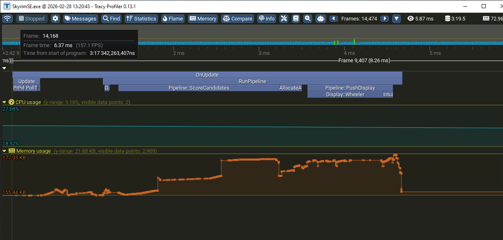

# Wheeler Push Spikes

**Created:** 2026-02-28
**Based on:** Tracy profiler capture (v0.13.1, ~14,474 frames, 3m19s session)



---

## Summary

Periodic frame-time spikes (12.7ms vs normal 6-7ms) traced to `Display::Wheeler` inside `Pipeline::PushDisplay`. The spike is **not** purely external Wheeler API overhead — Huginn's multi-page loop and per-slot update pattern amplify the cost.

## Tracy Observations

| Metric | Normal Frame | Spike Frame |
|--------|-------------|-------------|
| Frame time | 6.37ms (157 FPS) | 12.7ms (79 FPS) |
| OnUpdate | ~5ms | 9.14ms (1783% of mean) |
| OnUpdate self time | — | 654us (7.15%) |
| Display::Wheeler | ~2ms | ~8ms (dominates) |
| Memory | 155-160 KB steady | 177 KB peak during spike |

The spikes correlate with state transitions (combat start/end, location change) where many slots change simultaneously.

---

## Root Cause Analysis

### 1. Multi-Page Re-Allocation in WheelerBackend::Push

**File:** `src/display/WheelerBackend.cpp:32-39`

```cpp
for (size_t page = 0; page < slotAllocator.GetPageCount(); ++page) {
    if (page == slotAllocator.GetCurrentPage()) {
        pageAssignments = ctx.assignments;  // Free — already computed
    } else {
        pageAssignments = slotAllocator.AllocateSlotsForPage(  // EXPENSIVE
            page, ctx.scoredCandidates, ctx.overrides, ...);
    }
```

Every pipeline run re-allocates slots for ALL non-current pages. Each `AllocateSlotsForPage` call involves classification matching, priority sorting, and constraint evaluation. With N pages, the Wheeler push does N-1 redundant allocation passes that the player isn't even looking at.

**Cost multiplier:** Linear in page count. 3 pages = 2 extra allocation passes per pipeline tick.

### 2. Per-Slot Cross-DLL API Calls

**File:** `src/wheeler/WheelerClient.cpp:621-727`

Each slot that changed does up to 4 cross-DLL function pointer calls:
1. `RemoveItem()` — remove old item from Wheeler
2. `AddItemByFormID()` — add new item
3. `IsEntryEmpty()` — recovery check on failure
4. `SetManagedWheelEntrySubtext()` — update subtext label

Each call crosses the DLL boundary into Wheeler, potentially acquiring Wheeler's internal locks and triggering UI state updates. When many slots change at once (state transition), all slots hit the remove+add path instead of the cache-hit early exit at line 641.

**Worst case:** `slots_per_page × pages × 4` cross-DLL calls per pipeline tick.

### 3. Mutex Contention Window

**File:** `src/wheeler/WheelerClient.cpp:582`

```cpp
std::lock_guard<std::mutex> dataLock(m_pageDataMutex);
```

The entire per-page update loop runs under `m_pageDataMutex`. If a Wheeler callback fires during the update (item activation, wheel state change), it contends on this mutex via `m_callbackMutex → m_pageDataMutex` lock ordering.

### 4. Per-Page Vector Allocations in WheelerBackend::Push

**File:** `src/display/WheelerBackend.cpp:76-79`

```cpp
auto formIDs = Slot::ExtractFormIDs(pageAssignments);
auto wildcardFlags = Slot::ExtractWildcardFlags(pageAssignments);
auto uniqueIDs = Slot::ExtractUniqueIDs(pageAssignments);
auto subtexts = Slot::ExtractSubtexts(pageAssignments);
```

Four new vectors allocated per page per pipeline tick. These contribute to the staircase memory pattern visible in Tracy.

---

## Proposed Optimizations

### P1: Defer Non-Current Page Allocation

**Problem:** Non-current pages are re-allocated every pipeline tick, but the player only sees the current page on the Intuition widget and only sees other Wheeler wheels when manually cycling.

**Fix:** Cache the last slot assignments per page. Only re-allocate a non-current page when:
- The player switches to that page (via page key or Wheeler wheel cycling)
- A forced refresh is requested (`hg refresh`)

**Expected savings:** Eliminate N-1 `AllocateSlotsForPage` calls per pipeline tick. For 3 pages, this is ~66% reduction in allocation work during PushDisplay.

**Risk:** Low. Non-current page content may be slightly stale when the player switches, but `SlotLocker` already provides temporal stability — a one-tick delay is imperceptible.

**Files:** `WheelerBackend.cpp`, `WheelerBackend.h`

### P2: Diff-Based Wheeler Updates (Skip Unchanged Slots)

**Problem:** The FormID cache check at line 641 correctly skips unchanged items, but the subtext comparison at line 714 can trigger even for cosmetic-only changes (wildcard flag toggled, same FormID). This causes unnecessary `SetManagedWheelEntrySubtext` cross-DLL calls.

**Fix:** Tighten the subtext dirty check — only call `SetEntrySubtext`/`ClearEntrySubtext` when the actual text string changed, not when intermediate flags changed.

**Expected savings:** Reduce subtext API calls by ~30-50% during steady-state operation.

**Risk:** Low. Pure display optimization.

**Files:** `WheelerClient.cpp`

### P3: Pre-Allocate Extract Vectors

**Problem:** `ExtractFormIDs`, `ExtractWildcardFlags`, `ExtractUniqueIDs`, `ExtractSubtexts` each allocate a new vector per page per tick.

**Fix:** Use `thread_local` or member-level vectors with `clear()` + `reserve()` instead of fresh allocations. The slot count per page is known at configuration time.

**Expected savings:** Eliminate 4 × N heap allocations per pipeline tick. Reduces the memory staircase visible in Tracy.

**Risk:** Low.

**Files:** `WheelerBackend.cpp` (or `SlotUtils.h` if Extract functions are modified)

### P4: Batch Wheeler API Calls (Future — Requires Wheeler API Change)

**Problem:** Each slot update is a separate cross-DLL call. With 8 slots × 3 pages × 2-4 calls per slot, that's up to 96 DLL boundary crossings.

**Fix:** Propose a batch update API to Wheeler (`UpdateManagedWheelBatch`) that accepts all slot changes in a single call. This eliminates per-call overhead (lock acquisition, validation) and allows Wheeler to batch its internal UI updates.

**Expected savings:** Potentially 5-10x reduction in cross-DLL overhead during full-wheel updates.

**Risk:** Requires Wheeler API v3 coordination. Not actionable unilaterally.

---

## Implementation Order

1. **P1: Defer non-current page allocation** — biggest win, simplest change
2. **P3: Pre-allocate extract vectors** — quick cleanup, reduces memory churn
3. **P2: Tighten subtext dirty check** — small targeted fix
4. **P4: Batch API** — future coordination with Wheeler author

---

## Relationship to Existing Optimizations

The existing `performance-optimizations.md` lists `Display::Wheeler (5.25ms)` as "Not Optimized — External mod API overhead, out of our control." This analysis shows that **P1-P3 are within Huginn's control** and can reduce the Wheeler push cost substantially without any changes to Wheeler itself. Only P4 requires external coordination.
